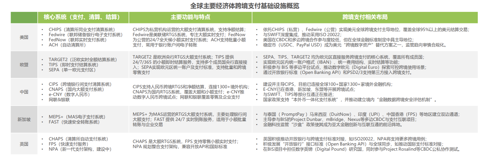

# 第三章 传统跨境支付体系的效率瓶颈与根源剖析

## 3.1 传统跨境支付的主流模式与运行机理

跨境支付体系的演进历经百余年时间,从早期的金属货币携带、纸质汇票结算,逐步发展为电子化、网络化的支付清算体系。1973年环球银行金融电信协会(SWIFT)的成立标志着跨境支付进入电子化时代,此后国际信用卡组织的兴起以及21世纪第三方支付平台的涌现,共同构成了当前跨境支付的主流模式(见图3-1)。

### 3.1.1 代理行模式

代理行模式(Correspondent Banking Model)是最为传统且应用最为广泛的跨境支付方式,其运作依托于商业银行之间建立的多级代理关系网络。在此模式下,若汇款行与收款行未建立直接账户关系,资金需经由一家或多家中间银行完成跨境转移。

该模式的运行机理具体表现为:当客户在A国银行发起跨境汇款时,A国银行通过SWIFT网络向B国银行发送支付指令。若两家银行之间存在直接代理关系,资金可直接从A国银行在B国的代理账户划转至收款行;若不存在直接关系,则需经由一家或多家中间行转接,每经过一个中间行,均需完成账户核对、资金清算、合规审查等流程。这种多级代理结构导致支付链条被不断拉长,形成典型的"链式清算"特征。

SWIFT系统在代理行模式中扮演核心角色,其连接全球超过11,000家金融机构,覆盖200多个国家和地区,日均处理超过4400万条支付报文。然而SWIFT本身并不参与资金清算,仅提供报文传递服务,实际的资金流动仍需依赖各国清算系统及银行间账户体系完成。这种"信息流与资金流分离"的架构,在保证系统稳定性的同时,也埋下了效率低下的隐患。

代理行模式在大额B2B跨境支付中占据主导地位。数据显示,2024年全球跨境支付总规模达194.6万亿美元,其中B2B支付占比超过95%,代理行模式承载了其中绝大部分交易量。该模式的优势在于覆盖范围广、系统成熟稳定、受到各国央行和监管机构认可。但其劣势同样显著:多级中介导致成本累积、清算周期长达3-5个工作日、各环节信息不透明、合规审查重复进行,这些问题在中小规模支付场景中尤为突出。

### 3.1.2 清算所模式

清算所模式(Clearing House Model)依托于区域性或全球性清算组织建立的统一清算平台,通过集中清算机制降低银行间的双边清算成本。该模式的典型代表包括美国的清算所银行同业支付系统(CHIPS)、欧盟的跨欧自动实时全额清算系统(TARGET2)、中国的人民币跨境支付系统(CIPS)等。

清算所模式的运行逻辑与代理行模式存在本质差异。在该模式下,参与成员银行在清算所开立账户,跨境支付指令通过清算所系统进行集中轧差或实时全额结算。以CHIPS为例,该系统采用连续净额结算(CNS)机制,在交易日内不断累积各参与行之间的债权债务关系,并在每日特定时点进行多边轧差,最终通过美联储账户完成净头寸清算。这种机制显著减少了实际资金划拨次数,提高了清算效率。

CIPS系统作为人民币国际化的重要基础设施,自2015年上线以来发展迅速。截至2025年1月,CIPS直接参与者达169家,间接参与者1467家,覆盖119个国家和地区,业务触达185个国家和地区。2024年全年处理业务821.7万笔,同比增长24.3%,金额达175.5万亿元人民币,同比增长42.6%,日均处理金额6523.9亿元人民币。该系统支持实时全额结算(RTGS)和普通模式两种清算方式,其中RTGS模式可实现秒级资金到账。

尽管清算所模式在效率上优于传统代理行模式,但其应用范围受到限制。清算所通常服务于特定货币或特定区域,跨清算所的支付仍需通过代理行模式完成。例如,一笔从中国到巴西的人民币-雷亚尔支付,即便使用CIPS系统完成人民币端清算,在巴西端仍可能需要借助代理行网络完成雷亚尔的最终交付。这种"清算所孤岛"现象限制了该模式的全球适用性。

### 3.1.3 第三方支付模式

第三方支付模式伴随互联网经济和跨境电商的兴起而快速发展。该模式以PayPal、万里汇(WorldFirst)、连连国际(LianLian)、Stripe等专业支付服务商为代表,通过建立本地化账户网络、API技术直连、虚拟账户体系等创新手段,为跨境支付提供差异化解决方案。

第三方支付模式的核心机理在于"本地化资金池+虚拟账户体系"。支付服务商在多个国家和地区设立本地实体,并在当地银行开立资金池账户。当用户发起跨境支付时,资金实际上是在支付服务商的本地账户之间流动,而非跨境划转。例如,中国商户通过万里汇收取美国买家的货款,资金流向为:美国买家→万里汇美国账户→万里汇内部账务处理→万里汇中国账户→中国商户。这种"境内资金流+境外资金流"分离的模式,规避了传统跨境清算的复杂流程,大幅缩短了到账周期。

数据显示,2024年全球跨境第三方收款服务市场规模达5925亿美元,2020-2024年复合增长率为12.6%,预计2029年将达到10711亿美元。中国跨境出口第三方收款市场规模达4048亿美元,占全球市场的68.3%,年复合增长率高达16.5%。第三方支付在跨境电商场景中的渗透率尤为显著,79.47%的中国跨境电商商家选择第三方收款工具,电商场景占第三方跨境支付总规模的70%。

第三方支付模式的优势在于:到账周期缩短至T+0至T+2,部分平台可实现实时到账;综合费率控制在0.4%-3.49%之间,显著低于传统银行电汇;支持多币种、多支付方式,覆盖130余种货币;提供API接口与电商平台、ERP系统无缝对接;附加增值服务如锁汇、融资、税务合规等。然而,该模式的局限同样明显:单笔支付限额较低,难以满足大额B2B场景需求;资金安全依赖于平台自身风控能力;跨平台资金流动仍需借助传统银行体系;各国监管政策差异导致合规成本上升。

综合来看,三种主流模式各有适用场景:代理行模式适用于大额、低频的企业间贸易结算;清算所模式适用于特定货币区域内的高效清算;第三方支付模式适用于小额、高频的跨境电商及个人消费场景。三者共同构成了当前跨境支付的多层次体系,但彼此之间的互操作性不足,整体效率仍存在较大提升空间。

## 3.2 传统跨境支付效率痛点诊断

尽管跨境支付体系在过去数十年间不断演进,技术手段日益丰富,但效率问题始终制约着行业发展。这些问题在全球贸易结构转型、跨境电商爆发式增长的背景下更加凸显,成为阻碍中小规模支付场景发展的核心瓶颈。

### 3.2.1 清算效率低下:多级中转拉长支付周期

传统跨境支付最为直观的效率问题体现在清算周期过长。在代理行模式下,普通跨境电汇的到账周期通常为3-5个工作日,部分涉及非主流货币或偏远地区的支付甚至需要7个工作日以上。招商银行跨境电汇业务数据显示,其最长清算周期可达T+5。这一现象的根本原因在于多级中转结构:每经过一个中间行,均需完成报文解析、账户核对、资金划拨、合规审查等流程,且各环节采用批量处理方式,而非实时处理。

支付周期延长对中小规模支付场景的影响尤为严重。对于跨境电商商户而言,资金占用周期长意味着现金流周转效率降低,尤其在"黑五""双十一"等大促期间,资金回笼延迟可能导致供应链断裂。对于C端用户,国际留学生缴纳学费、海外务工人员汇款等场景,长周期等待不仅带来资金使用上的不便,更可能因汇率波动产生额外损失。

相比之下,国内支付已普遍实现实时到账,形成鲜明对比。中国人民银行网上支付跨行清算系统(IBPS)支持7×24小时实时清算,资金秒级到账。这种效率差距在跨境场景中尤为突出,成为用户体验的主要痛点。

### 3.2.2 支付成本高昂:显性与隐性费用叠加

跨境支付成本由显性费用与隐性费用两部分构成,两者叠加形成沉重的成本负担。显性费用包括手续费、电讯费、中转行费用等。以中国银行跨境电汇为例,其手续费按汇款金额的1‰收取,最低50元人民币,同时收取150元人民币/笔的电讯费。若涉及中间行,每家中间行还会加收10-30美元不等的转汇费。一笔1万美元的跨境汇款,综合显性费用可能达到200-300元人民币,费率高达2%-3%。

隐性费用主要体现在汇率溢价。传统银行在提供外汇兑换服务时,通常在央行中间价基础上加点,买入价与卖出价之间的价差(Spread)即为银行利润来源。这一价差通常在0.5%-2%之间,对于小额高频支付,汇率溢价占总成本的比例可能超过手续费本身。此外,资金占用成本也属于隐性费用范畴,3-5日的清算周期意味着汇款人提前支付资金,收款人延迟收到资金,双方均承受时间价值损失。

成本问题在中小规模支付场景中表现更为突出。对于客单价20-50美元的跨境电商订单,若支付成本占比达到2%-3%,将严重侵蚀商户利润空间。联合国可持续发展目标(SDG)10.c明确提出,到2030年将跨境汇款成本降至3%以下,G20更进一步设定2027年零售跨境支付平均成本降至1%的目标。这表明,当前跨境支付成本距离国际社会的理想水平仍有较大差距。

### 3.2.3 信息不透明:资金流向追踪困难

跨境支付涉及多方参与,包括汇款行、收款行、中间行、清算系统、外汇交易对手等,各参与方之间的信息系统相互独立,缺乏统一的信息共享机制。这导致支付过程中的信息透明度严重不足,用户难以实时掌握资金流向和处理进度。

在代理行模式下,汇款人发起支付后,通常只能获得一个SWIFT报文号作为凭证,但无法查询资金在各中间行的具体流转状态。收款人同样面临信息盲区,仅在资金最终到账时才能确认支付完成。若支付过程中出现异常,如某中间行因合规审查暂扣资金,或因账户信息错误退回款项,用户往往需要数日才能获知结果,且查询过程繁琐,需通过汇款行逐级向中间行追溯,耗时耗力。

信息不透明还导致纠纷处理效率低下。当发生支付失败、金额错误、收款延迟等问题时,用户难以快速定位责任方,银行间推诿扯皮现象时有发生。某跨境电商平台的调研数据显示,35%的商户将"用户体验欠佳"列为跨境支付的主要痛点,其中信息不透明是重要影响因素。

相比之下,国内支付平台如支付宝、微信支付均提供实时支付状态查询功能,用户可随时查看交易进度、预计到账时间、失败原因等详细信息。这种透明度差距凸显了传统跨境支付体系在信息化建设上的滞后。

### 3.2.4 中小场景适配不足:准入门槛高、流程繁琐

传统跨境支付体系主要服务于大型企业和金融机构,其业务流程、费率结构、合规要求等均围绕大额B2B支付设计,对中小企业和个人用户的需求考虑不足。这种"重企业、轻个人""重大额、轻小额"的倾向,导致中小规模支付场景的适配性较差。

准入门槛方面,企业开立跨境支付账户需提供完整的公司注册文件、财务报表、贸易合同、税务证明等材料,审批周期长达数周甚至数月。对于跨境电商中小商户,尤其是刚起步的个体卖家,这种繁琐的流程构成显著障碍。某调研显示,31%的跨境商户认为"多币种管理难"是主要痛点,反映出传统银行在多币种账户开立、货币兑换便利性上的不足。

流程繁琐体现在多个环节。跨境汇款需填写详细的收款人信息,包括SWIFT代码、IBAN号、银行地址等,任何一项填写错误都可能导致退款或延迟。外汇购汇需提供交易背景证明,如发票、合同等,审核流程复杂。对于C端用户,境外消费退税、留学汇款等场景,往往需要前往银行柜台办理,无法通过线上渠道完成,用户体验较差。

传统支付体系对小额高频支付的支持不足还体现在费率结构上。固定费用(如150元/笔的电讯费)对小额支付形成较高比例成本,缺乏针对小额支付的优惠费率机制。这导致单笔金额低于500美元的跨境支付,综合费率可能高达5%-10%,严重制约了该场景的发展。

全球跨境支付市场结构数据印证了这一问题。2024年,个人相关支付(B2C、C2B、C2C)仅占总规模的4.3%,但其增速超过30%,远高于B2B支付的5.9%。这表明,中小规模支付场景存在巨大的潜在需求,但传统体系难以有效满足,市场空间被严重压制。

### 3.2.5 风控与合规协同弱:重复审查、效率低下

跨境支付涉及多国监管体系,各国在反洗钱(AML)、反恐怖融资(CFT)、客户身份识别(KYC)等方面的合规要求存在差异。传统跨境支付体系中,各参与方独立进行合规审查,缺乏有效的信息共享和协同机制,导致重复审查现象严重,合规成本高企。

在代理行模式下,一笔跨境支付可能经过3-5家银行,每家银行均需独立完成KYC审查、交易背景核实、制裁名单筛查等流程。这些审查在各行之间不互认,即使汇款行已完成严格审核,中间行和收款行仍需重复进行。某国际银行的内部数据显示,合规审查环节占跨境支付总处理时间的40%-60%,成为拖累效率的主要因素。

合规成本的上升也推高了整体支付成本。大型国际银行每年在跨境支付合规上的投入可达数亿美元,包括系统建设、人员配置、外部顾问费用等。这些成本最终通过手续费转嫁给用户。对于中小银行和支付机构,合规能力不足导致其难以参与跨境支付业务,或者只能选择依赖大型银行的代理服务,进一步加剧了成本问题。

监管政策差异还导致合规要求的不确定性。例如,欧盟《通用数据保护条例》(GDPR)对数据跨境传输提出严格限制,美国《外国账户税收合规法案》(FATCA)要求全球金融机构向美国税务机关报告美国纳税人账户信息,各国对加密货币、稳定币等新型支付工具的监管态度差异巨大。这种监管环境的碎片化增加了跨境支付机构的合规难度,也限制了创新空间。

综合来看,传统跨境支付体系在清算效率、成本控制、信息透明、场景适配、风控合规等方面均存在显著痛点。这些痛点在大额、低频的B2B场景中尚能被容忍,但在小额、高频的B2C、C2C场景中则成为难以逾越的障碍。随着全球跨境电商、数字服务、个人消费等场景的快速增长,传统支付体系的效率瓶颈日益凸显,亟需新的技术和模式加以突破。

## 3.3 传统跨境支付效率问题的根源分析

传统跨境支付效率低下并非偶然现象,而是由其底层架构、技术路径、制度环境等多重因素共同作用的必然结果。对这些根源进行深层次剖析,有助于理解为何传统模式在数字化时代日益显露疲态,也为探索新型解决方案提供理论依据。

### 3.3.1 代理行体系的固有结构性缺陷

代理行模式的核心问题源于其"多中心、长链条、弱协同"的结构特征。该模式建立在20世纪国际金融体系基础之上,彼时通讯技术落后、国际清算基础设施缺失,银行间建立双边账户关系成为跨境资金转移的唯一可行路径。这种历史路径依赖延续至今,形成了根深蒂固的结构性缺陷。

**链式清算的效率悖论**。代理行模式本质上是一种"点对点"的网络结构,全球数千家银行之间若要实现两两直连,需要建立的账户关系数量将呈指数级增长。为降低连接成本,实际操作中形成了"枢纽-辐射"(Hub-and-Spoke)结构,少数国际大行扮演枢纽角色,中小银行通过代理关系接入网络。然而,这种结构导致非直连银行间的支付必须经过多级中转,链条长度与效率呈反比关系。研究表明,每增加一个中间行,平均清算时间增加6-12小时,费用增加10-30美元。

**信息与资金流的分离困境**。SWIFT系统仅传递支付指令,实际资金清算依赖各国央行的实时全额清算系统(RTGS)或延迟净额清算系统(DNS),以及银行间的账户体系。这种"双轨制"架构导致信息流动速度(秒级)与资金流动速度(天级)严重不匹配。更严重的是,SWIFT报文格式复杂多样,MT103、MT202等报文类型多达数十种,各银行对报文的解析和处理能力参差不齐,经常出现人工干预需求,进一步拖累效率。

**代理关系的脆弱性与集中化风险**。代理行网络表面上看似覆盖全球,实则高度集中于少数西方大型银行。摩根大通、花旗银行、汇丰银行等机构掌握着大量代理关系,成为全球跨境支付的"超级节点"。这种集中化结构存在系统性风险:一旦某家枢纽银行因合规、政治等原因中断代理服务(De-risking),大量中小银行和边缘地区的金融机构将失去跨境支付渠道。世界银行数据显示,2011-2021年间,全球代理行关系数量减少约20%,新兴市场和发展中国家受影响最为严重,这一现象被称为"代理行脱媒"(Correspondent Banking De-risking)。

**账户余额管理的低效与高成本**。代理行模式要求各参与行在代理行处维持一定额度的预存资金(Nostro账户),以保证支付指令的即时执行。这些沉淀资金无法产生有效收益,构成巨大的机会成本。据估算,全球银行业在Nostro账户中沉淀的资金规模超过5万亿美元,若能释放其中10%的流动性,即可节省数百亿美元的资金成本。然而,由于各行之间缺乏实时信息共享和流动性优化机制,这一问题长期难以解决。

### 3.3.2 跨境清算系统的割裂与标准差异

全球跨境支付基础设施呈现明显的"碎片化"特征,各国、各地区建立的清算系统相互独立,技术标准、报文格式、运行规则各异,系统间互操作性严重不足。

**货币主权导致的清算体系割裂**。各国央行基于货币主权原则,建立本币清算系统,如美国的Fedwire、欧元区的TARGET2、英国的CHAPS、中国的CNAPS等。这些系统在技术架构、清算模式、运营时间上存在显著差异。例如,Fedwire采用实时全额清算(RTGS),TARGET2支持日间多次清算窗口,而部分新兴市场国家的清算系统仍采用T+1延迟净额清算。这种差异导致跨系统支付时,必须在双方系统的运营时间重叠窗口内完成,时区差异进一步压缩了可操作时间。

**报文标准的多样性与兼容性问题**。国际清算领域长期并存多种报文标准,SWIFT的MT(Message Type)系列标准、ISO 20022 XML标准、各国自定义标准等。尽管ISO 20022自2023年起在全球主要清算系统中逐步推广,但各系统的实施进度不一,报文字段定义、数据格式仍存在差异。这导致跨系统支付时需要进行报文转换和数据映射,增加了出错概率和处理时间。据SWIFT统计,约15%-20%的跨境支付指令因报文信息不完整或格式错误需要人工修正。

**清算时间窗口的错配**。全球主要清算系统的运营时间差异巨大。美国Fedwire工作日运营时间为美东时间21:00至18:30(覆盖次日),欧洲TARGET2为欧洲中部时间07:00至18:00,中国CNAPS为北京时间08:30至17:00。时区差异导致不同清算系统之间的可操作窗口大幅缩短,例如中国与美国之间的清算窗口仅有数小时,错过窗口则需等待次日,直接延长了清算周期。

**清算货币的霸权与不对称性**。美元在全球跨境支付中占据绝对主导地位,超过40%的跨境支付以美元计价,美国的清算系统(CHIPS、Fedwire)成为全球跨境美元清算的唯一通道。这种货币霸权带来两方面问题:一是地缘政治风险,美国可通过切断SWIFT或美元清算渠道实施金融制裁,对特定国家或实体的跨境支付形成"卡脖子"约束;二是汇兑效率低下,非美元货币之间的兑换往往需要通过美元作为中介货币(如人民币→美元→欧元),增加了汇兑成本和汇率风险。

### 3.3.3 人工干预环节多与信息传递滞后

传统跨境支付体系自动化程度低,大量环节依赖人工操作,信息传递方式落后,这是效率低下的直接原因。

**前端操作的手工化特征**。企业或个人发起跨境汇款时,通常需要填写纸质或电子表单,手动输入收款人姓名、账号、银行SWIFT代码、银行地址、IBAN号等复杂信息。这些信息字段多达数十项,且不同国家、不同银行的要求不尽相同,极易出现填写错误。银行前台人员需逐项核对,对于企业客户还需审核贸易背景资料,整个流程耗时可达数小时。相比之下,国内支付通过二维码、NFC等技术实现一键支付,跨境支付的前端体验明显滞后。

**中后台处理的批量化模式**。银行中后台对跨境支付指令的处理普遍采用批量模式,即将一段时间内(如1小时或半个工作日)积累的指令集中处理,而非逐笔实时处理。这种模式源于早期计算能力限制和成本考虑,但在当今云计算、分布式系统已成熟的背景下,批量模式显得尤为落后。批量处理导致单笔支付的等待时间不可控,即使某笔支付在批次开始时提交,也需等待整个批次处理完成才能进入下一环节。

**合规审查的人工依赖**。跨境支付的合规审查涉及制裁名单筛查、反洗钱风险评估、交易背景真实性核验等多个维度。尽管银行普遍部署了自动化筛查系统,但系统的误报率较高(False Positive Rate),通常在10%-30%之间,即大量正常交易被系统标记为可疑,需要合规人员逐一复核。某国际银行的内部流程显示,一笔触发合规预警的支付,人工复核时间可能长达24-48小时,严重拖累整体效率。

**信息传递的异步与延迟**。SWIFT报文虽然传输速度快,但其传递方式仍属于"存储-转发"(Store-and-Forward)模式,即报文在各中间节点暂存后再转发至下一节点,而非端到端直达。更重要的是,报文传递的及时性无法保证资金清算的及时性,银行收到支付指令后,何时执行清算操作取决于内部流程安排,缺乏统一的时效标准。这种信息传递与资金清算的异步性,导致用户无法获得确定的到账时间预期。

### 3.3.4 监管政策差异与合规成本高

跨境支付天然涉及多国司法管辖,各国在金融监管、外汇管制、税收政策等方面的差异,构成传统支付体系高成本、低效率的制度性根源。

**反洗钱与反恐融资监管的全球不协调**。国际反洗钱组织(FATF)制定了全球反洗钱标准,但各国在执行层面存在显著差异。发达国家监管趋严,要求金融机构对客户进行"了解你的客户"(KYC)和"了解你的客户的客户"(KYCC)审查,甚至延伸至"了解你的客户业务"(KYCB),审查深度和广度不断扩大。而部分发展中国家由于监管能力不足,合规标准较为宽松。这种不对称性导致国际银行在与后者建立代理关系时面临合规风险,不得不投入大量资源进行尽职调查,或直接选择退出代理关系,进一步加剧"代理行脱媒"问题。

**数据跨境流动的合规挑战**。跨境支付必然伴随客户数据的跨境传输,但各国对数据主权的重视程度不断提升。欧盟GDPR要求个人数据原则上不得传输至欧盟以外地区,除非目的国具备"充分性认定"或采取适当保障措施。中国《数据安全法》《个人信息保护法》同样对数据出境提出严格要求。这导致跨境支付机构需在多国建立数据中心,实施数据本地化存储,大幅增加了基础设施投入和运营成本。

**外汇管制政策的异质性**。各国外汇管制政策差异巨大,从完全自由兑换(如美国、欧元区)到严格管制(如部分新兴市场国家)。管制措施包括额度限制、用途审查、强制结汇等,跨境支付机构需针对不同国家设计差异化的业务流程,无法实现规模化、标准化运营。例如,中国对个人每年购汇额度设定为5万美元,企业跨境支付需提供贸易背景真实性证明,这些政策虽有其合理性,但客观上增加了跨境支付的复杂度。

**税收政策与跨境服务的双重征税风险**。跨境支付服务往往涉及多国税收管辖,可能面临双重征税问题。例如,某支付机构在A国注册,为B国用户提供服务,收取的手续费可能在A国作为营业收入纳税,在B国作为跨境服务被征收增值税或预提税。尽管多数国家签订了税收协定以避免双重征税,但协定覆盖范围有限,且执行中存在争议。这增加了跨境支付机构的税务合规成本和不确定性。

综合来看,传统跨境支付效率问题的根源深植于其底层架构、技术路径和制度环境之中。代理行体系的结构性缺陷决定了其在效率提升上的天花板;清算系统的割裂和标准差异构成技术层面的障碍;人工干预环节多和信息传递滞后反映了自动化、数字化程度不足;监管政策差异和合规成本高则是制度层面的约束。这些根源性问题相互交织、彼此强化,形成了传统跨境支付效率低下的"系统性困境"。

## 3.4 传统跨境支付现有优化尝试及局限性

面对日益凸显的效率问题,国际金融机构、清算组织和科技公司并非坐视不理,而是在技术、标准、基础设施等层面展开了一系列优化尝试。这些努力在一定程度上改善了跨境支付体验,但受限于传统体系的根本性约束,优化效果有限,难以实现质的突破。

### 3.4.1 技术标准升级:ISO 20022的推广与挑战

ISO 20022作为新一代金融报文标准,自2023年起在全球主要清算系统中逐步实施。相比传统SWIFT MT报文,ISO 20022采用XML格式,数据结构化程度更高,可承载更丰富的支付信息,包括交易背景、发票号码、税务信息等,理论上能够提升支付信息透明度、减少人工干预、加速合规审查。

然而,ISO 20022的推广面临诸多挑战。实施进度的不一致性导致全球清算系统处于新旧标准并存的"双轨期",SWIFT需要为两种标准之间的转换提供中介服务,增加了系统复杂度。各国、各机构对ISO 20022标准的理解和实施细节存在差异,字段定义、数据格式仍未完全统一。更关键的是,ISO 20022本质上是报文标准的升级,并未改变代理行模式的多级中转结构,无法从根本上解决清算周期长、成本高的问题,只是在现有框架内的"修修补补"。

### 3.4.2 实时支付系统的区域化推进

为缩短清算周期,多国建设了实时支付系统(Real-Time Payment,RTP),如美国的FedNow、欧盟的TIPS、中国的CNAPS三代系统、新加坡的FAST等。这些系统支持7×24小时运行,资金秒级到账,显著提升了境内支付效率。部分区域性组织还尝试推动实时支付系统的跨境互联,如东盟国家之间的PayNow-PromptPay互联互通,实现了新加坡与泰国之间的实时跨境汇款。

然而,实时支付系统的跨境应用面临两大局限。覆盖范围有限,目前仅在少数双边或区域性关系中实现互联,尚未形成全球性网络。货币兑换问题未解决,实时支付系统通常仅支持本币清算,跨境支付仍需依赖外汇市场进行货币兑换,而外汇市场的交易时间、流动性、汇率波动等因素仍会影响最终的到账效率和成本。因此,实时支付系统的跨境化只是局部改进,无法全面替代传统跨境支付体系。

### 3.4.3 清算组织的创新探索:SWIFT gpi与Nexus

SWIFT推出的全球支付创新服务(gpi,Global Payments Innovation)旨在提升跨境支付的速度、透明度和可追溯性。gpi要求参与银行承诺在30分钟内完成资金入账(不包括合规审查时间),提供端到端的支付追踪功能,允许用户实时查询资金流转状态,并要求手续费透明化,禁止中间行扣除不明费用。截至2024年,SWIFT gpi覆盖全球超过4000家金融机构,处理的跨境支付占SWIFT总量的70%以上。

尽管SWIFT gpi取得一定成效,但其局限性同样明显。承诺的30分钟到账仅针对资金在银行账户间的划转,不包括合规审查等耗时环节,实际端到端时效仍可能达到数日。支付追踪功能的准确性依赖于各参与行及时更新状态信息,但部分银行因系统落后或流程管理问题,无法做到实时更新。手续费透明化只是要求明示费用,并未实质性降低费用水平。因此,SWIFT gpi本质上仍是在代理行体系框架内的优化,未能突破结构性限制。

国际清算银行(BIS)创新中心推动的Nexus项目,试图通过建立全球即时支付系统的互联网络,实现跨境支付的实时化。该项目设想各国实时支付系统通过统一接口相互连接,形成"系统的系统",跨境支付在秒级内完成清算。然而,Nexus目前仍处于概念验证和试点阶段,面临技术标准统一、各国监管协调、货币兑换机制设计等诸多难题,短期内难以实现全球推广。

### 3.4.4 央行数字货币(CBDC)的跨境应用探索

央行数字货币(Central Bank Digital Currency,CBDC)被视为跨境支付革新的潜在路径之一。BIS牵头的多边央行数字货币桥(mBridge)项目,联合中国、泰国、阿联酋、沙特等国央行,探索基于分布式账本技术(DLT)的CBDC跨境支付方案。该项目通过共享账本实现多国央行间的实时清算,理论上可绕过代理行体系,大幅缩短清算周期、降低成本。

然而,CBDC跨境应用面临复杂的技术、政策和协调问题。技术层面,各国CBDC的底层架构、技术路线差异巨大,如何实现互操作性是重大挑战。货币主权层面,CBDC的跨境流动涉及各国货币政策自主权、资本流动管理等敏感问题,各国央行对跨境CBDC持谨慎态度。隐私保护与合规监管的平衡问题,CBDC交易的可追溯性虽有利于反洗钱,但可能引发隐私担忧,如何在两者之间取得平衡尚无共识。因此,CBDC跨境支付目前仍处于试验阶段,距离大规模商用尚有很长距离。

### 3.4.5 第三方支付的增量创新与存量困境

第三方支付平台通过技术创新和商业模式创新,在一定程度上缓解了传统跨境支付的痛点,但其作用更多体现在增量市场(跨境电商、个人消费等小额高频场景),对存量市场(大额B2B支付)的改造能力有限。

第三方支付的创新主要集中在用户体验层面:简化操作流程,通过API接口与电商平台、ERP系统对接,实现一键收款;缩短到账周期,利用本地化资金池绕过跨境清算环节,部分平台实现T+0到账;降低费率,通过规模化运营分摊成本,费率控制在1%-3%之间;提供增值服务,如锁汇、融资、税务合规等,满足商户多元化需求。

然而,第三方支付模式的局限性同样突出。资金池模式的合规风险,各国对第三方支付机构的资金存管、流动性管理、跨境资金流动等有严格监管要求,部分国家甚至禁止第三方机构开展跨境支付业务,限制了其全球扩张。大额支付的天然劣势,第三方支付平台为控制风险,通常对单笔支付额度设定上限(如数万至数十万美元),无法满足大额B2B支付需求,这部分市场仍被传统银行垄断。平台间的互操作性不足,不同第三方支付平台之间缺乏统一标准和清算机制,用户在不同平台间转账仍需通过银行体系,未能形成真正的"网络效应"。

综上所述,传统跨境支付体系在标准升级、实时支付、清算创新、CBDC探索、第三方支付等方面均有优化尝试,这些努力在边际上改善了用户体验,但未能从根本上突破代理行体系的结构性约束、清算系统的割裂困境和监管政策的碎片化问题。传统模式的优化呈现"修修补补"的特征,局部改进难以实现系统性效率跃升。这为基于区块链等新兴技术的跨境支付创新留下了巨大空间,也为本研究聚焦Ripple方案提供了现实背景和问题导向。
