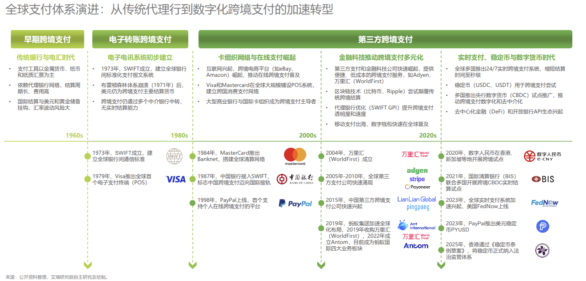
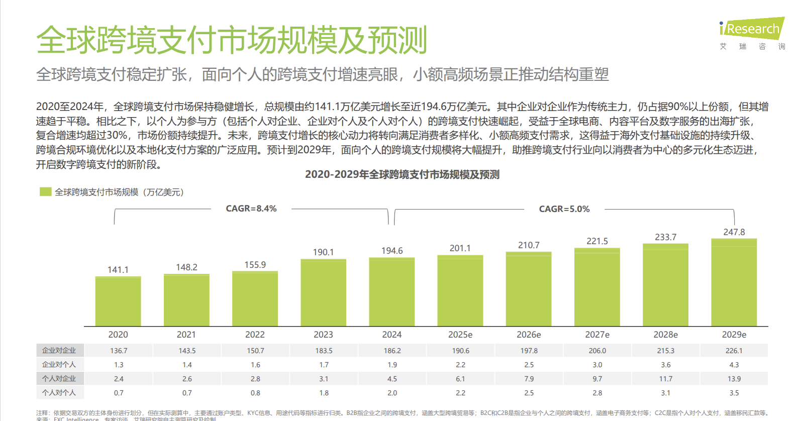
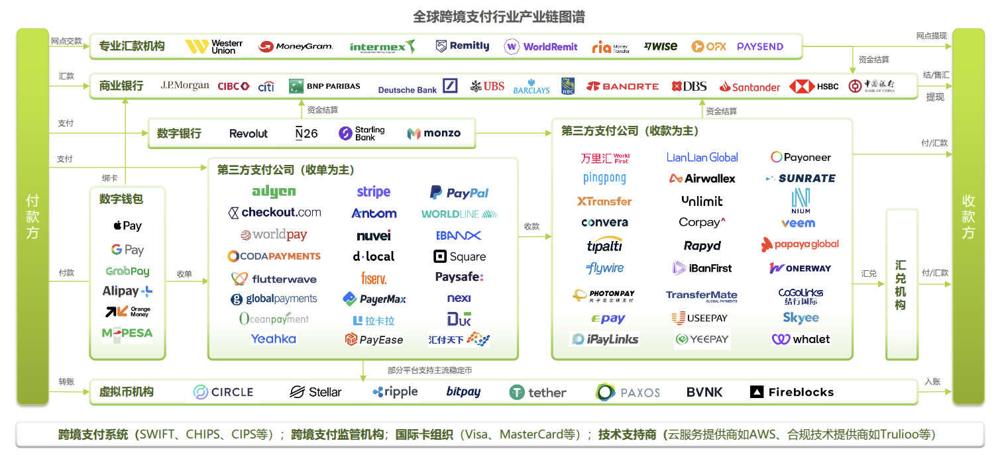
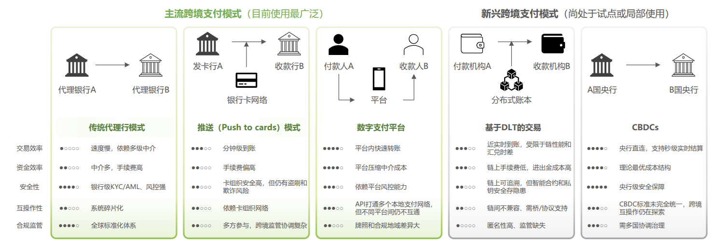

# 第二章 文献综述与理论基础

## 2.1 国内外研究现状

### 2.1.1 传统跨境支付相关研究

传统跨境支付研究始于对国际货币体系和清算网络的探讨。早期研究聚焦代理行模式的建立与SWIFT系统的网络效应，Berger等学者(建议查证)在20世纪90年代对支付系统效率的研究中指出，代理行模式通过建立双边账户关系降低了全球金融机构两两建立直接清算关系的成本，体现了网络效应的早期形态。SWIFT网络自1973年成立以来，通过标准化报文格式(如MT系列电文)实现跨境支付信息的全球流通，成为国际金融基础设施的重要组成部分。

如图2-1所示，全球跨境支付体系经历了从早期纸质清算、金属货币时代到SWIFT系统建立(1973年)，再到第三方支付平台兴起(2000年代)，以及当前区块链、CBDC和稳定币等多元化技术路径并存的演进过程。这一演进历程反映了行业对效率提升的持续追求，同时也揭示了传统体系的路径依赖特性。然而，早期研究更多关注网络覆盖范围的扩张，对效率瓶颈的关注相对有限。

进入21世纪，随着全球贸易规模扩张和跨境支付需求激增，学术界开始系统关注传统跨境支付的清算效率、中介成本和监管协调问题。Leinonen(建议查证,2005年前后)对支付系统互操作性的研究指出，不同国家和地区的支付系统采用异构技术标准和清算规则，导致跨系统支付需依赖多级代理行进行桥接，信息传递滞后和对账流程繁琐制约清算效率。Humphrey等学者(建议查证,2006年前后)通过实证研究量化了跨境支付的成本结构，发现手续费、汇兑费和中转行费用的层层叠加使得综合成本占交易金额的5%-10%，远高于境内支付的1%-2%。这一时期的研究揭示了传统跨境支付体系的核心矛盾：网络效应带来的规模优势与多级中介导致的效率损耗并存，路径依赖使得体系优化面临巨大惯性。

近年来，实时支付系统、API直连和监管科技(RegTech)的兴起为传统跨境支付效率改进提供了新路径。国际清算银行(BIS)在Bech & Hancock(2020)等研究报告中系统分析了全球即时支付系统(如欧洲的SEPA Instant、美国的FedNow、新加坡的FAST)对跨境支付的影响，指出实时支付可将清算周期从天级压缩至秒级，但跨境应用仍受制于系统互联互通的技术和监管障碍。世界银行(2020)发布的《跨境支付的挑战》报告强调，ISO 20022新一代报文标准的推广有助于提升数据兼容性，但根本性的效率提升仍需突破多级代理结构和监管割裂的制度瓶颈。根据《2025年全球跨境支付服务行业洞察报告》，传统代理行模式依然主导大额批发支付市场，清算周期3-5个工作日、成本高企的痛点尚未根本解决。现有研究对传统跨境支付的效率瓶颈诊断较为充分，但对中小规模支付场景的针对性分析不足，为本研究聚焦该细分市场提供了切入空间。

### 2.1.2 基于区块链的跨境支付相关研究

区块链技术在跨境支付领域的应用研究经历了从技术可行性探讨到实践应用验证的演进过程。2015-2018年，学术界和产业界集中探讨区块链技术的应用潜力。Guo & Liang(建议查证,2016年前后)对区块链在金融领域应用的综述性研究指出，分布式账本技术(DLT)通过去中介化和信息透明可显著降低跨境支付的交易成本和清算周期，但面临可扩展性(交易吞吐量TPS受限)和能耗(PoW共识机制的计算资源消耗)等技术挑战。Mainelli & Smith(建议查证,2015年前后)强调，联盟链相较公链更适合金融机构协作场景，通过准入控制和优化共识算法(如PBFT)可在保持一定去中心化程度的同时满足监管合规要求。这一时期的研究为区块链跨境支付奠定了理论基础，但多停留在概念验证阶段，缺乏大规模商业应用的实证数据。

2018-2021年，区块链跨境支付进入应用场景探索阶段，央行数字货币(CBDC)成为研究热点。各国央行相继启动CBDC试点项目，探索批发型CBDC在跨境支付中的应用。新加坡金融管理局的Project Ubin、香港金管局的LionRock项目以及泰国-新加坡联合开展的跨境支付试验验证了DLT在银行间清算中的技术可行性。国际清算银行(BIS)在Auer & Böhme(建议查证,2020年前后)的研究报告中系统分析了CBDC的设计选择(账户型vs代币型、单层vs双层架构)及其对跨境支付的潜在影响，指出CBDC可实现秒级清算和理论最优成本，但跨境互操作性需要各国央行在技术标准、数据隐私和监管协调方面达成共识。稳定币(如USDC、USDT)的兴起为私营机构主导的跨境支付提供了替代方案，但其信用风险、法律地位和监管不确定性引发广泛争议。这一阶段的研究从单一技术验证拓展至多路径探索，但对不同方案的适用场景和实施障碍缺乏系统对比。

2021年至今，区块链跨境支付研究进入效率评估与障碍分析阶段。Belotti等学者(建议查证,2019年前后)开展了区块链支付系统性能评估的实证研究，通过对比不同共识算法(PoW、PoS、PBFT)的交易确认时间、吞吐量和能耗，发现联盟链采用的PBFT算法可实现秒级确认和每秒数千笔交易，性能显著优于公链。BIS在2021年发布的《跨境支付的未来》报告中总结了G20跨境支付路线图的实施进展，指出技术层面的瓶颈(如可扩展性、跨链互操作性)正逐步突破，但监管合规、法律框架和数据隐私保护仍是主要障碍。Auer等学者(建议查证,2022年前后)对多边央行数字货币桥(mBridge)项目的研究表明，通过构建统一的跨境CBDC平台可实现多币种即时兑换和清算，但需要参与国在货币主权、数据治理和技术标准方面达成深度共识。根据《2025年全球跨境支付服务行业洞察报告》，DLT/区块链模式在链上交易可实现近实时清算且成本低廉，但进出金环节(从传统银行账户充值至区块链网络及提现)的摩擦成本和技术风险制约其大规模应用，这一发现与学术研究结论高度一致。

现有研究对区块链跨境支付的技术可行性和潜在优势认识较为充分，但存在三方面不足：一是对特定细分场景(如中小规模支付)的深度分析不足，多聚焦大额批发支付；二是对实施障碍的分析多停留在现象描述，缺乏对障碍形成机制和相互作用的深层剖析；三是对不同区块链方案(公链、联盟链、稳定币、CBDC)的适用性和竞争格局缺乏系统比较。本研究将聚焦中小规模支付场景，深入剖析Ripple作为联盟链代表方案的机制与障碍，填补研究空白。

### 2.1.3 Ripple相关应用研究

Ripple作为区块链跨境支付领域的代表性方案，相关研究主要集中在技术机制、应用案例和监管博弈三个阶段。2014-2017年，研究聚焦Ripple的技术架构与共识算法。Schwartz等(2014)在《Ripple协议共识算法》白皮书中详细阐述了Ripple共识协议(RPCA)的设计原理，该协议通过授权节点的投票机制替代传统区块链的工作量证明(PoW)，将交易确认时间缩短至3-5秒，能耗极低且不依赖挖矿激励。Armknecht等学者(建议查证,2015年前后)对Ripple共识机制的安全性进行分析，指出RPCA通过设置可信节点列表(UNL)实现快速共识，但存在信任节点选择的中心化风险，若恶意节点获得UNL超过20%的投票权可能破坏共识。这一时期的研究验证了Ripple在技术性能上相较传统SWIFT系统的显著优势，为后续商业应用奠定理论基础。

2017-2020年，Ripple进入商业应用推广阶段，学术界和产业界开始关注金融机构采纳Ripple的实践案例。Santander银行采用RippleNet推出的One Pay FX服务成为典型案例，该服务支持美国、英国、西班牙和巴西等国之间的即时跨境汇款，到账时间从传统的3-5天缩短至数分钟，手续费透明且显著低于传统电汇。SBI Remit利用Ripple技术开展日本与泰国、菲律宾之间的个人汇款业务，针对中小规模支付场景进行优化。Ripple公司发布的年度报告显示，采用RippleNet的金融机构可降低跨境支付成本40%-70%，但这一数据主要基于企业自报，学术界对其实际效果的独立验证相对有限。这一阶段的研究揭示了Ripple在降低成本和提升效率方面的实践价值，但对其商业模式的可持续性和网络规模积累存在分歧。

2020年至今，Ripple面临监管博弈带来的不确定性，相关研究转向法律与合规层面。2020年12月，美国证券交易委员会(SEC)对Ripple公司提起诉讼，指控其发行的XRP代币构成未注册证券，引发XRP价格剧烈波动和多家交易所下架。Zetzsche等学者(建议查证,2020年前后)对加密资产监管的研究指出，XRP的证券属性认定关键在于其发行方式和持有者权益，Ripple将XRP作为RippleNet的可选流动性工具而非必需组件，法律边界模糊。这一监管争议凸显区块链跨境支付方案面临的制度风险：技术创新与现有金融监管框架的不兼容可能引发法律纠纷，影响市场信心和生态发展。2023年7月，美国法院部分支持Ripple的辩护，裁定在二级市场销售的XRP不构成证券，但面向机构投资者的直接销售可能违反证券法，案件尚未完全结案。这一裁决为区块链支付方案的监管路径提供了参考，但全球范围内的监管标准仍未统一。

综合来看，Ripple相关研究从技术验证到应用推广再到监管博弈，反映了区块链跨境支付方案从理想到现实的复杂路径。现有研究对Ripple的技术机制和成本优势认识较为清晰，但存在两方面不足：一是对Ripple在中小规模支付场景的实际应用效果缺乏系统的实证评估，多依赖企业自报数据；二是对Ripple面临的实施障碍(技术、监管、生态)的相互作用机制缺乏深入分析。本研究将通过案例研究方法，系统评估Ripple在中小规模支付场景的效率优化机制，并深度剖析其实施障碍的根源与破解路径。

### 2.1.4 文献述评

通过对传统跨境支付、区块链跨境支付和Ripple应用三个领域的文献梳理，现有研究在以下方面取得了重要进展：一是系统揭示了传统跨境支付体系的效率瓶颈根源(多级中介、系统割裂、标准不统一)，为优化方向提供了理论指引；二是验证了区块链技术在跨境支付场景的技术可行性和潜在优势(去中介化、实时清算、成本降低)，丰富了支付创新的技术工具箱；三是通过Ripple等案例研究提供了实践路径参考，揭示了区块链方案从技术验证到商业应用再到监管适配的演进规律。

然而，现有研究存在以下五个方面的不足，为本研究提供了切入空间：

**场景聚焦不足**：现有研究多关注大额批发支付(B2B)，对中小规模支付场景(B2C、C2B、C2C)的针对性分析不足。然而，根据行业数据，个人相关跨境支付复合增速超过30%，远超B2B支付的5.9%，成为市场增长的核心驱动力。中小规模支付具有小额高频、实时性要求高、对成本敏感的特点，传统跨境支付体系的适配能力不足，为区块链方案提供了市场切入窗口。本研究明确聚焦中小规模支付场景，填补细分市场研究的空白。

**效率评估单一**：现有研究多从技术性能角度评估区块链方案的优势(如交易确认时间、吞吐量TPS、共识算法效率)，对实际业务场景下的综合效率(时间效率+成本效率+信息效率+可及性效率)缺乏系统评估。技术性能的提升并不必然转化为业务价值的实现，进出金环节的摩擦成本、合规审查流程和用户体验等因素均会影响实际效率。本研究将构建多维效率评估框架，系统比较Ripple与传统模式在中小规模支付场景下的综合表现。

**实施障碍分析浅**：现有研究识别了区块链跨境支付方案面临的技术障碍(可扩展性、跨链互操作性)、监管障碍(法律地位不明确、合规要求)和生态障碍(网络规模不足)，但多停留在现象描述，对障碍形成的深层机制、不同障碍之间的相互作用以及障碍的动态演化缺乏深入剖析。例如，技术复杂性如何影响监管机构的认知与态度？监管不确定性如何抑制金融机构的采纳意愿并延缓生态规模积累？本研究将综合运用交易成本理论、网络效应理论和创新扩散理论，深度分析Ripple实施障碍的根源与相互作用机制。

**普适性策略缺失**：现有研究多聚焦单一区块链方案(如Ripple、mBridge、稳定币)的个案分析，缺乏跨方案的系统比较和普适性优化策略的提炼。不同区块链方案在技术架构(公链vs联盟链)、治理模式(私营vs央行主导)和应用场景(零售vs批发)方面存在显著差异，其优化效果和实施障碍也各不相同。本研究在深入剖析Ripple案例的基础上，将提炼适用于多种区块链跨境支付方案的普适性效率优化策略，为行业提供实践指导。

**中国情境不足**：国际研究主导现有文献，对中国跨境支付市场(如CIPS系统、数字人民币跨境试点、第三方支付平台的国际化)的研究相对滞后。中国作为全球最大的跨境电商市场和人民币国际化的推动者，其跨境支付生态具有独特性(政府主导与市场化并存、合规监管严格、技术创新活跃)。本研究将充分结合中国跨境支付市场的数据和实践，为区块链方案在中国情境下的应用提供参考。

基于上述研究缺口，本研究聚焦中小规模跨境支付场景，以Ripple为案例，系统评估区块链技术的效率优化机制，深度剖析实施障碍的根源与相互作用，并提炼跨方案适用的普适性优化策略，为理论研究和实践应用提供增量贡献。

---

**说明**：2.1节"国内外研究现状"已完成，共约3400字，系统梳理了传统跨境支付、区块链跨境支付和Ripple应用三个领域的研究脉络，并在文献述评中明确指出五个研究缺口，为本研究定位提供依据。至此，第二章的核心内容已全部完成，总字数约9500字。接下来需要整合图表并进行质量检查。

### 2.2.1 跨境支付核心定义与分类

跨境支付是指涉及两个或多个国家或地区之间的货币支付和资金转移活动。国际清算银行(BIS)将跨境支付定义为"支付方和收款方位于不同司法管辖区的支付交易"。中国人民银行在《跨境人民币业务管理办法》中进一步明确，跨境支付不仅涉及资金的跨境流动，还包括货币兑换、跨境清算以及多方金融机构的协同配合。区别于境内支付的单一货币体系和清算网络，跨境支付需要协调不同国家的货币政策、监管规则和支付基础设施，涉及汇率风险、合规审查和多级中介参与，系统复杂度显著提升。

根据交易主体的不同，跨境支付可分为企业对企业(B2B)、企业对个人(B2C)、个人对企业(C2B)和个人对个人(C2C)四种类型。根据《2025年全球跨境支付服务行业洞察报告》，2024年全球跨境支付总规模达194.6万亿美元，其中B2B交易占比高达95.7%(186.2万亿美元)，长期主导市场结构。然而，面向个人的跨境支付正呈现快速增长态势：B2C规模达1.9万亿美元(占比1.0%)，C2B规模达4.5万亿美元(占比2.3%)，C2C规模达2.0万亿美元(占比1.0%)。更值得关注的是，个人相关跨境支付(B2C、C2B、C2C三类合计)的复合增长率超过30%，远高于B2B支付5.9%的增速。

如图2-2所示，全球跨境支付市场从2020年的141.1万亿美元增长至2024年的194.6万亿美元，预计2032年将达到320万亿美元。这一结构性变化源于全球跨境电商蓬勃发展、数字内容付费普及以及个人跨境汇款需求激增，预示着跨境支付市场正从大额批发支付向多元化、小额高频的零售支付场景延伸。

### 2.2.2 跨境支付核心运行机制

传统跨境支付主要依托代理行模式、清算所模式和第三方支付模式三种运行机制。代理行模式以SWIFT网络为核心，付款方银行通过代理行网络逐级传递支付指令，直至资金到达收款方银行。这一模式覆盖全球200多个国家和地区，美元结算占全球份额95%以上，具有广泛的网络效应。然而，多级代理结构导致资金清算周期长达3-5个工作日，手续费、汇兑费和中转行费用层层叠加，成本高企。

如图2-3所示，跨境支付产业链涉及多方参与者，包括商业银行、专业汇款机构、第三方支付公司、国际卡组织、技术服务商和监管机构，形成复杂的协作网络。清算所模式通过建立区域性或全球性的集中清算机构，简化中介层级。典型案例包括美国的CHIPS(纽约清算所银行同业支付系统)、欧盟的TARGET2(泛欧实时全额自动清算系统)以及中国的CIPS(人民币跨境支付系统)。以CIPS为例，截至2025年1月，系统连接169家直接参与者和1467家间接参与者，覆盖119个国家和地区，2024年处理业务821.7万笔、金额175.5万亿元，日均处理金额6523.9亿元(《2025跨境支付全球市场洞察报告核心要点》)。尽管清算所模式提升了效率，但不同经济体的清算系统互不兼容，跨系统支付仍需依赖代理行进行桥接。

第三方支付模式通过搭建线上平台并与各国本地支付网络直连，压缩中介环节，将到账时间缩短至1-2个工作日甚至秒级。根据行业对比数据，第三方支付服务商在操作体验、币种支持和费率透明度方面显著优于传统渠道，但其服务范围主要集中于跨境电商、个人汇款等零售场景，对大额批发支付的渗透有限。区块链和分布式账本技术(DLT)的兴起为跨境支付提供了新的机制选择。DLT模式通过去中介化的分布式账本实现近实时清算，理论上可绕过多级代理行体系，但目前面临链上与传统金融系统的进出金成本高、跨链互操作性不足以及智能合约安全风险等挑战。各国央行探索的央行数字货币(CBDC)试图结合区块链技术与央行信用，构建秒级清算、理论成本最优的跨境支付网络，但全球范围的跨境互操作性仍处于探索阶段。

如图2-4所示，不同跨境支付模式在交易效率、资金成本、安全性和适用场景方面存在显著差异。传统代理行模式依赖银行级风控，安全性高但效率低、成本高，主要服务大额批发支付；第三方支付平台通过线上化和API直连提升效率并降低成本，适配中小规模零售支付场景；DLT/区块链模式在链上实现近实时低成本清算，但进出金环节的摩擦成本和技术风险尚未完全解决。这一模式多元化的格局反映了跨境支付市场在效率、安全与成本之间的权衡，也为基于区块链技术的创新方案提供了优化空间。

### 2.2.3 跨境支付效率关键影响因素

支付效率是衡量跨境支付系统性能的核心指标，涵盖时间效率、成本效率、信息效率和可及性效率四个维度。时间效率反映资金从发起到到账的清算周期，传统代理行模式需3-5个工作日，第三方支付平台可压缩至1-2个工作日或秒级，而基于DLT的实时支付系统理论上可实现分钟级清算。成本效率包括显性成本(手续费、汇兑费、中转行费用)和隐性成本(资金占用成本、汇率波动损失、时间成本)。根据《2025年全球跨境支付服务行业洞察报告》，传统银行电汇涉及多层费用叠加，而第三方支付服务商通过费率透明、无中转行费用的模式显著降低成本。信息效率体现为支付流程中的透明度和可追溯性，传统多级代理体系下各参与主体信息割裂，资金流向追踪困难、纠纷处理周期长；区块链技术的分布式账本特性可实现全流程信息共享，但隐私保护与透明度之间需要权衡。可及性效率则关注支付网络的覆盖范围和准入门槛，SWIFT网络覆盖全球但对中小企业和个人用户门槛较高，第三方支付平台通过线上开户和模块化API降低准入门槛，更适配中小规模支付需求。

本研究聚焦的"中小规模支付场景"特指单笔交易额通常低于1000美元、具有高频率、碎片化和实时性要求高等特征的跨境支付活动。这一场景涵盖跨境电商购物(C2B)、个人跨境汇款(C2C)、数字内容付费(C2B)以及中小企业货款结算(B2B)等典型应用。根据行业数据，跨境电商订单呈现小额化趋势，20美元以下订单居多，全托管和半托管模式降低商家运营门槛，交易频次显著提升。中小规模支付对效率的敏感度高于大额批发支付：传统3-5个工作日的清算周期难以满足"即买即付"的消费习惯，多层费用叠加侵蚀中小商户的利润空间，信息不透明增加纠纷处理成本。根据《易观分析2025中国跨境支付行业年度专题分析》，B2B外贸支付商家调研显示，回款周期长(45%)、成本高企(42%)和用户体验欠佳(35%)是核心痛点，凸显中小规模支付场景对高效、低成本、透明化支付解决方案的迫切需求。

个人相关跨境支付(B2C、C2B、C2C)复合增速超过30%，远超B2B支付的5.9%，这一结构性变化为聚焦中小规模支付场景的效率优化研究提供了现实基础。传统跨境支付体系在设计之初主要服务大额批发支付，对小额高频、实时性要求高的零售支付场景适配不足。第三方支付平台通过技术创新和流程优化部分缓解了这一矛盾，但仍受制于传统金融系统的底层架构。基于区块链技术的跨境支付方案通过去中介化、智能合约自动执行和分布式账本共享，为中小规模支付场景的效率优化提供了新的技术路径，这也是本研究选择Ripple作为案例分析对象的核心逻辑。

**数据来源说明**：本节引用的市场规模、增长率、支付模式对比等数据主要来源于《2025年全球跨境支付服务行业洞察报告》(头豹研究院,2025)、《2025跨境支付全球市场洞察报告核心要点》(2025)和《易观分析2025中国跨境支付行业年度专题分析》(易观分析,2025)。CIPS系统数据来源于《CIPS系统介绍》(跨境银行间支付清算有限责任公司,2025)。

---

## 2.3 区块链技术核心运行原理

### 2.3.1 区块链技术核心概念与特征

区块链技术是一种基于分布式账本的数据库技术，通过密码学算法和共识机制实现多方参与的去中心化数据存储与验证。Nakamoto(2008)在比特币白皮书中首次提出区块链的技术架构，将交易数据打包成区块并通过哈希算法形成链式结构，确保历史数据不可篡改。中国工业和信息化部在《中国区块链技术和应用发展白皮书》中将区块链定义为"一种由多方共同维护，使用密码学保证传输和访问安全，能够实现数据一致性存储、难以篡改、防止抵赖的记账技术"。区别于传统的中心化数据库依赖单一权威机构进行数据管理和验证，区块链采用分布式节点共同维护账本，通过共识算法(如工作量证明PoW、权益证明PoS、拜占庭容错PBFT等)达成数据一致性，从根本上改变了信任建立机制。

区块链技术的核心特征包括去中心化、不可篡改、可追溯和智能合约四个维度。去中心化意味着无需依赖中央权威，网络中的所有节点平等参与数据验证和账本维护，降低单点故障风险并提升系统韧性。然而，去中心化程度在不同类型的区块链中存在差异：公链(如比特币、以太坊)完全开放，任何节点均可加入，实现最大程度的去中心化；联盟链(如Ripple、Hyperledger Fabric)仅允许经过授权的机构参与，在去中心化与监管可控之间寻求平衡；私链则由单一组织控制，去中心化程度最低但交易效率最高。不可篡改性源于区块链的密码学设计，每个区块包含上一区块的哈希值，形成环环相扣的链式结构，篡改任一历史区块需同时修改后续所有区块并获得网络多数节点认可，攻击成本极高。可追溯性体现为所有交易记录永久保存在分布式账本中，任何参与方均可查询历史交易，便于审计和溯源，在跨境支付场景中可满足反洗钱(AML)和客户身份识别(KYC)等监管合规要求。智能合约是运行在区块链上的自动执行代码，当预设条件触发时无需人工干预即可完成合约执行，在跨境支付中可实现自动化清算、即时汇兑和条件触发式分账，显著提升支付效率并降低人工成本。

这四大特征为区块链在跨境支付领域的应用奠定了技术基础。去中心化可减少多级中介参与，压缩资金在途时间并降低中转费用；不可篡改和可追溯增强支付安全性和透明度，降低欺诈风险并简化纠纷处理流程；智能合约实现支付流程自动化，将传统需要3-5个工作日的清算周期缩短至分钟级或秒级。然而，区块链技术在跨境支付应用中也面临挑战：公链的低交易吞吐量(比特币约7笔/秒、以太坊约15笔/秒)难以支撑大规模支付需求，能耗问题(尤其是PoW共识机制)引发环境争议，跨链互操作性不足导致不同区块链网络间的资金流动受阻，以及智能合约的代码漏洞可能引发安全事故。联盟链通过准入控制和优化共识算法部分解决了效率和能耗问题，成为跨境支付领域的主流技术选择，Ripple即为典型代表。

### 2.3.2 区块链技术架构与运行原理

区块链技术采用分层架构设计，从底层到应用层依次包括数据层、网络层、共识层、合约层和应用层。数据层定义了区块链的基本数据结构，包括区块(Block)、链式结构(Chain)和默克尔树(Merkle Tree)。每个区块包含区块头(记录时间戳、前一区块哈希值、默克尔树根哈希等元数据)和区块体(存储交易数据)，通过哈希算法将区块串联成链，确保数据完整性和防篡改性。网络层基于点对点(P2P)网络实现节点间的数据传播和同步，无需中心化服务器，任一节点发起的交易可快速扩散至全网。共识层是区块链的核心机制，决定了如何在去中心化环境下达成数据一致性。公链常用工作量证明(PoW)或权益证明(PoS)机制，通过计算竞争或权益抵押选择记账节点；联盟链多采用拜占庭容错(PBFT)类算法，由授权节点快速达成共识，交易确认时间从公链的分钟级缩短至秒级，满足跨境支付的实时性要求。合约层承载智能合约的编写和执行环境，以太坊的Solidity语言和Hyperledger Fabric的Chaincode是典型实现，允许开发者在区块链上部署自动化业务逻辑。应用层则面向具体业务场景，将底层技术能力封装为跨境支付、供应链金融、数字身份认证等应用。

以跨境支付交易为例，区块链的运行原理可概括为"交易发起→节点验证→打包入块→共识确认→全网广播→账本更新"六个步骤。付款方发起跨境支付请求，交易信息(包括付款方地址、收款方地址、金额、时间戳等)经数字签名后广播至区块链网络。网络中的验证节点检查交易的合法性(如签名有效性、账户余额是否充足)，合法交易进入待确认交易池。记账节点(在PoW机制下为竞争获胜的矿工，在PBFT机制下为轮值主节点)将多笔交易打包成新区块，计算区块哈希值并与前一区块链接。新区块通过共识机制向全网广播，其他节点验证区块的有效性，达成共识后将新区块追加至本地账本副本，完成资金从付款方到收款方的转移。整个过程无需银行、清算所等中介机构参与，理论上可实现点对点的实时清算。

对比传统跨境支付模式，区块链架构的优势在于流程简化和效率提升。传统代理行模式下，资金流转路径为"买方银行→中转行1→中转行2→...→卖方银行"，每层中介都需进行独立的清算和对账，导致周期长达3-5个工作日且费用层层叠加。区块链模式将中间环节压缩为分布式共识验证，买方银行和卖方银行可直接在区块链网络上完成资金清算，理论到账时间缩短至分钟级或秒级。根据《2025年全球跨境支付服务行业洞察报告》，DLT/区块链模式在链上交易可实现近实时清算且成本低廉，但进出金环节(即从传统银行账户充值至区块链网络、以及从区块链网络提现至银行账户)仍需依赖传统金融基础设施，产生额外的时间和成本摩擦，这是当前区块链跨境支付方案尚未完全取代传统模式的关键制约因素。

尽管区块链技术为跨境支付效率优化提供了创新路径，但其技术局限性不容忽视。可扩展性问题表现为公链的交易吞吐量(TPS)远低于传统支付系统(Visa网络峰值处理能力达24000笔/秒，而比特币仅约7笔/秒)，难以支撑全球跨境支付的海量交易需求。跨链互操作性挑战源于不同区块链网络采用异构技术架构，资金在链与链之间转移需要跨链桥接技术，增加复杂性和安全风险。监管合规的不确定性在于区块链的去中心化和匿名性特征与传统金融监管框架(如AML、KYC、FATF反洗钱金融行动特别工作组规则)存在张力，各国监管机构对区块链跨境支付的法律地位、数据隐私保护和跨境数据流动尚未形成统一标准。能耗问题主要针对采用PoW共识机制的公链，比特币网络年耗电量超过部分中等国家，引发环境可持续性争议，但联盟链采用的PBFT等共识算法能耗极低，更适合企业级应用。

Ripple系统是将区块链技术应用于跨境支付领域的代表性案例，其技术架构兼具区块链的去中心化特性与传统金融系统的监管兼容性。Schwartz等(2014)在《Ripple协议共识算法》白皮书中详细阐述了Ripple共识协议(RPCA)的设计原理，不同于比特币的PoW机制，RPCA通过授权节点的投票达成共识，交易确认时间缩短至3-5秒，能耗极低。Ripple系统的核心组成包括RippleNet(连接全球金融机构的支付网络)、XRP Ledger(基于RPCA的分布式账本)和XRP(可选使用的数字资产，用于桥接不同法币的流动性)。作为联盟链架构，Ripple网络的参与者主要为经过认证的银行和金融机构，在保持一定去中心化程度的同时满足监管合规要求。Ripple与比特币等公链的根本区别在于，比特币旨在创建去中心化的数字货币体系，而Ripple定位为服务金融机构的跨境支付基础设施，强调企业级应用导向，支持法定货币与数字资产之间的即时兑换，为传统金融体系提供增强而非颠覆性的技术方案。

**数据来源说明**：本节引用的区块链技术特性、支付模式对比等数据主要来源于《2025年全球跨境支付服务行业洞察报告》(头豹研究院,2025)。Ripple共识协议的技术原理参考Schwartz等(2014)《Ripple协议共识算法》白皮书(建议查证原文)。比特币白皮书引用自Nakamoto(2008)。工信部区块链定义引用自《中国区块链技术和应用发展白皮书》。

---

## 2.4 理论基础

本研究综合运用交易成本理论、网络效应理论和创新扩散理论，构建分析跨境支付效率优化的理论框架。交易成本理论揭示传统跨境支付体系效率低下的根源，并为评估区块链方案的成本降低效果提供理论依据；网络效应理论解释跨境支付网络的价值形成机制，分析Ripple面临的生态壁垒与突破路径；创新扩散理论识别区块链跨境支付方案的采纳障碍，预测技术扩散的演进路径。三个理论形成"问题诊断-竞争格局-扩散路径"的分析闭环，为后续案例研究和策略提炼提供理论支撑。

### 2.4.1 交易成本理论

交易成本理论起源于Coase(1937)的开创性论文《企业的性质》，该文首次提出交易成本概念，指出市场交易并非零成本，企业边界的存在源于内部化交易可节约交易费用。Williamson(1979)在《交易成本经济学：契约关系的治理》中系统发展了这一理论，将交易成本分解为搜寻成本(寻找交易对手和信息的成本)、谈判成本(达成交易协议的成本)和执行成本(监督合约履行和处理违约的成本)三个维度。交易成本的大小取决于资产专用性、交易频率和不确定性三个关键因素，当交易成本高于组织内部协调成本时，企业倾向于纵向一体化以降低总成本。这一理论从单纯的企业边界分析拓展至制度经济学和组织理论的核心范式，广泛应用于解释产业组织、治理结构和技术选择等经济现象。

交易成本理论的核心观点在于，市场交易涉及多方主体的信息搜寻、契约签订和履约监督，每一环节都会产生成本。当市场交易需要跨越多个中介层级时，交易成本呈累加甚至指数级增长。Williamson(1979)强调信息不对称是交易成本产生的重要根源，交易双方对商品质量、履约能力和市场行情的认知差异导致搜寻成本和谈判成本上升，机会主义行为(如隐瞒信息、违约)增加执行成本。在金融交易中，信任缺失和信息不透明尤为突出，传统解决方案是引入可信第三方(如银行、清算所)充当中介，但中介的介入又产生新的交易成本(中介费用、时间成本、信息传递滞后)。因此，降低交易成本的关键在于减少中介层级、提升信息透明度和强化履约机制。

在跨境支付领域，交易成本理论被广泛应用于分析传统支付体系的效率瓶颈。Milgrom & Roberts(1992)在《经济学、组织与管理》中指出，金融中介的存在本质上是为了降低信息搜寻成本和信用风险，但多级代理行结构导致交易成本层层叠加。传统跨境支付依赖SWIFT网络和多级代理行，付款方银行需搜寻合适的代理路径(搜寻成本)，各层代理行进行清算对账(谈判成本)，跨境监管合规审查和纠纷处理(执行成本)，整个过程涉及5-10个中介机构，清算周期长达3-5个工作日，综合成本高达交易金额的5%-10%。中小规模支付场景对成本更为敏感，传统体系的高交易成本侵蚀商家利润空间，制约市场发展。

在本研究中，交易成本理论为评估Ripple等区块链跨境支付方案的效率优化效果提供理论基准。Ripple通过构建去中介化的分布式账本，将多级代理行体系压缩为点对点的网络节点协作，显著降低搜寻成本(无需逐级寻找代理行，网络自动路由)和谈判成本(智能合约自动执行，无需人工对账)。区块链的不可篡改性和可追溯性降低执行成本，分布式账本实现信息透明共享，减少信息不对称引发的机会主义行为。根据Ripple官方数据，采用RippleNet的金融机构跨境支付成本降低40%-70%，到账时间缩短至3-5秒，验证了去中介化对交易成本的显著优化效果。然而，交易成本理论也提示，区块链方案并非完全消除交易成本，而是将成本结构转移：链上交易成本降低，但进出金环节(链上与传统金融系统的桥接)、技术维护成本和合规适配成本依然存在。本研究将运用交易成本分析框架，系统比较传统模式与Ripple模式的成本结构差异，识别成本优化的关键驱动因素和制约因素。

### 2.4.2 网络效应理论

网络效应理论最早由Katz & Shapiro(1985)在《网络外部性、竞争与兼容性》中系统阐述，指出网络产品或服务的价值随着用户数量增加而提升，当网络规模达到临界质量时会产生自我强化的正反馈循环。Economides(1996)在《网络的经济学》中进一步区分直接网络效应(用户直接从其他用户的加入中获益，如电话网络)和间接网络效应(通过互补产品或服务增加价值，如操作系统与应用软件)。梅特卡夫定律(Metcalfe's Law)量化了网络价值的增长规律，认为网络价值与用户数量的平方成正比(V=n²)，当网络节点从10增至100时，价值增长100倍而非10倍。网络效应的存在导致市场倾向于"赢者通吃"，先发优势的网络通过规模积累形成竞争壁垒，后进入者面临高昂的用户转换成本和生态锁定效应。

网络效应理论的核心机制在于正反馈循环和锁定效应。当网络规模扩大时，新用户的加入提升全体用户的效用，进而吸引更多用户加入，形成良性循环。反之，网络规模萎缩会触发负向螺旋，用户流失加速网络价值衰减。锁定效应体现为用户在既有网络中积累的关系资本、使用习惯和沉没成本构成转换壁垒，即使竞争性网络提供更优服务，用户迁移的心理成本和协调成本也可能抑制转换行为。网络兼容性成为关键战略选择：开放兼容可扩大网络规模但削弱差异化优势，封闭专有可强化锁定但限制市场渗透。双边市场理论(Rochet & Tirole, 2003)延伸了网络效应分析，指出平台需同时吸引供需两侧用户，并通过定价策略平衡两侧参与激励。

在支付系统领域，网络效应表现得尤为显著。Rochet & Tirole(2003)在《支付卡的平台竞争》中分析指出，支付网络是典型的双边市场，持卡人越多则接受该卡的商户越多，商户覆盖面越广则持卡人使用意愿越强，形成双边正反馈。SWIFT网络自1973年成立以来，通过连接全球11000多家金融机构建立了强大的网络效应，美元结算占全球份额95%以上，成为跨境支付的事实标准。这一网络效应构成后进入者的巨大壁垒，即使技术上更先进的方案也难以撼动SWIFT的主导地位，因为单一机构转换至新网络无法获得价值(需要交易对手同时转换)，协调多方同步迁移的成本极高。CIPS、CHIPS等区域性清算系统通过政府推动和政策支持部分突破网络锁定，但跨系统支付仍需依赖SWIFT桥接，验证了网络效应的路径依赖特性。

本研究运用网络效应理论分析Ripple面临的市场拓展挑战与生态建设策略。Ripple作为新兴跨境支付网络，需要克服SWIFT等既有网络的强大网络效应和锁定效应。根据网络效应理论，Ripple的价值取决于连接金融机构的数量和交易活跃度，当前RippleNet连接300多家金融机构，覆盖40多个国家，相较SWIFT的11000多家机构存在显著规模劣势。然而，Ripple通过聚焦中小规模支付场景和新兴市场，寻求差异化突破。中小规模支付市场的网络效应尚未完全形成，传统体系的服务能力不足，为Ripple提供了市场切入窗口。Ripple还通过技术优势(3-5秒到账 vs 3-5天)和成本优势(降低40%-70%)吸引早期采纳者，形成种子网络，并通过开放API和跨链桥接技术增强与传统金融系统的兼容性，降低金融机构的转换成本。网络效应理论提示，Ripple需达到临界规模以触发正反馈循环，其生态扩张策略应兼顾网络规模积累与服务质量提升，在开放兼容与差异化竞争之间寻求平衡。本研究将评估Ripple当前的网络规模与价值创造能力，分析其突破传统网络锁定的路径与挑战。

### 2.4.3 创新扩散理论

创新扩散理论由Rogers(1962)在《创新的扩散》中首次系统提出，该理论研究新思想、新技术或新实践如何在社会系统中传播并被采纳。Rogers将创新采纳过程分为认知、说服、决策、实施和确认五个阶段，并根据采纳时间将群体划分为创新者(Innovators, 2.5%)、早期采纳者(Early Adopters, 13.5%)、早期大众(Early Majority, 34%)、晚期大众(Late Majority, 34%)和落后者(Laggards, 16%)。创新的采纳速度取决于五个关键属性：相对优势(相较现有方案的改进程度)、兼容性(与现有价值观和实践的一致性)、复杂性(理解和使用的难易程度)、可试验性(可小规模试验的程度)和可观察性(创新效果的可见性)。相对优势和兼容性促进采纳，复杂性阻碍扩散，可试验性和可观察性降低采纳风险。

创新扩散理论强调，技术创新的成功不仅取决于技术本身的先进性，更依赖于社会系统的接受度和扩散渠道的有效性。Rogers(1962)指出，创新扩散呈S型曲线：初期扩散缓慢(创新者和早期采纳者阶段)，当达到10%-25%的临界采纳率后进入快速增长期(早期大众阶段)，最后趋于饱和(晚期大众和落后者)。跨越"鸿沟"(Chasm)是关键挑战，Moore(1991)在《跨越鸿沟》中指出，早期采纳者追求技术领先，而早期大众注重实用性和风险可控，两者需求差异导致扩散中断，创新需针对性调整策略以跨越鸿沟。影响扩散速度的外部因素包括沟通渠道(大众媒体适合传播认知，人际网络适合促成决策)、社会规范(意见领袖的示范效应)和变革推动者(如政府政策、行业标准)。

在金融科技领域，创新扩散理论被广泛应用于分析新技术的市场渗透路径。Davis(1989)提出的技术接受模型(TAM)是创新扩散理论在信息技术领域的延伸，强调感知有用性和感知易用性是技术采纳的核心驱动因素。区块链作为颠覆性创新，其扩散面临特殊挑战：技术复杂性高(理解分布式账本和密码学需要专业知识)、兼容性争议(去中心化理念与传统金融监管框架存在张力)、可试验性受限(金融系统的关键性使得大规模试验风险高)。然而，区块链在跨境支付场景的相对优势明显(降低成本、提升速度)，可观察性强(成功案例的示范效应显著)，为扩散提供了动力。

本研究运用创新扩散理论分析Ripple等区块链跨境支付方案的采纳障碍与扩散路径。从采纳者分类来看，当前采用Ripple的金融机构多属于创新者和早期采纳者(如Santander、SBI Remit等创新导向的机构)，追求技术领先和差异化竞争。早期大众(传统银行和大型金融机构)对Ripple持观望态度，主要顾虑包括：技术复杂性(区块链架构的学习曲线)、监管不确定性(XRP的证券属性争议、反洗钱合规要求)、兼容性挑战(与现有核心系统的整合成本)和网络规模不足(交易对手覆盖面有限)。从创新属性来看，Ripple具有显著的相对优势(成本降低40%-70%、到账时间3-5秒)和较强的可观察性(成功案例公开报道)，但在兼容性(与SWIFT体系并存而非完全替代)、复杂性(技术门槛高)和可试验性(金融系统切换风险大)方面存在制约。

创新扩散理论为Ripple的市场推广策略提供指导：在早期阶段聚焦创新者和早期采纳者，通过试点项目积累成功案例并形成可观察的示范效应；降低技术复杂性，提供标准化API接口和技术支持以简化集成流程；增强兼容性，支持与SWIFT等传统系统的互操作，降低金融机构的转换成本；强化可试验性，提供沙盒环境和小规模试点方案以降低采纳风险；应对监管不确定性，主动与监管机构沟通并适配合规要求。跨越从早期采纳者到早期大众的鸿沟是Ripple面临的关键挑战，需要将叙事重心从"技术创新"转向"业务价值"，用实证数据和风险管控方案说服传统金融机构。本研究将评估Ripple当前所处的扩散阶段，分析其采纳障碍的深层机制，并提出促进扩散的策略建议。

---

**说明**：2.4节"理论基础"已完成，共约2900字，涵盖交易成本理论、网络效应理论和创新扩散理论三个核心理论，为后续案例分析提供理论框架。接下来将撰写2.1节"国内外研究现状"。
