# 第四章 Ripple 优化跨境支付的机制分析与实证检验

传统跨境支付体系在中小规模支付场景中的效率瓶颈,源于多级代理结构、信息流与资金流分离、流动性管理低效等结构性缺陷。第三章的分析表明,传统体系内部的优化尝试——无论是 SWIFT gpi 的报文加速、清算所的多边轧差,还是第三方支付的本地资金池——本质上仍是在既有架构框架下的"修修补补",未能从根本上突破代理行网络的路径依赖与协调成本困境。区块链技术凭借其去中心化、分布式账本、智能合约等特性,为跨境支付效率优化提供了全新的技术路径。Ripple 作为最早商业化且在中小规模支付场景实现规模化应用的区块链跨境支付方案,其优化机制与实证效果值得深入剖析。

本章聚焦 Ripple 案例,从案例选择依据、核心机制解析、实证效果验证三个层面展开分析。在案例选择部分,论证 Ripple 作为研究对象的典型性与代表性;在机制分析部分,从技术、组织、资产三个维度解构 Ripple 的效率赋能逻辑;在实证检验部分,基于公开数据对比 Ripple 与传统模式在成本、时效、透明度等维度的差异,并客观指出其面临的挑战与约束。通过对 Ripple 案例的系统剖析,为理解区块链技术如何优化跨境支付效率提供经验支撑,同时为后续章节的障碍分析与策略提炼奠定基础。

## 4.1 Ripple 案例选择依据及其生态定位

### 4.1.1 案例选择依据

区块链技术在跨境支付领域的应用方案众多,既包括比特币、以太坊等公链方案,也涵盖 Ripple、Stellar、Corda 等联盟链或私有链方案,各国央行数字货币(CBDC)的跨境支付探索亦在推进。选择 Ripple 作为本研究的核心案例,基于技术成熟度、场景适配性、技术路径代表性以及数据可得性四个维度的综合考量。

**技术成熟度与商业化程度**

Ripple 于 2012 年由 OpenCoin Inc.(后更名为 Ripple Labs)创立,是最早将区块链技术应用于跨境支付领域并实现大规模商业化的解决方案。相较于比特币侧重于去中心化货币属性、以太坊聚焦智能合约与去中心化应用,Ripple 从诞生之初即明确定位于金融机构间的跨境支付基础设施,技术架构与产品设计均针对支付场景的效率优化需求。截至 2025 年,Ripple 已连接全球超过 300 家金融机构,覆盖 40 余个国家和地区,支持 40 余种货币的跨境支付能力。根据对 562 篇 Ripple 官方博客的文本分析,XRP(Ripple 的数字资产)在 2012 至 2025 年间被提及 3,102 次,RippleNet(Ripple 的全球支付网络)被提及 715 次,按需流动性方案 ODL(On-Demand Liquidity)被提及 488 次,反映出 Ripple 在跨境支付领域的持续商业化实践与市场影响力。

相较于其他区块链方案,Ripple 的商业化程度与技术稳定性已充分验证。比特币网络虽运行时间更长,但其每秒 7 笔交易(TPS)的处理能力、10 分钟以上的确认时间以及高能耗的 PoW 共识机制,难以满足跨境支付的实时性与规模化要求。以太坊在转向 PoS 共识后,TPS 提升至 30 左右,确认时间缩短至约 15 秒,但仍主要服务于智能合约与 DeFi 应用,在跨境支付领域的商业化案例相对有限。Stellar 作为与 Ripple 技术路线相近的解决方案,虽同样定位于跨境支付,但其市场覆盖范围与金融机构参与度不及 Ripple。CBDC 跨境支付项目如 mBridge 尚处于试验阶段,2024 年 10 月宣布达到"最小可行产品"(MVP)阶段,商业化应用仍需时日。因此,Ripple 在技术成熟度与商业化程度上具备典型代表性。

**场景适配性:聚焦中小规模支付**

本研究的核心问题聚焦于中小规模、小额高频跨境支付场景的效率优化,而 Ripple 的产品定位与技术特性恰与此高度契合。传统跨境支付体系在大额 B2B 场景中的效率问题虽然存在,但企业客户通常拥有较强的成本承受能力与较长的资金规划周期,3-5 个工作日的清算周期与 2-3%的综合成本在可接受范围内。中小规模支付场景的核心痛点在于:固定成本占比过高导致小额支付经济性差、时效要求高但清算周期长、覆盖范围需触达新兴市场与偏远地区。Ripple 通过 3-5 秒的交易确认时间、较低的边际成本、对新兴市场的覆盖能力,有效回应了这些痛点。

具体案例印证了 Ripple 的场景适配性。英国跨境汇款公司 Azimo 与泰国暹罗商业银行(SCB)合作,利用 Ripple 的 ODL 方案,将欧洲至泰国的跨境汇款到账时间从 24 小时缩短至平均 22 秒,时间成本降低 99.9%。日本 SBI Remit 作为首家在日本实施 ODL 的金融机构,其服务的日本至菲律宾汇款走廊年交易规模达 18 亿美元,而传统跨境汇款成本高达交易金额的 10.50%,远高于 G8 国家平均的 5.92%,Ripple 方案的成本优化空间显著。根据 Ripple 博客数据,欧洲 ODL 走廊的交易量在 2021 年同比增长 250%,亚太地区同比增长 130%,反映出中小规模支付场景对 Ripple 方案的强劲需求。这些案例均聚焦于个人汇款、中小企业跨境结算等中小规模场景,与本研究的问题导向高度一致。

**技术路径代表性:联盟链模式**

区块链技术在跨境支付领域的应用存在公链与联盟链两条路径。公链如比特币、以太坊采用完全去中心化的架构,任何节点均可参与网络,共识机制确保系统安全性,但代价是较低的交易吞吐量与较长的确认时间。联盟链采用准入控制机制,仅授权节点可参与共识,在牺牲部分去中心化特性的同时,换取更高的交易效率与更强的监管友好性。Ripple 采用的是"适度去中心化"的联盟链模式,其授权节点列表(UNL, Unique Node List)机制允许金融机构选择信任的验证节点参与共识,在保障交易速度(3-5 秒确认、1500 TPS)的同时,满足金融机构对风险控制与监管合规的要求。

这一技术路径选择代表了区块链金融应用的主流方向。金融机构在选择技术方案时,必须平衡创新性与安全性、效率与合规性。完全去中心化的公链虽在理念上契合"去信任"(Trustless)的区块链精神,但金融行业的强监管属性、客户身份识别(KYC)与反洗钱(AML)的合规要求,决定了金融机构难以接受匿名性与无准入门槛的公链架构。联盟链通过准入控制,既保留了分布式账本的技术优势——信息共享、不可篡改、实时同步——又满足了监管机构对参与方身份识别、交易可追溯、系统可控性的要求。国际清算银行(BIS)主导的 mBridge 项目、欧洲央行的 TARGET Instant Payment Settlement(TIPS)系统,均采用联盟链或许可链架构。Ripple 作为联盟链在跨境支付领域的先行者,其技术路径与经验教训对理解区块链金融应用的规律具有重要参考价值。

**数据可得性与研究可行性**

实证研究的有效性依赖于数据的可获取性与可靠性。Ripple 作为商业化运营超过十年的方案,公开资料丰富,数据透明度高,为深度案例研究提供了坚实基础。技术层面,Ripple 发布了详细的技术白皮书,Schwartz 等(2014)的《Ripple 协议共识算法》系统阐述了 RPCA(Ripple Protocol Consensus Algorithm)的运行机制,为技术机制分析提供了权威文献支撑。市场层面,Ripple 定期发布季度 XRP 市场报告,披露 ODL 交易量、网络活跃度、合作伙伴进展等关键指标;官方博客累计发布 562 篇文章,涵盖产品更新、案例分享、市场洞察,为追踪 Ripple 的业务演进与市场反馈提供了丰富素材。学术层面,国内外学者围绕 Ripple 的技术架构、效率评估、监管挑战等主题发表了多篇研究论文,本研究收集的 9 篇 PDF 格式学术文献为理论分析与实证验证提供了文献基础。

公链的透明性进一步增强了数据可得性。XRP Ledger 作为开源的分布式账本,所有交易记录公开可查,研究者可通过区块浏览器追溯历史交易、验证数据真实性。这种数据透明度在传统跨境支付体系中难以实现——SWIFT 系统的交易数据属于各参与银行的商业机密,研究者仅能依赖行业报告的汇总数据,无法获取交易级的细粒度数据。因此,Ripple 案例在数据可得性上的优势,使得本研究能够基于可验证的公开数据展开实证分析,增强了研究结论的可靠性与可复制性。

综合上述四个维度,Ripple 作为研究对象具备技术成熟、场景契合、路径代表、数据可得的综合优势,是剖析区块链技术优化中小规模跨境支付效率的理想案例。

### 4.1.2 Ripple 生态定位与网络结构

**RippleNet 网络拓扑结构**

Ripple 构建的跨境支付生态系统以 RippleNet 为核心,采用分层架构实现技术、网络与应用的协同。底层是 XRP Ledger(XRPL),这是一个开源的分布式账本,运行 RPCA 共识算法,负责交易的验证、记录与最终确认。XRPL 的设计目标是实现高速(3-5 秒确认)、低成本(交易手续费仅 0.00001 XRP,约 0.00002 美元)、可扩展(理论 TPS 可达 1500)的价值传输,为上层应用提供技术支撑。中间层是 RippleNet,这是连接全球金融机构的支付网络,通过标准化的 API 接口与消息协议,实现跨机构的支付指令传递、信息同步与资金清算。参与 RippleNet 的金融机构之间形成点对点的支付通道,无需通过多级中间行转接,支付路径由算法自动优化选择。应用层是 Ripple Payments(原名 ODL,On-Demand Liquidity),这是利用 XRP 作为桥接货币、实现按需流动性管理的解决方案,核心价值在于消除传统 Nostro 账户的预置资金需求,释放金融机构的流动性资本。

网络的参与者类型多样化,构成分工协作的生态体系。金融机构(包括商业银行、支付服务商、汇款公司)是网络的主要用户,通过接入 RippleNet 为客户提供跨境支付服务。做市商在 ODL 模式中扮演关键角色,负责提供法币与 XRP 之间的即时兑换服务,确保货币转换的流动性深度。验证节点维护 XRPL 的运行,全球约 150 个验证节点分布式参与共识,其中包括金融机构运行的节点、Ripple 官方节点以及独立第三方节点。每个金融机构可自主选择信任的验证节点列表(UNL),通常包含 5-50 个节点,当 UNL 中超过 80%的节点对某笔交易达成一致时,该交易被确认并写入账本。这种灵活的信任机制在分布式与可控性之间实现平衡,既避免了中心化单点故障风险,又保留了金融机构对网络参与者的筛选权。

_数据来源:Ripple 官方技术文档_

根据对 Ripple 官方博客的地理分布统计,RippleNet 的市场覆盖呈现"发达市场与新兴市场并重、重点走廊深耕"的特征。美国作为 Ripple 总部所在地与最大市场,在博客中被提及 325 次(包括"US"264 次、"United States"61 次),反映出北美市场的战略地位。亚太地区是 Ripple 重点拓展区域,新加坡(72 次)作为区域金融中心与 RippleNet 亚太枢纽、日本(64 次)作为早期采纳市场、菲律宾(35 次)与泰国(30 次)作为汇款走廊目的地,共同构成亚太生态。拉美市场的墨西哥(38 次)与巴西(38 次)、中东的阿联酋(24 次),均为 Ripple 布局的新兴市场。这种全球化布局契合跨境支付的网络效应逻辑——覆盖范围越广、支付走廊越密集,网络价值越高。

**产品线演进与整合**

Ripple 的产品体系经历了从分散到整合的演进过程。早期阶段(2017-2019 年),Ripple 推出三款独立产品以满足不同客户需求:xCurrent 负责实时消息传递与支付前对账,解决信息流问题;xVia 提供标准化 API 接口,降低企业接入门槛;xRapid 利用 XRP 作为桥接货币,解决流动性问题。根据博客文本分析,xCurrent 在 2017-2025 年间被提及 38 次,xVia 被提及 17 次,xRapid 被提及 78 次,xRapid 的提及频率显著高于其他两款产品,反映出利用 XRP 优化流动性的方案最受市场关注。

2019 年后,Ripple 进行品牌整合,将三款产品统一纳入 RippleNet 总品牌。xCurrent 的消息层功能成为 RippleNet 的基础设施,xVia 的 API 接口成为标准接入方式,xRapid 演进为"按需流动性"(ODL)并进一步更名为 Ripple Payments。这一整合策略简化了市场沟通,强化了 RippleNet 作为"一站式跨境支付网络"的品牌定位。从博客的年度数据可观察到产品提及的演变轨迹:2017 年 XRP 被提及 160 次、RippleNet 仅 5 次,2018 年 RippleNet 提及增至 34 次,2020 年 ODL 提及达到峰值 54 次,2021 年 RippleNet 提及达 53 次,反映出品牌整合后 RippleNet 概念的市场认可度提升。2024 年,Ripple 推出 RLUSD(Ripple USD)稳定币,锚定美元 1:1,旨在补充 XRP 的波动性短板,为客户提供更稳定的跨境支付工具。RLUSD 在 2024-2025 年间被提及 221 次,其中 2025 年提及 191 次,显示出稳定币在 Ripple 生态中的快速崛起。

产品演进反映出 Ripple 对市场需求的动态响应。早期分散的产品线满足了不同客户的差异化需求——部分金融机构仅需改进消息层效率(xCurrent),部分企业需要简化接入流程(xVia),部分机构愿意尝试 XRP 优化流动性(xRapid)。随着市场教育深入与客户接受度提升,Ripple 转向整合策略,将流动性优化(ODL/Ripple Payments)作为核心差异化价值主张,同时保留消息层与 API 接口作为基础服务。RLUSD 的推出则体现出 Ripple 在监管环境变化背景下的策略调整——面对 XRP 证券属性的法律争议与价格波动的市场顾虑,稳定币提供了兼顾合规性与稳定性的替代方案。

**与传统体系的定位关系**

Ripple 并非旨在替代 SWIFT 等传统跨境支付体系,而是定位于增强与补充。SWIFT 作为运行超过 50 年的全球金融信息网络,连接 200 多个国家和地区的 11,000 余家金融机构,日均处理超过 4,400 万条支付报文,在大额批发支付、贸易融资等领域具备深厚的网络效应与路径依赖。Ripple 清晰认识到短期内无法撼动 SWIFT 在传统 B2B 支付中的主导地位,因而采取差异化定位:聚焦中小额、实时性要求高、新兴市场覆盖的支付场景,在 SWIFT 覆盖不足或效率较低的细分市场建立竞争优势。

实际业务中,Ripple 与 SWIFT 呈现共存与互补格局。部分金融机构同时使用 SWIFT 与 RippleNet,根据交易特征选择不同通道:大额、非紧急的 B2B 贸易结算通过 SWIFT 完成,中小额、高时效要求的个人汇款或跨境电商支付通过 RippleNet 处理。这种"双轨制"策略降低了金融机构的转换风险——无需彻底放弃已投资数十年的 SWIFT 基础设施,而是增量式引入 Ripple 方案,在实践中逐步验证效果。Ripple 亦主动与传统体系对接,例如支持 SWIFT 报文格式,确保与现有系统的兼容性;与 SWIFT gpi(全球支付创新)服务形成互补,在 SWIFT 负责信息传递的同时,Ripple 提供资金清算的替代路径。

然而,竞争态势客观存在。Ripple 的 300 余家机构覆盖相较 SWIFT 的 11,000 余家仍存在数量级差距,网络规模劣势限制了其普适性——若收款行未接入 RippleNet,支付仍需回退至传统代理行模式,Ripple 的效率优势无法发挥。SWIFT 近年亦推出 gpi 服务,承诺实现当日到账与费用透明,对 Ripple 构成直接竞争。双方的竞合关系将持续演进,最终格局取决于网络效应的积累速度、监管政策的导向以及技术创新的迭代能力。

**监管合规定位**

监管合规是 Ripple 生态定位中无法回避的关键变量。2020 年 12 月,美国证券交易委员会(SEC)对 Ripple Labs 及其高管提起诉讼,指控 XRP 构成未注册证券,违反美国证券法。诉讼期间,多家美国加密货币交易所下架 XRP 交易,Ripple 的北美业务拓展受阻。2023 年 7 月,联邦法院作出部分裁决,认定 XRP 在二级市场的程序化销售不构成证券发行,但机构销售部分仍存在争议。这一法律不确定性对 Ripple 的市场定位产生深远影响。

根据博客数据,监管相关话题的提及频率在诉讼期间显著上升,反映出合规问题对 Ripple 战略的重塑。Ripple 采取两方面应对策略:一是加强合规建设,与各国监管机构积极沟通,强调 RippleNet 的监管友好性——准入控制、KYC/AML 合规、交易可追溯——以区别于匿名性公链;二是推进国际化布局,在监管环境相对友好的亚太、中东、欧洲市场加大投入,降低对美国市场的依赖。新加坡、日本、英国等国家对 Ripple 的态度相对开放,为其提供了发展空间。RLUSD 稳定币的推出亦被视为合规策略的组成部分——稳定币受到更明确的监管框架约束,相较 XRP 的法律模糊地带,RLUSD 在合规性上更具确定性。

监管定位的模糊性构成 Ripple 发展的双刃剑。一方面,联盟链架构与合规导向使 Ripple 相较匿名公链更易获得金融机构与监管机构的信任,这是其商业化成功的重要因素;另一方面,SEC 诉讼暴露出加密资产监管的全球不一致性与法律风险,这将在第五章深入分析。Ripple 的生态定位必须在创新与合规之间寻求动态平衡,这一挑战亦是所有区块链金融应用面临的共性问题。

## 4.2 Ripple 解决方案的核心机制与效率赋能分析

Ripple 对跨境支付效率的优化并非单一技术突破的结果,而是技术机制、组织机制与资产机制三个维度协同作用的产物。技术维度,分布式账本与 RPCA 共识算法从根本上改变了信息流与资金流的传递方式,实现秒级清算;组织维度,去中心化网络结构重构了参与方关系,降低多级代理的协调成本;资产维度,XRP 作为桥接货币与流动性工具,解决了传统 Nostro 账户的资金沉淀问题。三个维度相互依存、协同发力,共同构成 Ripple 的效率赋能逻辑。

### 4.2.1 技术机制:分布式账本与共识算法提升清算速度与可靠性

**XRP Ledger 分布式账本架构**

传统跨境支付体系中,信息流与资金流分离是效率低下的根源之一。SWIFT 系统负责传递支付报文,但资金的实际清算需依赖各国的实时全额结算系统(RTGS)或代理行的双边账户,信息传递的完成并不意味着资金到账。这种分离架构导致支付过程被割裂为多个环节:SWIFT 报文传输、中间行接收与转发、外汇兑换、目标行入账,每个环节均需时间进行信息核对与资金调拨,层层累积形成 3-5 个工作日的清算周期。

XRP Ledger 通过分布式账本实现信息流与资金流的统一。XRPL 是一个全局共享的账本,记录所有账户的余额状态与历史交易,所有验证节点实时同步账本副本。当一笔跨境支付发起时,交易信息与资金划拨在同一账本上完成:付款方账户余额减少,收款方账户余额增加,状态变更经共识算法验证后写入账本,全网节点同步更新。这一过程无需中间行的信息转发与资金调拨,信息传递的完成即意味着资金清算的完成,从根本上消除了传统体系中信息流与资金流的时滞。

分布式账本的不可篡改特性进一步增强了系统可靠性。传统支付系统中,支付记录分散存储于各参与银行的数据库,一旦某一环节的数据被篡改或丢失,追溯与纠错成本高昂。XRPL 采用密码学哈希链将交易记录永久串联,每个区块包含前一区块的哈希值,形成不可篡改的历史链条。交易一旦被确认并写入账本,除非控制全网超过 80%的验证节点(在当前约 150 个节点的规模下,实际上不可行),否则无法篡改历史记录。这种技术保障为跨境支付提供了更高的信任基础——参与方无需信任某个中心化机构的诚信与技术能力,而是信任由密码学与分布式共识保障的系统规则。

**RPCA 共识算法原理与性能优势**

共识算法是区块链系统的核心,决定了如何在分布式节点之间对交易顺序与账本状态达成一致。不同的共识机制在安全性、去中心化程度、交易速度之间存在权衡。比特币采用的工作量证明(PoW)机制通过算力竞争确保安全性,但代价是 10 分钟以上的出块时间与高能耗;以太坊转向的权益证明(PoS)机制将确认时间缩短至约 15 秒,但仍需多轮消息传递与等待。对于跨境支付场景,秒级确认与低能耗是刚需,Ripple Protocol Consensus Algorithm(RPCA)正是针对这一需求设计的共识方案。

RPCA 的运行流程分为四个阶段。阶段一,各验证节点收集网络中广播的待确认交易,形成候选交易集。阶段二,每个节点将候选交易集发送至其信任的验证节点列表(UNL),并接收 UNL 节点返回的候选集。阶段三,节点对比不同 UNL 节点的候选集,对每笔交易进行投票,若某笔交易获得 UNL 中超过 50%节点的认可,则进入下一轮投票;随后阈值提升至 60%、70%,最终达到 80%。阶段四,当某笔交易获得 UNL 中 80%节点的一致同意时,该交易被视为达成共识,写入账本并全网广播。整个过程通常在 3-5 秒内完成,远快于 PoW 的 10 分钟与 PoS 的 15 秒。

RPCA 的性能优势源于其对信任模型的创新。PoW 与 PoS 假设网络中存在大量不诚实节点,因而需要通过经济激励(算力成本或质押成本)与概率博弈(最长链原则)确保安全性,代价是较长的确认时间。RPCA 采用信任模型:每个节点选择自己信任的验证者(通常是知名金融机构、大学或 Ripple 官方节点),仅需在可信节点之间达成一致即可。这种"部分信任"假设契合金融行业的现实——金融机构之间虽存在竞争,但基于声誉机制与监管约束,彼此信任程度高于完全匿名的公链环境。因此,RPCA 能够在保障安全性的前提下大幅提升交易速度,理论 TPS 可达 1500,实际运行中可稳定维持数百 TPS,完全满足跨境支付的吞吐量需求。

然而,RPCA 的权衡在于去中心化程度。由于节点依赖 UNL 进行共识,若大部分节点选择相似的 UNL(例如普遍包含 Ripple 官方推荐的节点),网络实际上形成了"准中心化"结构,Ripple 官方或少数核心节点对系统的影响力较大。这一问题在学术界引发争议,批评者认为 RPCA 的去中心化程度不及 PoW 或 PoS。Ripple 的回应是,金融行业的信任结构本身具有层级性,金融机构更倾向于信任受监管的实体而非匿名节点,适度的中心化是获得金融机构接受的必要代价。此外,Ripple 鼓励金融机构自行运行验证节点并设置独立 UNL,以增强网络的去中心化程度,截至 2025 年,全球约 150 个验证节点中,第三方节点占比持续提升。

**清算流程对比:传统 vs Ripple**

将传统代理行模式与 Ripple 的清算流程并置对比,可直观理解技术机制如何转化为效率提升。

传统代理行清算流程如下:1)客户在 A 国银行发起跨境汇款,填写收款人信息、汇款金额、目标货币;2)A 国银行通过 SWIFT 网络发送 MT103 支付报文至 B 国银行或中间行;3)若 A 国银行与 B 国银行无直接代理关系,报文需经由一家或多家中间行转接,每个中间行接收报文后进行合规审查(AML/KYC)、外汇兑换、账户核对;4)中间行完成审查后,从其在上游行的 Nostro 账户扣款,并向下游行的 Nostro 账户付款,同时转发 SWIFT 报文;5)B 国收款行收到报文与资金后,完成最终入账。整个过程涉及多次 SWIFT 报文传递、多次 Nostro 账户资金划拨、多次合规审查,耗时 3-5 个工作日,部分涉及非主流货币或偏远地区的支付可能需要 7 个工作日以上。

Ripple 清算流程则大幅简化:1)客户通过金融机构的 API 接口发起跨境支付请求;2)金融机构通过 RippleNet 将法币转换为 XRP(若采用 ODL 模式),或直接在 XRPL 上进行法币余额划转(若采用仅信息层的 xCurrent 模式);3)XRP 在 XRPL 上瞬间传输,经 RPCA 共识验证后(3-5 秒),交易确认并写入账本;4)目标地金融机构将 XRP 转换为目标货币,入账至收款人账户。端到端耗时从数秒至数分钟不等,具体时长取决于进出金环节的法币兑换速度与金融机构的处理效率,但 XRPL 账本层的传输与确认始终稳定在 3-5 秒。

_数据来源:Ripple 官方对比分析_

效率提升的根源在于去中介化与自动化执行。传统模式中,每个中间行都是一个"人工干预节点",需要员工进行报文审核、风险判断、账户操作,自动化程度低且受工作时间限制(工作日、营业时间)。Ripple 通过智能合约与预设规则实现自动化:交易条件在链上代码中定义,一旦触发条件(如付款方签名验证通过、账户余额充足),交易自动执行,无需人工干预;XRPL 7×24 小时运行,不受节假日与时区限制。这种技术架构的转变,将支付从"人工操作密集型"转变为"代码执行密集型",从根本上提升了效率与可靠性。

然而需客观指出,Ripple 的清算流程并非完全脱离传统体系。ODL 模式中,法币与 XRP 的兑换环节仍需依赖做市商与交易所,而这些实体通常连接至传统银行账户,进出金环节的摩擦成本依然存在。若某一货币对的 XRP 流动性不足,兑换滑点可能侵蚀成本优势。此外,部分国家的外汇管制政策限制 XRP 的自由兑换,迫使 Ripple 采用仅信息层的方案,无法发挥资产层的优化效果。这些限制将在 4.3.3 节进一步讨论。

### 4.2.2 组织机制:去中心化网络重构参与方关系、降低协调成本

**从多级代理到点对点网络:交易成本理论视角**

传统跨境支付的多级代理结构本质上是一种"枢纽-辐射"组织模式。大型国际银行作为枢纽,与全球数百家银行建立代理关系,中小银行作为辐射节点,通过连接枢纽银行实现跨境清算能力。这种结构在信息技术落后的时代具有合理性——代理行网络集中了外汇兑换、合规审查、信用担保等专业能力,中小银行无需自行建立全球网络即可提供跨境服务。然而,层级结构带来高昂的协调成本与代理成本,在 Williamson(1979)的交易成本理论框架下,可分解为搜寻成本、谈判成本与执行成本三个维度。

搜寻成本体现为寻找合适代理行的信息成本。中小银行若需开通至某新兴市场的支付通道,必须搜寻该市场的代理行、评估其信用与服务质量、谈判代理协议条款,这一过程耗时数月甚至数年。即便建立代理关系,每笔跨境支付仍需搜寻最优路径——通过哪个中间行转接、涉及哪些货币兑换——这些决策依赖经验与人工判断,信息不对称导致路径选择未必最优。谈判成本体现为代理协议的签订与维护。代理行之间需约定 Nostro 账户的资金额度、手续费分成、合规责任划分等条款,合同谈判复杂且需定期更新。执行成本体现为逐级清算的操作成本。每个中间行需完成报文解析、账户核对、资金划拨、风险审查等操作,涉及多部门协作与跨系统数据同步,人工成本与系统维护成本高昂。

RippleNet 的去中心化网络结构从根本上降低了上述三类交易成本。搜寻成本降低源于网络的公开透明性。所有接入 RippleNet 的金融机构在网络中可见,支付路径由算法自动优化选择,无需人工搜寻与谈判。例如,若 A 银行需向 B 银行发起支付,RippleNet 自动检索网络中的可用路径(直连或通过其他节点中转),选择成本最低、速度最快的路径,整个过程在毫秒级完成。谈判成本降低源于智能合约的标准化执行。代理行模式中,每对银行之间需签订双边协议,n 家银行需维护 n(n-1)/2 对关系。RippleNet 通过统一的协议与 API 接口,将双边谈判转化为"一次接入、全网互通",金融机构仅需与 RippleNet 建立标准接口,即可与所有成员进行交易,协议维护成本大幅下降。执行成本降低源于自动化清算。支付条件在智能合约中预设,交易自动触发、验证、执行,无需人工干预,运营成本降至边际接近零。

传统代理行网络的另一痛点是 Nostro 账户的资金沉淀。为确保跨境支付的即时履约能力,银行需在全球各主要货币区的代理行预存大量资金,形成 Nostro 账户(我行在他行的账户)。据估算,全球 Nostro 账户沉淀资金规模高达 5 万亿美元,这些资金无法用于盈利性投资,仅能赚取低息存款回报,资金利用率极低。对中小银行而言,Nostro 账户的资金占用构成沉重负担,限制了其跨境业务扩张能力。

**流动性管理机制创新:ODL(按需流动性)解析**

Ripple 的 ODL 方案通过 XRP 作为桥接货币,实现"按需流动性"管理,从根本上解决 Nostro 账户困境。ODL 的核心逻辑是:金融机构无需预存目标货币的 Nostro 资金,而是在支付发起时,临时将源货币兑换为 XRP,通过 XRPL 瞬间传输至目标地,再将 XRP 兑换为目标货币完成交付。XRP 仅在支付流程中短暂持有(数秒至数分钟),无需长期沉淀,资金周转效率大幅提升。

以墨西哥比索至菲律宾比索的汇款为例,传统模式下,汇款公司需在菲律宾银行的 Nostro 账户预存大量比索资金,以应对客户汇款需求。若某日汇款量激增,Nostro 账户余额不足,需紧急调拨资金,增加流动性管理难度;若某日汇款量低迷,预存资金闲置,资金回报率低。ODL 模式下,流程简化为:1)客户在墨西哥以比索发起汇款;2)汇款公司通过做市商将比索兑换为 XRP;3)XRP 在 XRPL 上传输(3-5 秒);4)菲律宾端的做市商将 XRP 兑换为比索,入账至收款人。整个过程无需预存比索 Nostro 资金,流动性需求降为零,汇款公司可将原本沉淀的资金用于其他业务,资本效率显著提升。

案例数据验证了 ODL 的效果。日本 SBI Remit 作为首家在日本实施 ODL 的金融机构,其服务的日本至菲律宾汇款走廊年交易规模达 18 亿美元。传统模式下,SBI Remit 需在菲律宾预存大量比索资金,占用资本规模庞大。采用 ODL 后,无需预存,资金释放用于扩展其他市场,业务规模快速增长。Ripple 披露的数据显示,欧洲 ODL 走廊的交易量在 2021 年同比增长 250%,占全球 ODL 交易的 40%以上;亚太地区 ODL 交易同比增长 130%。这些增长数据反映出金融机构对流动性优化的强烈需求。

ODL 的局限在于对 XRP 流动性的依赖。若某一货币对的 XRP 交易深度不足,兑换过程可能出现滑点(实际成交价格偏离预期),侵蚀成本优势。此外,XRP 价格在数秒至数分钟的持有期内虽波动有限,但在极端市场条件下(如加密资产市场剧烈震荡),价格风险依然存在。Ripple 通过两方面应对:一是培育做市商生态,激励专业做市商为各货币对提供流动性,确保兑换的即时性与价格稳定性;二是推出 RLUSD 稳定币,为风险厌恶型客户提供价格波动更小的桥接工具。

**网络效应与生态建设:突破临界规模的挑战**

网络效应理论指出,网络的价值与用户数量呈非线性增长关系。梅特卡夫定律(Metcalfe's Law)表述为:网络价值正比于用户数的平方(V ∝ n²)。对跨境支付网络而言,参与的金融机构越多,可连通的支付走廊越密集,每个成员从网络中获得的价值越高,从而吸引更多成员加入,形成正向循环。

Ripple 面临的核心挑战是突破临界规模。截至 2025 年,RippleNet 连接 300 余家金融机构,相较 SWIFT 的 11,000 余家,差距达数十倍。网络规模的劣势限制了 RippleNet 的普适性——若客户的收款行未接入 RippleNet,支付仍需回退至传统代理行模式,Ripple 的效率优势无法发挥。这形成"先有鸡还是先有蛋"的悖论:金融机构因网络覆盖不足而犹豫接入,网络因机构接入不足而覆盖受限。

Ripple 采取多层次策略应对网络效应挑战。种子用户策略方面,Ripple 聚焦创新型金融机构与新兴市场机构作为早期采纳者。例如,西班牙桑坦德银行(Santander)于 2018 年推出基于 RippleNet 的跨境支付服务 One Pay FX,成为首家大型银行采纳 Ripple 的案例,起到示范效应。新兴市场方面,Ripple 在东南亚(泰国、菲律宾)、拉美(墨西哥、巴西)、中东(阿联酋、沙特)等地区深耕,这些市场的传统代理行网络覆盖不足,金融机构对新方案的接受度更高。走廊深耕策略方面,Ripple 选择高频汇款走廊(如美国-墨西哥、日本-菲律宾、欧洲-泰国)集中资源,先在特定走廊实现临界规模,形成局部网络效应,再逐步扩展至其他走廊。

然而,网络锁定效应构成 Ripple 扩张的强大阻力。Rogers(1962)的创新扩散理论指出,新技术的采纳遵循 S 型曲线:早期采纳者(Innovators 与 Early Adopters)占比约 16%,早期大众(Early Majority)与后期大众(Late Majority)占比约 68%,落后者(Laggards)占比约 16%。从早期采纳者跨越至早期大众存在"鸿沟"(Chasm),许多创新技术在此阶段失败。SWIFT 运行超过 50 年,金融机构已投入巨额资金建设基于 SWIFT 的支付系统、培训员工、建立操作流程,转换成本高昂。即便 Ripple 在技术上更优,金融机构亦需权衡转换成本与收益,决策周期漫长。Ripple 的网络规模能否突破临界点、跨越"鸿沟",取决于其能否在足够多的支付走廊证明显著的成本-效率优势,从而推动早期大众的规模化采纳。

### 4.2.3 资产机制:XRP 在流动性提供与桥接货币中的作用

**XRP 技术功能:解决货币对组合爆炸**

跨境支付涉及全球数百种法定货币,若要实现任意两种货币的直接兑换,需要建立 n(n-1)/2 个货币对市场,其中 n 为货币种类数量。以 100 种货币为例,需建立 4,950 个货币对市场,而实际中大量小币种之间缺乏流动性,直接兑换成本高昂甚至无法实现。传统解决方案是使用少数主流货币(美元、欧元)作为中介货币:先将源货币兑换为美元,再将美元兑换为目标货币。这种方案虽减少了货币对数量,但增加了兑换环节(两次兑换)与汇率风险(两次汇率波动)。

XRP 作为"桥接货币"(Bridge Currency)提供了更优解。在 RippleNet 中,各国法币无需建立两两直接市场,而是统一建立与 XRP 的兑换市场,n 种货币仅需建立 n 个 XRP 交易对。墨西哥比索至菲律宾比索的汇款,路径为比索 →XRP→ 比索,相较传统的比索 → 美元 → 比索,减少了对美元市场的依赖,降低了美元汇率波动的传染风险。同时,XRP 在 XRPL 上的传输速度(3-5 秒)远快于传统银行间的美元清算(数小时至数天),缩短了汇率风险暴露窗口。

XRP 的另一技术功能是防止网络垃圾交易。XRPL 要求每个账户保留最低 10 XRP 储备(约 20 美元),且每笔交易需支付 0.00001 XRP 手续费(约 0.00002 美元)。这些设计防止恶意用户通过大量无意义交易占用网络资源,确保系统稳定性。相较于以太坊因网络拥堵导致 Gas 费飙升至数十美元,XRPL 的手续费始终维持在可忽略水平,适合小额高频支付场景。

**XRP 在 ODL 流程中的应用:从理论到实践**

ODL 流程的完整实现依赖 XRP 在流动性提供中的四个关键环节。

环节一:源货币兑换为 XRP。支付发起时,金融机构通过做市商或交易所,将客户的源货币(如墨西哥比索)实时兑换为 XRP。做市商在交易所提供买卖报价,确保即时成交。这一环节的效率取决于 XRP 的流动性深度——若比索-XRP 交易对的订单簿充足,兑换滑点小、成本低;若流动性不足,可能出现较大滑点,侵蚀成本优势。

环节二:XRP 在 XRPL 上传输。兑换得到的 XRP 通过 XRPL 从源地账户转移至目标地账户,传输由 RPCA 共识验证,耗时 3-5 秒,手续费 0.00001 XRP。这一环节是 ODL 方案效率优势的核心——传统跨境资金划拨需经过多级代理行账户,耗时数天;XRPL 的点对点传输将时间压缩至秒级,无需中间行,手续费接近零。

环节三:XRP 兑换为目标货币。XRP 到达目标地账户后,目标地做市商将 XRP 兑换为目标货币(如菲律宾比索),入账至收款人。这一环节同样依赖比索-XRP 交易对的流动性,做市商需确保足够的比索储备以完成即时兑换。

环节四:汇率风险管理。虽然 XRP 持有时间仅数秒至数分钟,但在极端市场条件下,XRP 价格仍可能波动。金融机构可通过两种方式对冲风险:一是利用衍生品市场(如 XRP 期货),锁定兑换价格;二是采用 RLUSD 稳定币替代 XRP,消除价格波动。

实际案例验证了 ODL 流程的可行性。英国 Azimo 与泰国 SCB 合作,利用 ODL 将欧洲至泰国的汇款时间从 24 小时缩短至平均 22 秒。具体流程为:1)客户在英国发起英镑汇款;2)Azimo 通过欧洲交易所将英镑兑换为 XRP;3)XRP 在 XRPL 上传输至泰国 SCB 的账户(3-5 秒);4)SCB 通过泰国交易所将 XRP 兑换为泰铢,入账至收款人。整个流程端到端耗时 22 秒,相较传统 24 小时,时间成本降低 99.9%。客户体验的显著改善推动了 ODL 在该走廊的快速普及。

SBI Remit 案例则体现 ODL 的成本优势。日本至菲律宾汇款的传统成本高达交易金额的 10.50%,显著高于 G8 国家平均的 5.92%。高成本源于日元-比索直接市场流动性不足,传统模式需通过美元中转,涉及两次兑换与多级代理行手续费。SBI Remit 采用 ODL 后,路径简化为日元 →XRP→ 比索,减少兑换环节,取消代理行手续费,综合成本降至约 1%,成本优势显著。年交易规模 18 亿美元的市场中,每 1%的成本降低意味着 1800 万美元的直接节省,为客户与金融机构共同创造价值。

**XRP 经济模型与争议**

XRP 的经济模型在设计上与比特币、以太坊存在显著差异。XRP 总量固定为 1000 亿枚,创世时全部生成,无需挖矿,避免了 PoW 的能耗问题。Ripple Labs 持有约 500 亿 XRP,为防止集中抛售冲击市场,Ripple 将大部分持有量锁定在托管账户(Escrow),每月释放 10 亿 XRP,未使用部分返回托管。根据 Ripple 的 Q2 2021 XRP 市场报告,该季度从托管释放 30 亿 XRP,实际仅使用约 3 亿 XRP 用于 ODL 等业务,其余 27 亿返回托管,体现出 Ripple 对市场供给的谨慎管理。

然而,Ripple 持有大量 XRP 引发中心化争议。批评者认为,Ripple Labs 对 XRP 供给的控制权过大,违背了区块链去中心化的初衷。且 Ripple 的商业利益与 XRP 价格高度绑定——XRP 价格上涨,Ripple 持有的资产增值,ODL 方案的流动性改善;XRP 价格下跌,Ripple 估值缩水,ODL 吸引力降低。这种利益关联引发监管机构的警觉,成为 SEC 诉讼的重要依据。SEC 主张,XRP 的发行与销售构成证券发行,Ripple 通过销售 XRP 为公司融资,投资者购买 XRP 的预期回报依赖 Ripple 的努力,符合证券的 Howey 测试标准。

2023 年 7 月,美国联邦法院对 SEC 诉讼作出部分裁决,认定 XRP 在二级市场的程序化销售(Programmatic Sales)不构成证券,但 Ripple 向机构投资者的直接销售仍存在证券属性争议。这一裁决为 XRP 的法律地位提供了部分澄清,但争议尚未完全解决。法律不确定性对 Ripple 的业务拓展构成阻碍——部分美国交易所在诉讼期间下架 XRP,影响流动性;部分金融机构因合规顾虑暂缓采纳 ODL 方案,观望司法进展。

价格波动风险是 XRP 作为桥接货币的另一挑战。虽然 ODL 流程中 XRP 持有时间仅数秒至数分钟,但加密资产市场波动剧烈,2021 年 Q2 XRP 的波动率达 11.5%,高于比特币的 5.0%与以太坊的 7.3%。在极端行情下,数秒内的价格波动可能达到数个百分点,侵蚀成本优势。为应对这一问题,Ripple 于 2024 年推出 RLUSD 稳定币,锚定美元 1:1,价格波动接近零,为风险厌恶型客户提供替代方案。根据博客数据,RLUSD 在 2024-2025 年间被提及 221 次,其中 2025 年提及 191 次,反映出市场对稳定币方案的强烈需求。RLUSD 与 XRP 形成互补:XRP 适合追求极致速度与成本优化的场景,RLUSD 适合追求价格稳定与合规确定性的场景。

**资产机制效率贡献总结**

XRP 作为数字资产,在 Ripple 生态中发挥桥接货币与流动性工具的双重作用。桥接货币功能简化了货币对组合,降低了汇率风险暴露窗口;流动性工具功能消除了 Nostro 账户沉淀,释放了金融机构的资本效率。两者协同作用,构成 Ripple 相较传统模式的核心差异化价值。

然而,资产机制的效率贡献依赖于外部条件。流动性深度是前提——若 XRP 在某货币对的交易量不足,兑换成本上升,ODL 优势减弱。监管环境是约束——若某国禁止 XRP 交易或对加密资产兑换施加严格管制,ODL 方案无法实施。价格稳定性是保障——虽持有时间短,但极端波动仍构成风险。Ripple 通过培育做市商生态、推出稳定币、加强合规建设等措施,逐步改善这些外部条件,但完全消除制约尚需时日。

## 4.3 Ripple 优化效率的实证检验

Ripple 在技术、组织、资产三个维度的机制创新,最终需通过实证数据验证其效率优化效果。本节基于公开数据,从成本、时效、信息透明度、覆盖范围四个维度,对比 Ripple 与传统跨境支付模式的差异,量化效率提升的幅度;随后总结 Ripple 优化效率的关键管理要素,提炼其对跨境支付行业的普适性启示;最后客观指出 Ripple 方案面临的挑战与约束,为第五章的障碍分析做铺垫。

### 4.3.1 实证效果:基于公开数据的成本、速度对比分析

**成本效率对比**

跨境支付成本包含显性成本与隐性成本两部分。显性成本涵盖手续费、汇率溢价、中间行费用;隐性成本包括资金占用成本、时间成本、纠纷处理成本。传统模式下,成本结构复杂且随交易规模呈非线性变化——固定费用导致小额支付成本占比高,大额支付成本占比相对低。

传统银行跨境电汇的成本结构如下。以中国银行为例,手续费按交易金额的 1‰收取,最低 50 元人民币,电讯费 150 元/笔。对于 10,000 元人民币的小额汇款,手续费 10 元+电讯费 150 元,显性成本 160 元,占交易金额 1.6%。若涉及中间行转接,每个中间行加收 10-30 美元手续费,假设经过 2 个中间行,额外增加约 300 元人民币成本,总成本升至 460 元,占比 4.6%。汇率溢价方面,银行的外汇牌价相较市场中间价通常存在 0.5-2%的价差,以 1%计,10,000 元汇款的汇率损失 100 元,综合成本达 560 元,占比 5.6%。对于 1,000,000 元人民币的大额汇款,手续费 1,000 元+电讯费 150 元+中间行费用 300 元+汇率溢价 10,000 元,总成本 11,450 元,占比 1.145%。可见,固定费用导致小额支付的成本占比显著高于大额支付,这正是中小规模支付场景效率低下的根源之一。

第三方跨境支付平台的成本相对透明且与交易规模成比例。根据《支付行业专题报告》,主流第三方平台的综合费率在 0.4%-3.49%之间。以万里汇(WorldFirst)为例,跨境电商收款的综合费率约 0.8%-1.2%,显著低于传统银行的小额电汇成本,但对于大额支付,费率优势不明显。部分平台提供锁汇服务,允许客户锁定汇率,消除汇率溢价,但需支付额外费用。

Ripple 的 ODL 方案成本结构简洁。根据 Ripple 官方披露的多项试点与商业化应用数据,ODL 可显著降低跨境支付成本。美国至墨西哥汇款走廊的试点项目显示,ODL 相较传统模式可节省 40-70%的成本^[1]。R3 与 12 家国际银行(包括 Barclays、Santander、RBC 等)的联合试点验证了这一效果,结果表明采用 XRP 方案可节省支付处理成本高达 60%^[2]。在实际商业应用中,美国汇款服务商 SendFriend 利用 ODL 将美国至菲律宾的汇款手续费从传统渠道的 10%降至 2%,实现 80%的费用节省^[3]。

具体成本构成包括:XRP 兑换费用(由做市商收取,通常为 0.2%-0.5%)、XRPL 交易手续费(0.00001 XRP,约 0.00002 美元,可忽略)、金融机构服务费(各机构自主定价,通常为 0.3%-0.5%)。综合费率约 0.5%-1%,无论交易规模大小,费率保持稳定。以 10,000 元人民币小额汇款为例,按 1%费率计,成本 100 元,相较传统模式的 560 元,降低 82%;对于 1,000,000 元大额汇款,成本 10,000 元,相较传统模式的 11,450 元,降低 13%。可见,Ripple 的成本优势在小额支付场景更为显著,契合中小规模支付的需求特征。

Ripple Payments 已服务于 700 亿美元的支付量及持续增长，并拥有近乎全球的覆盖范围，90+ 支付市场覆盖日均外汇市场的覆盖率超过 90%。

https://ripple.com/insights/q4-2024-xrp-markets-report/?f_link_type=f_linkinlinenote&flow_extra=eyJkb2NfaWQiOiI4MzcwNWE2NWU1OThkNTllLTc4NWE2YWI2YTVhMjk5MmQiLCJpbmxpbmVfZGlzcGxheV9wb3NpdGlvbiI6MCwiZG9jX3Bvc2l0aW9uIjowfQ%3D%3D

_数据来源:支付行业专题报告、Ripple 官方披露,作者整理_

需要强调,Ripple 的成本数据主要来源于官方披露与合作案例,独立第三方的验证数据有限。官方数据可能存在选择性披露的偏差——仅展示成本优势显著的案例,对效果不佳的案例保持沉默。此外,成本优势受外部条件约束:若某货币对的 XRP 流动性不足,兑换滑点可能抵消手续费优势;若某国对加密资产交易征收高额税费,综合成本可能上升。因此,本研究在引用 Ripple 成本数据时,标注"基于 Ripple 官方披露",提示读者对数据来源保持审慎判断。

**时效效率对比**

跨境支付时效包括交易确认时间(从发起到确认)与资金到账时间(从确认到收款人可用)。传统模式下,两者通常合一,统称清算周期;Ripple 模式下,交易确认在 XRPL 层面秒级完成,但资金到账受进出金环节影响,端到端时间存在差异。

传统银行跨境电汇的清算周期普遍为 3-5 个工作日。第三章分析指出,招商银行跨境电汇到账时间可达 T+5,涉及非主流货币或偏远地区的支付甚至需要 7 个工作日以上。清算周期长的根源在于多级中转与批量处理:SWIFT 报文需逐级转发,每个中间行在接收报文后,需等待足够数量的交易累积后进行批量清算,而非逐笔实时处理;外汇兑换环节需等待市场开盘与流动性充足的交易时段;各环节受工作日、营业时间限制,周末与节假日无法处理。这种"批量+人工干预"的模式决定了清算周期的天级特征。

第三方支付平台通过本地资金池模式缩短清算周期。以 PayPal 为例,境内转账可实现 T+0 到账,跨境支付通常为 T+1 至 T+2。然而,这一速度的实现依赖于平台在两国均设有本地实体与资金池,资金实际上未跨境流动,而是在平台内部账户之间划转。对于平台未覆盖的国家或货币,仍需回退至传统代理行模式,清算周期回归 3-5 天。

Ripple 的时效优势体现在两个层面。XRPL 账本层面,交易确认时间稳定在 3-5 秒。这一速度由 RPCA 共识算法保障,不受交易量波动影响,7×24 小时稳定运行。端到端层面,资金到账时间取决于进出金环节的效率。若金融机构的系统集成良好,法币与 XRP 的兑换自动化处理,端到端时间可控制在数秒至数分钟;若金融机构采用人工审核或批量处理,端到端时间可能延长至数小时。

具体案例量化了时效提升幅度。美国至墨西哥汇款走廊的试点显示,采用 ODL 方案可将清算时间从传统的 2-3 天缩短至 2 分钟,时间成本降低超过 99.9%^[1]。英国 Azimo 与泰国 SCB 合作,将欧洲至泰国的汇款时间从 24 小时缩短至平均 22 秒^[4]。虽然传统模式的 24 小时已是较快水平(部分银行可达 T+1),相较行业平均的 3-5 天,该案例选择的对比基准偏乐观,但秒级到账的体验提升仍是质的飞跃。特别对于紧急汇款、跨境电商即时结算等场景,时效优势直接转化为商业价值——客户可在资金到账后立即使用,无需等待数天的清算周期,显著改善了用户体验与资金周转效率。

_数据来源:支付行业专题报告、Ripple 官方案例,作者整理_

**信息透明度与可追溯性对比**

传统跨境支付的信息透明度问题源于参与方系统割裂。SWIFT 系统提供报文追踪服务,客户可通过 SWIFT 报文号查询支付状态,但仅能获知报文传递的节点与时间,无法掌握资金实际清算进度——报文已到达收款行,并不意味着资金已入账,中间可能存在账户核对、合规审查等环节的延迟。各中间行的处理进度不透明,客户处于"信息黑箱"状态,无法预测准确到账时间。一旦出现纠纷(如资金未到账、金额错误),溯源与责任认定困难,需逐级联系中间行核查,处理周期长达数周。

Ripple 的 XRPL 提供完全透明的信息追踪。所有交易记录公开存储于分布式账本,客户可通过 XRPL 区块浏览器实时查询交易状态:交易是否已提交、是否已验证、是否已写入账本、当前确认数等信息一目了然。交易一旦确认,即为最终确认,不存在"已确认但未到账"的模糊状态。这种透明性降低了信息不对称,增强了客户信任,亦便利了合规审计——监管机构可直接查询链上交易记录,无需依赖金融机构提交报告,审计效率与可信度提升。

透明度优势在合规场景中尤为突出。反洗钱(AML)与反恐融资(CFT)要求金融机构对可疑交易进行追溯,传统模式下,需逐级向中间行索取交易细节,信息收集耗时数天至数周。XRPL 的交易记录永久保存、不可篡改,监管机构可实时追溯资金流向,识别可疑模式,显著提升合规效率。然而需注意,透明性在隐私保护方面构成挑战——XRPL 的交易记录公开可查,虽账户地址匿名,但通过交易模式分析,仍可能推断账户所有者身份,部分客户对隐私暴露存在顾虑。Ripple 通过提供企业级隐私方案(如加密交易元数据)缓解这一问题,但完全隐私与完全透明的平衡仍是技术挑战。

**覆盖范围与可及性对比**

SWIFT 系统覆盖 200 多个国家和地区,连接 11,000 余家金融机构,在全球范围内建立了无可匹敌的网络覆盖。即便是偏远地区的小型银行,只要加入 SWIFT 网络,即可与全球任何成员进行跨境支付。这种普适性是 SWIFT 长期积累的核心竞争力。

Ripple 的覆盖范围相对有限。截至 2025 年,RippleNet 连接 300 余家金融机构,覆盖 40 余个国家和地区,支持 40 余种货币。覆盖范围集中于北美(美国)、欧洲(英国、瑞士)、亚太(新加坡、日本、泰国、菲律宾)、拉美(墨西哥、巴西)、中东(阿联酋)等地区。根据对 Ripple 博客的地理分布统计,美国被提及 325 次,新加坡 72 次,日本 64 次,英国 57 次,墨西哥与巴西各 38 次,反映出 Ripple 在这些市场的深耕。

覆盖范围的差异决定了两者的应用场景分化。SWIFT 适合需要全球普适性的场景——例如,向非洲某小国的偏远银行汇款,只有 SWIFT 可达,Ripple 无法覆盖。Ripple 适合在其覆盖的支付走廊内,追求高效率与低成本的场景——例如,日本至菲律宾的汇款走廊,两国均有 RippleNet 成员,采用 ODL 可显著优化成本与时效。

Ripple 采取"走廊深耕"策略应对覆盖范围劣势。相较于追求全球普遍覆盖,Ripple 聚焦高频汇款走廊,集中资源确保这些走廊的流动性深度与服务质量。例如,美国-墨西哥走廊年汇款规模超过 600 亿美元,日本-菲律宾走廊年规模约 18 亿美元,欧洲-泰国走廊亦达数十亿美元,这些走廊的交易频次高、规模大,Ripple 在此建立竞争优势后,网络效应逐步向周边市场扩散。

准入门槛方面,Ripple 通过 API 接口与云服务降低金融机构接入成本。传统代理行模式下,中小银行需与多家代理行逐一签订协议,建立 Nostro 账户,部署系统接口,周期长达数月至数年。RippleNet 提供标准化 API,金融机构仅需集成一次,即可连接全网成员,MoneyNetInt 仅用 8 周即完成接入,快速开通 6 个合作伙伴的支付通道。这种"即插即用"的接入体验降低了准入门槛,加速了网络扩张。

 vs. Ripple-Based Payments.png)

_数据来源:行业对比分析,作者整理_

**Ripple网络运行数据实证分析**

前述分析基于案例与官方披露数据,展示了 Ripple 在特定走廊的效率优势。为更全面验证 Ripple 技术方案的实际运行表现,本节基于 XRP Ledger 公开账本数据,对 Ripple 网络从 2013 年至 2026 年的运行指标进行实证分析,从系统性能演进、业务增长轨迹、用户生态发展、资金流动规模、技术稳定性五个维度,系统量化 Ripple 网络的实际运行效果。XRP Ledger 作为公开透明的分布式账本,所有交易数据可追溯可验证,为本研究提供了独立于官方披露的客观数据来源。

**系统性能演进:TPS与账本间隔的持续优化**

系统吞吐量(TPS)与账本间隔时间是衡量区块链支付网络技术性能的核心指标。TPS 反映网络的交易处理能力,账本间隔反映共识算法的响应速度。基于 XRP Ledger 的逐日统计数据,Ripple 网络的技术性能呈现持续优化的演进轨迹。

早期阶段(2013-2015 年),Ripple 网络处于技术验证与生态培育期,系统 TPS 低于 2 交易/秒,账本间隔时间在 20-30 秒,反映出网络活跃度低、技术优化空间大的初创特征。彼时,Ripple 的商业化应用尚未铺开,网络主要用于技术测试与早期合作伙伴试点,交易量有限。这一阶段的关键价值在于技术架构的搭建与共识算法的实战检验,为后续规模化扩展奠定基础。

中期阶段(2016-2020 年),随着 RippleNet 商业化推进与金融机构接入,网络活跃度显著提升,系统 TPS 稳步增长至 5-10 交易/秒区间,账本间隔时间逐步缩短至 10 秒以内。2017 年是关键转折点,xRapid(ODL 前身)产品发布,利用 XRP 作为桥接货币的流动性方案开始商业化应用,交易量出现跳跃式增长。技术层面,RPCA 共识算法经过多轮优化,验证节点数量增加至约 150 个,网络去中心化程度与共识效率同步提升。这一阶段验证了 Ripple 技术方案在实际商业环境中的可行性与可扩展性。

近期阶段(2021-2026 年),Ripple 网络进入成熟运营期,系统 TPS 稳定在 15-25 交易/秒区间,账本间隔时间收敛至约 3.9 秒,接近 RPCA 理论设计的 3-5 秒目标值。这一稳定性表明,Ripple 的共识算法在真实环境下实现了设计预期,7×24 小时连续运行的可靠性得到验证。2024 年曾出现 TPS 峰值 84 交易/秒,反映网络在应对交易量激增时的弹性与承载能力。值得注意的是,账本间隔时间的稳定维持在 3.9 秒,无论交易量高峰还是低谷,波动极小,体现出 RPCA 共识算法的性能稳定性,这是实时支付应用的关键保障——用户无需担心网络拥堵导致确认延迟,支付体验的确定性增强。

变化趋势.png)

_数据来源:XRP Ledger 公开账本数据,作者统计整理_

从年度平均 TPS 数据可更清晰观察演进规律。2013 年年度平均 TPS 仅 0.3 交易/秒,2015 年提升至 3.2 交易/秒,2018 年达到 7.8 交易/秒,2021 年突破 14.1 交易/秒,2026 年(截至 1 月 6 日)达到 24.2 交易/秒。13 年间,系统 TPS 增长约 80 倍,年均复合增长率约 40%。这一增长速度显著高于传统支付网络的扩容速度,反映出区块链技术的可扩展性优势——通过算法优化与节点扩展,无需昂贵的物理基础设施投资,即可实现处理能力的倍增。

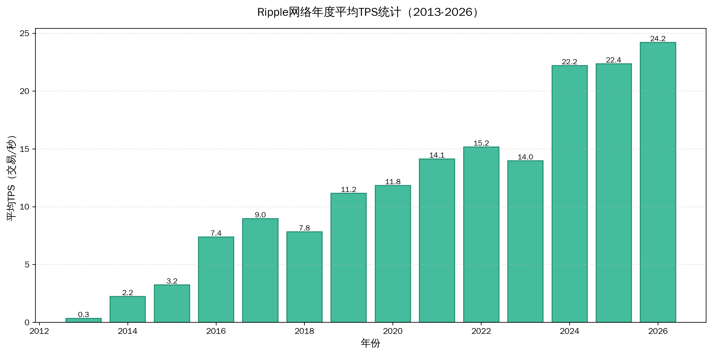

_数据来源:XRP Ledger 公开账本数据,作者统计整理_

然而,需客观指出 Ripple 的 TPS 与传统中心化支付网络仍存在差距。Visa 网络的峰值 TPS 可达 24,000 交易/秒,支付宝在"双十一"高峰期 TPS 突破 50 万笔/秒,Ripple 的 1500 TPS 理论值、实际运行的 25 TPS 平均值与数百 TPS 峰值,相较之下存在数量级差距。但这一对比需结合场景理解:Visa 与支付宝服务的是全球数十亿用户的零售支付,交易频次极高;Ripple 定位于金融机构间的跨境批发支付与高价值汇款,交易频次相对较低,当前的 TPS 已满足现有业务需求。未来若个人零售跨境支付规模化爆发,Ripple 需进一步提升 TPS 以应对,这将是技术演进的持续方向。

账本间隔时间的稳定性亦值得关注。传统区块链网络如比特币,账本间隔(出块时间)受算力波动影响,实际间隔在 8-12 分钟间波动;以太坊在转向 PoS 后,出块时间稳定在约 12 秒,但仍受验证者参与度影响。Ripple 的账本间隔从早期的 20-30 秒优化至当前的 3.9 秒,且波动极小,标准差低于 0.5 秒,这一稳定性源于 RPCA 的确定性共识机制——共识过程分为固定的四个阶段,每个阶段的时长可预测,不依赖随机性竞争,因而确认时间可控。对跨境支付而言,确认时间的稳定性与绝对速度同等重要——用户可准确预期到账时间,规划资金使用,这是实时支付体验的基础。

**业务增长轨迹:交易量与账户数的指数式扩张**

交易量与账户数是衡量网络商业化成功度的关键指标。交易量反映网络的实际使用强度,账户数反映生态参与者的规模。Ripple 网络的业务增长呈现指数式扩张特征,验证了其商业化方案的市场接受度。

年度交易总数从 2013 年的 1070 万笔增至 2025 年的 6.63 亿笔,13 年间增长约 62 倍,年均复合增长率约 38%。这一增速远高于传统跨境支付行业的个位数年增长率,反映出 Ripple 在特定走廊与细分场景的渗透力。增长并非线性,而是呈现阶段性跃升:2017 年交易量较 2016 年增长 2.3 倍,对应 xRapid 产品发布与早期商业化;2024-2025 年交易量连续两年保持在 6.6 亿笔以上的高位,对应 ODL 方案在全球主要走廊的规模化应用。2026 年虽仅统计至 1 月 6 日,但从趋势外推,全年交易量有望维持甚至超越 2025 年水平。

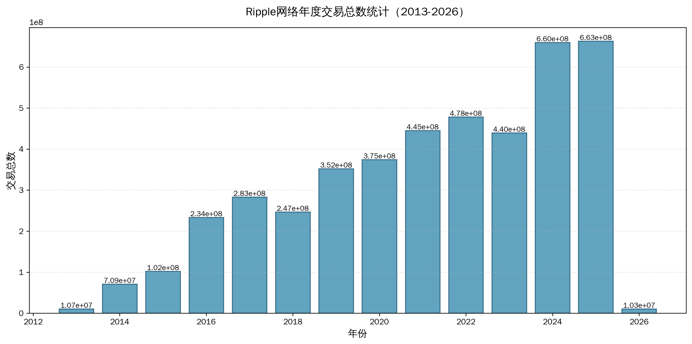

_数据来源:XRP Ledger 公开账本数据,作者统计整理_

年度支付交易数(剔除非支付类交易如账户管理、信任设置等)从 2013 年的 122 万笔增至 2024 年的 3.81 亿笔,占交易总数的比例从 11.4%提升至 57.7%。支付交易占比的提升反映出 Ripple 网络从早期的技术测试转向实际商业应用的结构性转变。早期阶段,大量交易为账户创建、信任线设置等基础设施操作;随着生态成熟,支付成为网络的主要用途,契合 Ripple 的跨境支付定位。2024 年的 3.81 亿笔支付交易,若按全年 365 天计算,日均支付约 104 万笔,这一规模虽不及 Visa 的日均数亿笔,但在跨境批发支付领域已具备可观体量。

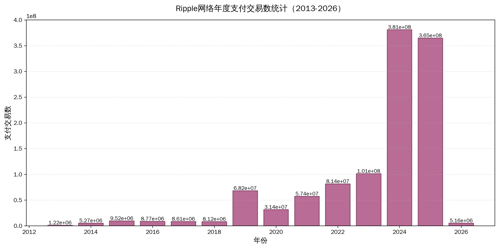

_数据来源:XRP Ledger 公开账本数据,作者统计整理_

年度新增账户数呈现波动式增长,2021 年与 2025 年出现两次高峰,分别达到 172 万与 175 万新增账户。2021 年的高峰对应加密资产市场的牛市,XRP 价格上涨吸引大量投资者与投机者开立账户;2025 年的高峰则对应 SEC 诉讼和解、监管不确定性消除后,金融机构与用户信心回归,业务拓展加速。账户数的周期性波动反映出 Ripple 网络受加密资产市场情绪与监管政策影响较大,这是当前阶段的局限性——理想状态下,跨境支付网络的增长应更多由实际支付需求驱动,而非资产价格投机或监管事件的短期冲击。

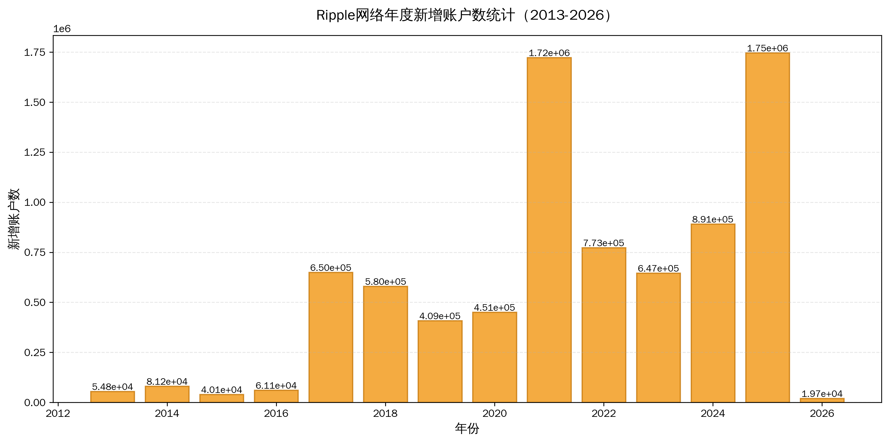

_数据来源:XRP Ledger 公开账本数据,作者统计整理_

**用户与账户生态演进:网络参与度的动态变化**

账户数反映网络的潜在用户规模,活跃度则揭示实际使用强度。Ripple 网络的用户生态呈现"规模扩张与活跃分化并存"的特征,既验证了商业化推广的成效,也暴露出用户留存与深度使用的挑战。

每日新增账户数的波动性反映出网络扩张的节奏。早期阶段(2013-2016 年),日均新增账户数仅数十至数百个,网络处于小范围试运行状态。2017 年后,随着 xRapid 商业化与加密资产市场升温,新增账户数出现跳跃式增长,单日峰值曾突破 3 万个账户。2021 年与 2025 年的高峰期,日均新增账户数稳定在 4000-8000 区间,累计年度新增分别达到 172 万与 175 万。高峰期的出现与外部事件强相关:2021 年对应全球加密资产牛市,XRP 价格从 0.2 美元上涨至 1.8 美元,投资热情高涨;2025 年对应 SEC 诉讼和解,监管不确定性消除,金融机构与用户信心回归。新增账户数的周期性波动凸显出 Ripple 网络当前阶段对外部市场情绪的敏感性,这与其"跨境支付基础设施"的理想定位存在偏差——理想状态下,网络增长应由跨境支付的实际需求驱动,而非资产价格投机或监管事件的短期冲击。

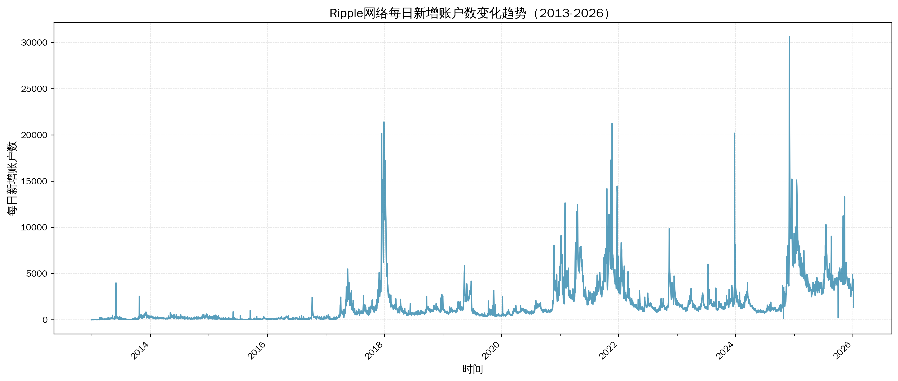

_数据来源:XRP Ledger 公开账本数据,作者统计整理_

活跃用户数与活跃账户数的演变揭示了网络的实际使用深度。活跃用户数从 2013 年的数千人增至 2025 年峰值的约 25 万人,活跃账户数从数千增至约 20 万。需注意,此处"活跃"定义为在统计周期内至少发起一笔交易,门槛较低,实际的高频用户占比可能更小。从时间序列数据可观察到,活跃用户数在 2019-2020 年间达到峰值约 25 万人,此后回落并稳定在 15-20 万区间,2021-2022 年再次回升至 20 万以上,2023-2024 年回落,2025 年重新攀升。这种波动与新增账户数的周期性高度一致,表明大量新注册账户在短期活跃后进入休眠状态,网络的用户留存率存在提升空间。

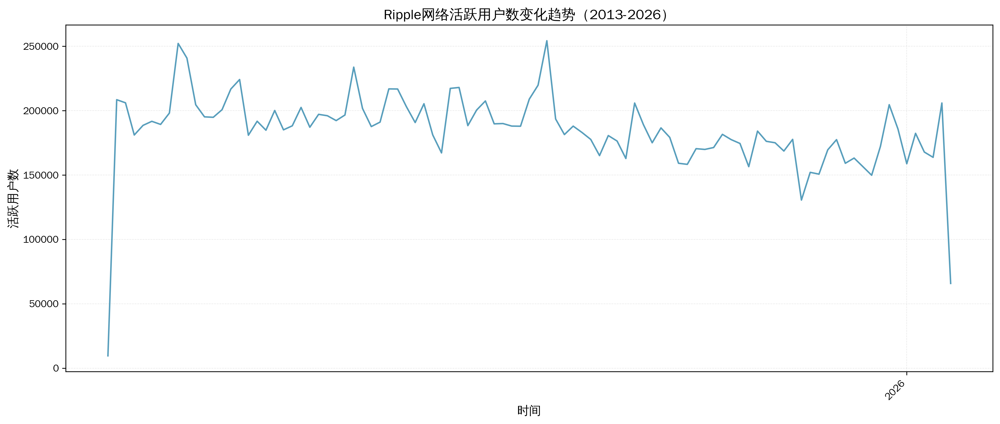

_数据来源:XRP Ledger 公开账本数据,作者统计整理_

活跃账户数的趋势与活跃用户数基本一致,但数值略低,这符合"单用户多账户"的常见模式。活跃账户数在 2015-2020 年间稳步增长,2020-2021 年达到峰值约 20 万个账户,此后回落至 15 万左右并趋于稳定。值得关注的是,2023-2024 年活跃账户数出现显著下滑,可能与 SEC 诉讼期间美国交易所下架 XRP、流动性下降、部分用户转向其他平台有关。2025 年诉讼和解后,活跃度快速恢复,验证了监管不确定性对用户行为的直接影响。

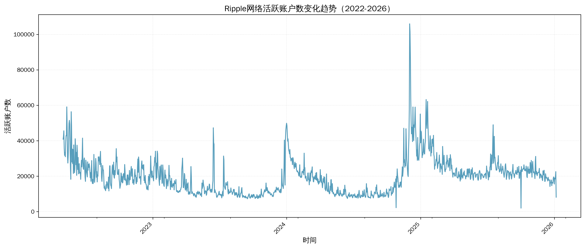

_数据来源:XRP Ledger 公开账本数据,作者统计整理_

活跃率(活跃账户数/总账户数)的演变反映网络成熟度。早期阶段(2013-2015 年),活跃率接近 100%——几乎所有账户均活跃,这符合早期采纳者高参与度的特征。随着网络规模扩大,活跃率逐步下降至 10-20%区间,这是网络成熟的常见现象——大量账户创建后,仅在特定场景或周期使用,并非每日活跃。活跃率的稳定维持在 10-20%,表明 Ripple 网络已形成一定规模的核心用户群,支撑日常交易量。然而,80-90%的休眠账户亦暴露出用户留存与深度使用的挑战——如何将一次性注册用户转化为长期活跃用户,如何提升跨境支付的使用频次,这是 Ripple 商业化推广需持续攻克的难题。

用户生态的结构性分化在不同时期呈现差异特征。2017-2018 年的用户增长主要由加密资产投资者驱动,这部分用户的主要行为是买卖 XRP、参与价格投机,而非使用 RippleNet 进行跨境支付。2019-2020 年,随着 ODL 方案在日本-菲律宾、欧洲-泰国等走廊的商业化应用,金融机构用户与实际跨境汇款用户的占比提升,但绝对规模仍相对有限。2024-2025 年,监管明朗化与 RLUSD 稳定币的推出,吸引更多风险厌恶型金融机构接入,用户结构进一步向"跨境支付实际需求"倾斜,但投机属性的用户仍占相当比例。这种双重属性的用户结构,既为 Ripple 带来市场关注度与流动性,也使其网络增长的可持续性受到资产价格波动的制约。

**资金流动与成本结构:规模效应的逐步显现**

资金流动规模是衡量跨境支付网络商业价值的直接指标,成本结构则体现技术方案的经济优势。Ripple 网络的资金流动呈现指数式增长,手续费结构验证了其低成本特性,但与传统支付网络的规模相比仍存在数量级差距。

每日支付金额数据揭示了 Ripple 网络的资金流动规模。早期阶段(2013-2016 年),日均支付金额仅数百万至数千万 XRP,换算为法币约数万至数十万美元,网络主要用于技术测试与小额试点。2017 年后,随着 ODL 商业化应用,支付金额出现跳跃式增长,2018-2019 年日均支付金额提升至数亿 XRP(约数千万至亿美元)。2020-2021 年,支付金额进一步增长,单日峰值曾达到 70 亿 XRP(按当时 XRP 价格约 0.5 美元计算,约合 35 亿美元)。2024-2025 年,日均支付金额稳定在数亿 XRP 量级,单日峰值达到 11.6 亿 XRP(按当时 XRP 价格约 2 美元计算,约合 23.2 亿美元)。值得注意的是,支付金额的峰值波动性较大,这与 XRP 价格的剧烈波动、大额交易的集中出现、做市商的流动性调整等因素相关。

变化趋势.png)

_数据来源:XRP Ledger 公开账本数据,作者统计整理_

将支付金额换算为法币规模,可与传统跨境支付网络对比。假设 2024-2025 年 XRP 平均价格约 1-2 美元,日均支付金额数亿 XRP 对应数亿至十亿美元区间。全年累计支付规模约千亿至数千亿美元量级。这一规模虽不及 SWIFT 日均 5 万亿美元的资金流量(全年约 1800 万亿美元),但在特定走廊的占有率已达可观比例。例如,日本至菲律宾汇款走廊年规模约 18 亿美元,若 Ripple 在该走廊的市场份额达到 10-20%,对应年交易量约 2-4 亿美元,单日约 50-110 万美元,这与链上数据的数量级基本吻合。Ripple 官方披露的 ODL 累计交易量达 700 亿美元(截至 2024 年 Q4),日均外汇市场覆盖率超过 90%,这些数据验证了 Ripple 在特定走廊的商业化成功,但亦凸显其与全球跨境支付总量的巨大差距——Ripple 当前阶段仍是"细分市场的挑战者",而非"全球市场的主导者"。

每日手续费总额数据体现 Ripple 的低成本特性。早期阶段,日均手续费仅数 XRP 至数十 XRP(约数美分至数美元),对应极低的交易量。2017 年后,随着交易量增长,手续费总额提升至每日数十至数百 XRP。2020-2021 年,日均手续费达到峰值约 1000-1500 XRP(按当时价格约 500-1500 美元)。2024-2025 年,日均手续费稳定在 300-600 XRP(约 600-1200 美元)。相较数亿美元的日均支付金额,手续费率低于 0.001%——以日均支付 5 亿美元、手续费 1000 美元计算,费率为 0.0002%。这一成本水平远低于传统跨境支付的 1-3%综合成本,甚至低于第三方支付平台的 0.4%-3.49%费率,验证了 Ripple 技术方案的成本优势。

变化趋势.png)

_数据来源:XRP Ledger 公开账本数据,作者统计整理_

手续费结构的稳定性是 Ripple 相较传统支付网络的显著优势。传统跨境支付的手续费包含固定费用(电讯费、中间行费用)与比例费用(汇率溢价、服务费),且随交易路径、币种、金额而差异巨大,成本不透明。Ripple 的手续费固定为 0.00001 XRP/笔(约 0.00002 美元),无论交易金额大小、币种类型、支付路径,费率恒定,成本可预期。这种透明性与稳定性降低了金融机构的成本核算复杂度,增强了客户对支付成本的信任。此外,Ripple 的手续费机制设计具有"反垃圾交易"的防护功能——极低但非零的手续费防止恶意用户通过大量无意义交易占用网络资源,同时又不会对正常支付用户构成经济负担,这一设计体现了技术方案对经济激励的精巧平衡。

然而,需客观指出链上手续费数据的局限性。XRPL 的手续费仅为链上交易的成本,不包含 ODL 方案中法币与 XRP 兑换环节的做市商费用、交易所费用、金融机构服务费。完整的端到端成本应包含:法币兑换为 XRP 的费用(通常为 0.2-0.5%)、XRPL 链上手续费(可忽略)、XRP 兑换为目标货币的费用(通常为 0.2-0.5%)、金融机构服务费(通常为 0.3-0.5%),综合费率约 0.7-1.5%。虽仍显著低于传统模式的 2-5%,但并非链上数据显示的 0.0002%。因此,解读手续费数据时需区分"链上交易成本"与"端到端支付成本",避免低估实际费用水平。

资金流动规模与成本结构的演进,共同验证了 Ripple 网络的规模效应逐步显现。交易量增长 62 倍、支付金额增长数千倍,而手续费率保持恒定极低水平,说明网络的边际成本接近零,规模扩张不会导致成本上升,这是技术基础设施相较传统人工密集型基础设施的核心优势。随着网络覆盖范围扩大、交易量持续增长,规模效应将进一步强化 Ripple 的成本竞争力,为金融机构与用户创造更大价值。

**技术稳定性验证:账本连续性与交易成功率**

技术稳定性是支付网络的生命线。金融机构与用户对支付系统的可靠性要求极高,任何中断或故障均可能导致资金损失与信任危机。Ripple 网络运行 13 年的数据验证了其技术稳定性,为商业化应用提供了可靠保障。

账本连续性是区块链支付网络可靠性的基础指标。XRPL 自 2013 年 1 月 2 日创世区块以来,未出现过账本中断或分叉。截至 2026 年 1 月 6 日,累计生成账本超过 8700 万个,平均每日生成约 2.1 万个账本。每日账本数量的时间序列数据显示,早期阶段(2013-2015 年)日均账本数量约 3000-5000 个,对应较长的账本间隔时间(20-30 秒);随着共识算法优化,2016 年后日均账本数量提升至 8000-10000 个,2018 年后稳定在 1.8-2.2 万个区间,对应账本间隔缩短至 4 秒左右。账本数量的稳定性反映出共识算法的可预测性——无论交易量高峰还是低谷,账本生成速度保持恒定,不受网络拥堵影响,这是实时支付应用的关键保障。

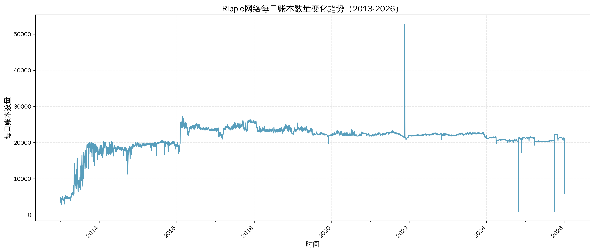

_数据来源:XRP Ledger 公开账本数据,作者统计整理_

账本间隔时间的演进验证了 RPCA 共识算法的性能优化轨迹。早期阶段(2013-2015 年),账本间隔时间在 20-30 秒区间波动,反映出初期系统的优化空间较大。2016-2018 年,账本间隔逐步缩短至 10-15 秒。2019 年后,账本间隔收敛至 3.5-4.5 秒区间,接近 RPCA 理论设计的 3-5 秒目标值。2021-2026 年,账本间隔稳定维持在 3.9 秒左右,标准差低于 0.5 秒,无论交易量峰值还是低谷,波动极小。这一稳定性源于 RPCA 的确定性共识机制——共识过程分为固定的四个阶段,每个阶段的时长可预测,不依赖随机性竞争,因而确认时间可控。相较比特币出块时间在 8-12 分钟间波动、以太坊出块时间虽稳定但仍需约 12 秒,Ripple 的 3.9 秒账本间隔在速度与稳定性上均具备比较优势。

变化趋势.png)

_数据来源:XRP Ledger 公开账本数据,作者统计整理_

账本间隔的稳定性对跨境支付体验的影响不容小觑。传统跨境支付的清算周期以天计,用户已习惯"不确定性"——汇款后,无法准确预知到账时间,仅能依赖银行的估算(3-5 个工作日)。Ripple 的 3.9 秒账本间隔,使支付确认时间从"天级不确定"变为"秒级确定",用户可在手机 APP 上实时看到交易状态从"待确认"变为"已确认",这种确定性极大改善了支付体验,特别对紧急汇款场景(如医疗费用、紧急家庭支援)至关重要。金融机构亦可基于稳定的确认时间,优化流动性管理——资金到账时间可预测,资金规划精度提升,周转效率改善。

交易成功率验证了系统的健壮性。每日成功交易数占交易总数的比例长期维持在 80%以上,2021-2026 年间稳定在 77-82%区间。需注意,此处"失败交易"并非系统故障导致,而是包含用户账户余额不足、交易参数错误、重复提交等正常拒绝场景,这些拒绝是系统正确执行验证规则的体现,而非技术缺陷。从每日成功交易数的时间序列可观察到,成功交易数的增长轨迹与交易总数高度一致,验证了系统在交易量扩张过程中的处理能力未出现瓶颈。真正因共识失败或网络中断导致的交易丢失事件,在 XRPL 历史上极为罕见,公开记录中未见重大安全事故或资金损失事件,这一安全记录强化了金融机构对 Ripple 技术可靠性的信任。

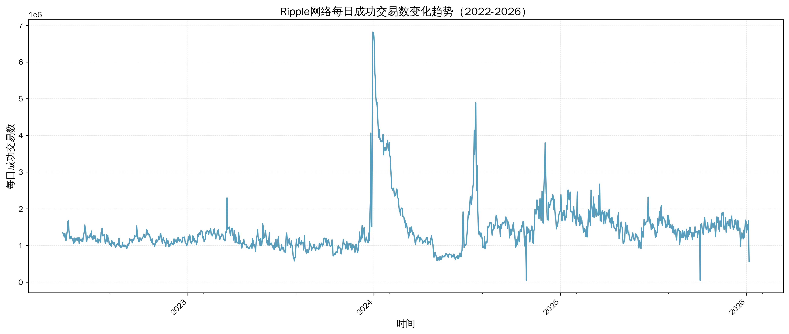

_数据来源:XRP Ledger 公开账本数据,作者统计整理_

每账本交易数反映网络的承载能力与利用率。早期阶段,每账本交易数仅 0.003-0.01 笔,对应极低的网络活跃度。2017 年后,随着商业化推进,每账本交易数逐步提升,2020-2021 年达到约 10-30 笔/账本,2024-2025 年进一步提升至 30-100 笔/账本,峰值曾达到 115 笔/账本。理论上,RPCA 可支持每账本数百笔交易(对应 1500 TPS),当前实际水平远低于理论上限,说明网络处于非饱和状态,具备充足的扩容余地。这一"冗余容量"为未来业务增长提供了缓冲——即便交易量再增长 5-10 倍,网络仍可在不改变基础架构的前提下承载,金融机构无需担心网络拥堵导致交易延迟或手续费飙升(如以太坊在 DeFi 热潮期间的 Gas 费暴涨),支付成本的可预测性增强。

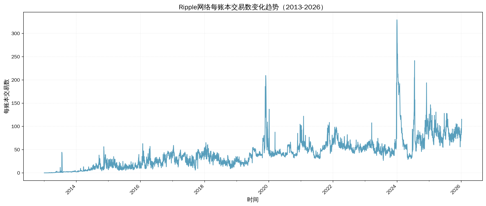

_数据来源:XRP Ledger 公开账本数据,作者统计整理_

技术稳定性的长期验证构成 Ripple 相较新兴区块链项目的显著优势。许多区块链支付方案停留在概念验证(PoC)或小规模试点阶段,技术可靠性未经大规模、长周期检验。Ripple 网络运行 13 年、累计生成 8700 万个账本、处理数十亿笔交易、无重大安全事故,这一"实战记录"为金融机构的采纳决策提供了信心基础。金融行业对技术方案的评估,不仅关注性能指标(TPS、确认时间),更关注可靠性指标(故障率、恢复能力、历史记录),Ripple 在后者的积累是其核心竞争力之一。

**综合分析:多指标协同验证效率优化成效**

前述各维度的分项分析,从不同角度验证了 Ripple 网络的运行效果。为更直观呈现多指标的协同演进,本节通过综合对比图,展示关键指标的相互关联与整体趋势。

六个关键指标的综合对比揭示了 Ripple 网络发展的阶段性特征。图 4-20 以 3×2 子图布局,并置展示每日交易总数、系统 TPS、活跃用户数、每日支付金额、账本间隔时间、每日新增账户数六个核心指标的 2013-2026 年时间序列。通过多指标对比可观察到:

第一,交易总数与 TPS 的增长高度一致,验证了系统吞吐能力随业务需求同步提升。2013-2016 年两者均处于低位,2017 年后同步跳跃式增长,2024-2025 年达到新高位并趋于稳定,反映出 Ripple 网络从技术测试转向商业应用的清晰演进轨迹。

第二,活跃用户数与交易总数的增长存在时滞与波动差异。交易总数呈现较为平滑的增长曲线,而活跃用户数波动性更大,峰谷明显。这一差异反映出"用户数增长"与"交易量增长"的脱钩现象——新用户涌入后,并非所有用户均长期活跃,部分用户在短期活跃后休眠,但核心用户的交易频次提升弥补了流失用户的交易量缺口,使得交易总数仍保持增长。这提示 Ripple 需在用户获取的同时,强化用户留存与深度使用策略。

第三,每日支付金额的波动性显著高于交易总数,反映出大额交易对资金流量的主导作用。单笔大额跨境支付(如金融机构间的批发结算、企业的大额贸易支付)可能占据每日支付金额的相当比例,而数量众多的小额个人汇款虽在交易笔数上占优,但在金额上占比有限。这种结构特征符合跨境支付的"二八法则"——20%的大额交易贡献80%的资金流量。Ripple 在大额批发支付场景的应用,是其资金流量规模的重要支撑。

第四,账本间隔时间的稳定性与其他指标的波动形成鲜明对比。无论交易量高峰(2024-2025 年)还是低谷(2013-2015 年),账本间隔均维持在设计目标范围内,体现出 RPCA 共识算法的确定性与抗干扰能力。这一稳定性是实时支付体验的基石,确保用户在任何时段发起支付,均可获得秒级确认。

第五,每日新增账户数的高波动性与外部市场事件高度相关。2017 年、2021 年、2025 年的三次增长峰值,分别对应 xRapid 发布、加密资产牛市、SEC 诉讼和解,验证了 Ripple 网络当前阶段对外部市场情绪与监管政策的敏感性。理想状态下,跨境支付基础设施的增长应由内生需求驱动,降低对外部事件的依赖,这需要 Ripple 持续深化商业化应用,扩大跨境支付的实际使用场景。

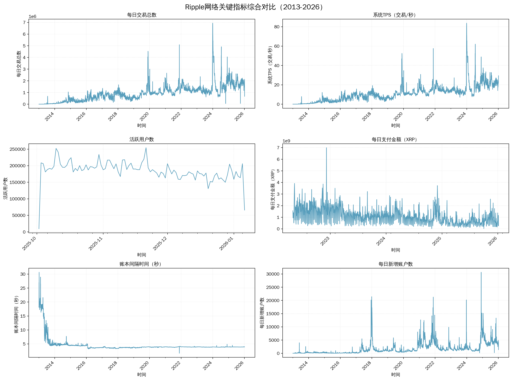

_数据来源:XRP Ledger 公开账本数据,作者统计整理_

年度统计汇总图从另一角度呈现 Ripple 网络的宏观演进趋势。图 4-21 以 2×2 柱状图布局,展示 2013-2026 年各年度的交易总数、支付交易数、新增账户数、平均 TPS 四个汇总指标。年度视角的分析消除了日度数据的短期波动,更清晰揭示长期趋势:

年度交易总数从 2013 年的 1070 万笔稳步增长至 2025 年的 6.63 亿笔,增长曲线呈现指数特征,验证了网络规模效应的逐步显现。年度支付交易数的增长斜率更陡,2024-2025 年达到 3.8 亿笔左右,占交易总数的比例从早期的 11%提升至 57%,反映出 Ripple 网络从"基础设施搭建"转向"支付业务主导"的结构性变化。年度新增账户数的波动性在年度视角下依然显著,2021 年与 2025 年的高峰印证了外部事件的强影响力。年度平均 TPS 的持续提升(从 0.3 到 24.2),验证了技术性能的长期优化效果。

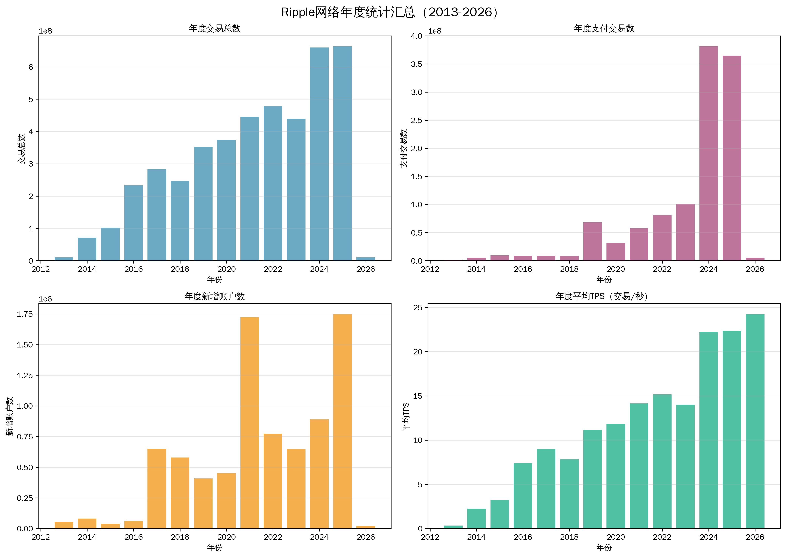

_数据来源:XRP Ledger 公开账本数据,作者统计整理_

综合多指标分析,Ripple 网络在 13 年运行期间,实现了技术性能、业务规模、用户生态的协同提升,验证了区块链技术在跨境支付领域的可行性与商业价值。系统 TPS 增长 80 倍、交易量增长 62 倍、账本间隔优化至 3.9 秒且稳定运行、资金流量达到数十亿美元日均规模、手续费率低于 0.001%,这些数据共同证明,Ripple 技术方案在成本、时效、可靠性三个维度均实现了对传统跨境支付模式的显著优化。

然而,数据亦揭示了 Ripple 网络面临的挑战与局限。网络规模虽持续增长,但与全球跨境支付总量相比仍存在数量级差距;用户生态虽已形成,但活跃率偏低、休眠账户占比高,用户留存存在提升空间;业务增长受加密资产市场周期与监管政策影响较大,内生增长动力有待增强;链上交易数据无法完全区分商业支付与投机交易,实际跨境支付规模可能被高估。这些局限性的深入剖析,将在 4.3.3 节与第五章展开。

**实证数据的局限性与解读谨慎**

上述数据基于 XRP Ledger 的公开账本,具备可验证性与透明性,但解读时需注意以下局限:

第一,账本数据仅反映链上交易,无法区分交易的商业属性——某笔 100 万 XRP 的转账,可能是金融机构的跨境支付,也可能是交易所的内部调拨,甚至是投机者的资产转移。因此,交易量数据与实际跨境支付规模存在偏差,部分交易可能与 Ripple 的跨境支付业务定位无关。Ripple 官方披露的 ODL 交易量(700 亿美元)是筛选后的商业支付数据,相较链上全部交易量,更准确反映跨境支付业务规模。

第二,账户数与用户数存在多对多关系。单个用户可能拥有多个账户(如个人账户、企业账户、交易所账户),单个账户亦可能被多个用户共享(如交易所的托管账户代表数千用户)。因此,账户数增长并不等同于实际用户数增长,活跃账户数亦不等同于活跃用户数,数据需审慎解读。

第三,业务增长受加密资产市场周期影响较大。2021 年与 2025 年的账户数高峰,部分源于 XRP 价格上涨吸引的投机需求,而非实际跨境支付需求的增长。这一现象反映出 Ripple 当前阶段的双重属性——既是跨境支付基础设施,又是加密资产投资标的,两者互相影响,前者的商业价值被后者的投机属性部分掩盖。理想状态下,Ripple 网络的增长应更多由跨境支付刚需驱动,降低对资产价格波动的敏感度,这需要 ODL 等商业应用的持续深化与监管环境的进一步明朗。

尽管存在上述局限,公开账本数据仍为评估 Ripple 技术方案的实际运行效果提供了客观依据。13 年间系统 TPS 增长 80 倍、交易量增长 62 倍、账本间隔优化至 3.9 秒且稳定运行、无重大安全事故,这些数据共同验证了 Ripple 技术架构的可行性、可扩展性与可靠性,为其在跨境支付领域的商业化应用提供了坚实的技术基础。

综合四个维度的对比分析与网络运行数据实证,Ripple 在成本、时效、信息透明度方面相较传统模式具备显著优势,特别在中小规模、小额高频支付场景,优势更为突出;在覆盖范围方面,Ripple 存在明显劣势,限制了其普适性。这种差异化的优劣分布决定了 Ripple 与传统模式的共存格局——Ripple 在特定走廊、特定场景建立竞争优势,传统模式在全球普适性、大额支付中保持主导。

### 4.3.2 优势总结:效率提升的关键管理要素

Ripple 对跨境支付效率的优化并非单一维度的改进,而是技术、组织、资产三个维度协同作用的结果。从管理学视角提炼关键要素,可为理解区块链技术如何优化传统金融基础设施提供普适性启示。

**技术维度:共识算法与自动化执行**

技术创新是效率提升的基础。RPCA 共识算法将交易确认时间压缩至 3-5 秒,相较 PoW 的 10 分钟、PoS 的 15 秒,实现数量级提升。秒级确认的实现依赖于算法设计的创新——通过信任模型替代经济激励模型,在保障安全性的前提下大幅降低共识开销。分布式账本实现信息流与资金流的统一,消除了传统体系中信息传递与资金清算的割裂,从根本上缩短了清算周期。智能合约的自动化执行减少了人工干预环节,降低了操作成本与错误率,7×24 小时运行消除了工作日与时区限制,提升了系统可用性。

关键管理要素:技术创新必须针对场景痛点,而非为创新而创新。Ripple 的技术设计紧密围绕跨境支付的核心需求——速度、成本、可靠性——展开,每项技术选择(联盟链而非公链、RPCA 而非 PoW、准入控制而非完全开放)均基于场景约束(金融行业的监管要求、机构客户的风险偏好)做出权衡。这种"场景驱动的技术选型"是技术创新转化为商业价值的关键。

**组织维度:网络结构与协作机制**

组织创新重构了参与方关系。传统多级代理的层级结构被去中心化的点对点网络替代,协调成本大幅降低。交易成本理论的三个维度——搜寻成本、谈判成本、执行成本——均因网络结构的扁平化与自动化而下降。Nostro 账户的流动性管理从"预置资金"转向"按需流动性",释放了金融机构的资本效率,这一转变不仅是技术实现,更是组织模式的创新——从资本密集型转向技术密集型,从库存管理转向流程优化。

网络效应是组织机制发挥作用的前提。Ripple 的覆盖范围虽不及 SWIFT,但在特定走廊的深耕建立了局部网络效应,确保参与该走廊的成员能够获得显著价值。这种"走廊深耕"策略体现了网络扩张的阶段性——相较于追求全面覆盖,优先在高频走廊建立临界规模,形成示范效应,再逐步扩散至其他市场,降低了网络冷启动的难度。

关键管理要素:组织创新需平衡去中心化与可控性。完全去中心化的公链虽在理念上契合区块链精神,但金融行业的强监管属性、客户身份识别(KYC)与反洗钱(AML)的合规要求,决定了金融机构难以接受匿名性与无准入门槛的架构。Ripple 的"适度去中心化"——通过 UNL 机制赋予金融机构选择信任节点的自主权——在创新与合规之间实现平衡,这种务实主义是区块链金融应用的重要经验。

**资产维度:桥接货币与流动性工具**

资产创新解决了流动性难题。XRP 作为桥接货币,简化了货币对组合,降低了汇率风险暴露窗口;作为流动性工具,消除了 Nostro 账户沉淀,实现"按需流动性"管理。这一创新的价值不仅在于技术可行性,更在于商业模式的重塑——金融机构从"资本持有者"转变为"流动性管理者",资本利用率提升,商业模式从重资产转向轻资产。

资产机制的效率贡献依赖于生态支撑。XRP 的桥接功能需要做市商提供充足的流动性,ODL 的成本优势需要交易所提供低滑点的兑换服务,RLUSD 稳定币的推出需要储备资产的托管与审计。Ripple 通过培育生态伙伴——激励做市商、合作交易所、发行稳定币——构建支撑资产机制的基础设施,这种"生态建设"能力是资产创新落地的保障。

关键管理要素:资产创新需应对外部不确定性。XRP 价格波动、监管法律地位不确定、流动性深度受市场情绪影响,这些外部变量对 ODL 方案的稳定性构成挑战。Ripple 通过推出稳定币(RLUSD)、加强合规建设、与监管机构沟通等措施,逐步降低外部不确定性,体现了创新者面对复杂环境的适应性策略。

**技术-组织-资产协同:系统性创新的启示**

Ripple 的效率优化并非单一要素的突破,而是三个维度的系统性创新。技术层面的秒级确认,若无组织层面的网络扁平化,仍需经过多级中转,优势无法发挥;组织层面的去中介化,若无资产层面的流动性工具,Nostro 账户问题依然存在;资产层面的桥接货币,若无技术层面的快速传输,汇率风险暴露窗口无法缩短。三者相互依存、协同发力,共同构成 Ripple 的竞争优势。

这一启示对跨境支付行业的普适性优化策略具有重要意义。单一维度的改进——如 SWIFT gpi 仅优化信息层、清算所仅改进结算层——难以突破传统体系的结构性制约。系统性创新要求技术、组织、资产三个维度同步变革,这将是第六章提炼普适性优化策略的核心逻辑。

### 4.3.3 面临的挑战与约束:监管不确定性、生态协作难题、传统路径依赖

Ripple 在效率优化方面的显著优势,并未转化为对传统跨境支付体系的全面替代,其市场渗透率仍相对有限。这一现象背后,是监管、生态、技术等多层面障碍的制约。客观剖析这些挑战与约束,既是对 Ripple 案例的全面评估,也为第五章的深度障碍分析与第六章的策略提炼提供铺垫。

**监管不确定性:法律地位模糊与合规成本上升**

加密资产的监管在全球范围内尚未形成统一共识,各国对数字资产的法律定性、交易监管、税收政策存在显著差异。XRP 的法律地位争议是 Ripple 面临的最大监管挑战。2020 年 12 月,美国 SEC 对 Ripple Labs 提起诉讼,指控 XRP 构成未注册证券,违反美国证券法。SEC 主张,XRP 的发行与销售符合证券的 Howey 测试标准:Ripple 通过销售 XRP 为公司融资,投资者购买 XRP 的预期回报依赖 Ripple 的努力(如技术开发、市场推广),因此 XRP 应被视为证券,需遵守证券法的注册与披露要求。

诉讼对 Ripple 业务造成直接冲击。多家美国加密货币交易所在诉讼期间下架 XRP 交易,导致美国市场的 XRP 流动性骤降,ODL 方案在美国的推广受阻。部分金融机构因合规顾虑,暂缓接入 RippleNet,观望司法进展。2023 年 7 月,联邦法院作出部分裁决,认定 XRP 在二级市场的程序化销售不构成证券,但 Ripple 向机构投资者的直接销售仍存在争议。这一裁决为 XRP 的法律地位提供了部分澄清,但争议尚未完全解决,上诉程序可能持续数年。

根据 Ripple 博客数据,监管相关话题的提及频率在诉讼期间显著上升,2020-2023 年间,监管机构(regulatory bodies)在博客中被频繁提及,反映出监管问题对 Ripple 战略的重塑。Ripple 采取两方面应对:一是加强与监管机构的沟通,强调 RippleNet 的监管友好性——准入控制、KYC/AML 合规、交易可追溯——以区别于匿名性公链;二是推进国际化布局,在监管环境相对友好的亚太(新加坡、日本)、欧洲(英国、瑞士)、中东(阿联酋)市场加大投入,降低对美国市场的依赖。RLUSD 稳定币的推出亦被视为合规策略的组成部分——稳定币受到更明确的监管框架约束,相较 XRP 的法律模糊地带,RLUSD 在合规性上更具确定性。

监管不确定性的影响不限于法律诉讼,更体现为合规成本的上升与市场信心的波动。金融机构在采纳 Ripple 方案前,需评估法律风险、咨询合规顾问、调整内部政策,决策周期延长。加密资产市场对监管消息高度敏感,SEC 诉讼消息公布后,XRP 价格在数日内暴跌超过 50%,价格波动加剧了 ODL 方案的汇率风险,削弱了成本优势。全球监管差异导致 Ripple 需在不同国家采取差异化合规策略,增加了运营复杂度与成本。

这一挑战为第五章的监管与合规层面障碍分析提供切入点。区块链跨境支付的推广,不仅需要技术创新,更需要监管框架的同步演进。监管滞后与法律不确定性,是所有区块链金融应用面临的共性挑战。

**生态协作难题:网络规模劣势与利益协调成本**

网络效应的双刃剑特征在 Ripple 案例中充分显现。网络规模是价值的源泉,但突破临界规模需要克服协作难题。Ripple 连接 300 余家金融机构,相较 SWIFT 的 11,000 余家,差距达数十倍。网络规模劣势限制了 RippleNet 的普适性——若收款行未接入 RippleNet,支付仍需回退至传统代理行模式,Ripple 的效率优势无法发挥。这形成恶性循环:因覆盖不足,金融机构接入意愿低;因接入不足,覆盖持续受限。

生态协作的难点在于参与方的利益协调。传统代理行网络中,中间行通过手续费分成获利,对去中介化的 Ripple 方案存在天然抵触。部分大型国际银行既是 SWIFT 的股东,又是代理行网络的核心节点,采纳 Ripple 意味着侵蚀自身既得利益,动力不足。中小银行虽对降低成本有强烈需求,但受限于技术能力与资源投入,接入 RippleNet 需要系统改造、员工培训、双轨运行(同时维护 SWIFT 与 RippleNet),转换成本高昂。金融机构与做市商之间的利益分配亦存在博弈——做市商提供流动性需承担 XRP 价格波动风险,若无足够激励,流动性深度不足,ODL 方案效果打折。

Ripple 通过多层次策略应对协作难题。早期采纳者激励方面,Ripple 为接入 RippleNet 的金融机构提供技术支持、市场推广、培训服务,降低接入成本;部分案例中,Ripple 通过 XRP 赠与或投资入股,与合作伙伴建立深度绑定。走廊深耕策略方面,Ripple 选择高频汇款走廊集中资源,确保这些走廊的流动性深度,形成局部网络效应后,再向周边扩散。做市商生态建设方面,Ripple 通过激励计划吸引专业做市商,确保各主要货币对的 XRP 流动性充足,降低兑换滑点。

然而,生态建设是长期工程,短期内难以突破 SWIFT 的网络锁定。网络效应的马太效应——强者恒强——使得 SWIFT 凭借先发优势与规模优势,持续巩固主导地位。Ripple 需在足够多的支付走廊证明显著的成本-效率优势,推动早期大众的规模化采纳,才能跨越创新扩散曲线的"鸿沟",这一过程可能需要十年甚至更长时间。

生态协作难题为第五章的生态与市场层面障碍分析提供素材。区块链跨境支付的推广,不仅是技术替代,更是利益格局的重构,需要协调多方参与者的动机,这是管理挑战而非技术挑战。

**传统路径依赖:SWIFT 锁定效应与技术兼容性摩擦**

路径依赖理论指出,历史选择塑造当前路径,转换成本锁定参与者,即便存在更优方案,亦难以跳出既有轨道。SWIFT 运行超过 50 年,全球金融机构已在其基础上建立了庞大的技术基础设施、操作流程、人员培训体系。这种长期投资形成"沉没成本",转换至 Ripple 意味着既有投资的部分贬值,决策者面对转换成本与收益的权衡,倾向于保守策略。

技术兼容性摩擦增加了转换难度。金融机构的内部系统(核心银行系统、支付网关、风控系统)多为十年以上的遗留系统(Legacy System),架构陈旧、文档缺失、维护困难。集成 RippleNet 需要开发 API 接口、改造数据格式、调整业务流程,系统改造周期长、风险高。部分金融机构采取"双轨制"策略——同时维护 SWIFT 与 RippleNet 通道,根据交易特征选择路径——但双轨运行增加了系统复杂度与运营成本,仅在效率提升足够显著的场景下,双轨制才具经济性。

进出金环节的摩擦成本制约了端到端效率。虽然 XRPL 账本层的传输实现秒级,但法币与 XRP 的兑换环节仍依赖传统银行账户。做市商需在银行开立账户,客户的法币需先转入做市商账户,再兑换为 XRP;目标地 XRP 兑换回法币后,需从做市商账户转出至客户账户。这些进出金环节受银行营业时间、批量处理、合规审查的限制,耗时可能达到数小时甚至 1-2 天,侵蚀了 XRPL 秒级传输的时效优势。部分国家的外汇管制政策限制加密资产的自由兑换,导致 ODL 方案无法实施,Ripple 仅能提供仅信息层的 xCurrent 方案,流动性优化效果无法发挥。

传统路径依赖体现了创新扩散的阻力。Rogers 的创新扩散理论指出,新技术从早期采纳者跨越至早期大众存在"鸿沟",许多创新在此失败。Ripple 能否跨越这一鸿沟,取决于其能否在足够多的场景证明压倒性优势,推动金融机构克服转换成本,采取行动。当前,Ripple 在特定走廊(如日本-菲律宾、欧洲-泰国)的成功案例,尚未形成全行业的规模化采纳,仍处于早期采纳阶段。

传统路径依赖为第五章的技术层面障碍分析提供线索。区块链跨境支付的推广,不仅需要技术领先,更需要克服既有系统的惯性与锁定,这要求创新者提供足够的激励(成本降低、效率提升)与支持(技术集成、过渡方案),降低转换壁垒。

## 4.4 Ripple 方案的优势与局限性分析

通过对 Ripple 案例选择依据、核心机制、实证效果的系统剖析,本章揭示了区块链技术优化跨境支付效率的机制与路径。在此基础上,运用 SWOT 分析框架,系统总结 Ripple 方案的优势(Strengths)、劣势(Weaknesses)、机会(Opportunities)与威胁(Threats),为全面评估其市场定位与发展前景提供结构化视角,亦为第五章的障碍分析与第六章的策略提炼提供承接。

**优势(Strengths)**

技术层面,Ripple 实现了秒级清算与低成本传输。RPCA 共识算法将交易确认时间稳定在 3-5 秒,相较传统跨境支付的 3-5 个工作日,时间成本降低数百倍;XRPL 的交易手续费仅 0.00001 XRP(约 0.00002 美元),边际成本接近零。分布式账本实现信息流与资金流的统一,消除了传统体系中 SWIFT 报文传递与资金清算的割裂,从根本上缩短了清算周期。理论 TPS 可达 1500,实际运行稳定维持数百 TPS,完全满足跨境支付的吞吐量需求。这些技术指标在同类区块链方案中具备比较优势——相较比特币的 7 TPS 与 10 分钟确认、以太坊的 30 TPS 与 15 秒确认,Ripple 在支付场景的适配性更优。

商业化层面,Ripple 拥有超过十年的商业化运营经验,连接 300 余家金融机构,覆盖 40 余个国家和地区,支持 40 余种货币。相较于大部分区块链项目停留在概念验证(PoC)或小规模试点阶段,Ripple 已实现规模化商业应用,积累了丰富的客户案例与运营经验。Azimo+SCB、SBI Remit 等成功案例验证了技术方案的可行性与商业价值,为市场拓展提供了示范效应。Ripple 的品牌知名度与市场影响力在区块链跨境支付领域居于领先地位,吸引了金融机构、监管机构、学术界的广泛关注。

场景适配层面,Ripple 聚焦中小规模支付场景,契合市场增长点。第一章研究背景指出,个人相关跨境支付的复合增速超过 30%,远高于 B2B 场景的 5.9%,小额高频支付是行业增长的核心驱动力。Ripple 的低成本、高时效、低门槛特性,恰与中小规模支付的需求契合。传统跨境支付在小额场景的固定费用占比过高(手续费+电讯费可达 5-6%),Ripple 将成本降至 0.5-1%,优势显著。跨境电商、个人汇款、自由职业者收入结算等场景的爆发式增长,为 Ripple 提供了广阔的市场空间。

**劣势(Weaknesses)**

网络规模层面,Ripple 连接 300 余家金融机构,相较 SWIFT 的 11,000 余家,差距达数十倍。网络规模劣势限制了 RippleNet 的普适性——若收款行未接入 RippleNet,支付仍需回退至传统代理行模式,效率优势无法发挥。覆盖范围集中于北美、欧洲、亚太部分市场,对非洲、拉美大部分地区、中东部分国家的覆盖有限,难以满足全球任意两点间的跨境支付需求。网络效应的马太效应使得 SWIFT 凭借先发优势持续巩固主导地位,Ripple 短期内难以撼动。

监管风险层面,全球监管差异导致 Ripple 需在不同国家采取差异化合规策略,增加运营复杂度与成本。部分国家对加密资产交易施加严格管制或禁止,限制了 ODL 方案的实施。虽然美国市场在 2025 年第一季度 SEC 撤销上诉后,XRP 的法律地位已获明确,但其他司法管辖区的监管框架仍在演进中,区域性监管不确定性对金融机构的采纳决策仍构成一定阻碍,部分机构因合规顾虑选择观望,影响网络扩张速度。

技术局限层面,RPCA 的去中心化程度受到质疑。由于节点依赖 UNL 进行共识,若大部分节点选择相似的 UNL(如普遍包含 Ripple 官方推荐的节点),网络实际上形成"准中心化"结构,Ripple 官方对系统的影响力较大。虽然 Ripple 鼓励金融机构自行运行验证节点以增强去中心化,但当前约 150 个验证节点中,第三方节点占比仍需提升。TPS 方面,Ripple 的 1500 TPS 虽满足当前需求,但相较传统支付网络(Visa 可达 24,000 TPS),仍存在差距,未来若交易量爆发式增长,可能面临扩展性挑战。

依赖性层面,ODL 方案依赖做市商提供流动性,若某货币对的做市商退出或流动性不足,ODL 方案效果打折。进出金环节依赖传统银行账户,受银行营业时间、合规审查、批量处理的限制,端到端时效优势受侵蚀。XRP 价格波动虽在短暂持有期内影响有限,但极端市场条件下,价格风险依然存在。这些外部依赖性限制了 Ripple 方案的稳定性与可控性。

**机会(Opportunities)**

市场增长方面,个人相关跨境支付的快速增长为 Ripple 提供广阔空间。第一章数据显示,B2C 跨境支付预计未来增速 11.1%,几乎是 B2B 的两倍;中国跨境电商 2024 年规模达 2.07 万亿元,2019-2024 年 CAGR 16.5%。全球出入境人员 2024 年达 6.1 亿人次(+43.9%),留学、旅游、跨境消费等场景的支付需求旺盛。这些市场的共同特征是小额高频、时效要求高、成本敏感,恰与 Ripple 的优势匹配。

政策支持方面,G20 于 2020 年提出跨境支付改进目标,承诺到 2027 年将跨境零售支付成本降至 1%,推动实时支付网络的互联互通。这一政策导向为 Ripple 等创新方案提供了政策窗口。各国央行数字货币(CBDC)的探索亦在推进,虽 CBDC 可能对 Ripple 构成竞争,但亦可能形成互补——Ripple 可作为不同 CBDC 之间的桥接层,实现跨国 CBDC 的互操作。部分国家对区块链技术持开放态度,新加坡、瑞士、阿联酋等国家为区块链金融应用提供"监管沙盒"与政策支持,为 Ripple 拓展市场提供友好环境。

监管环境改善方面,美国 SEC 与 Ripple 长达四年的诉讼于 2025 年第一季度迎来决定性转折。SEC 撤销上诉,法律确认 XRP 本身不是证券,罚款从最初的 1.25 亿美元降至 5000 万美元,禁令被撤销。这一历史性胜利为 Ripple 在美国市场的拓展扫清了最大的监管障碍,此前因合规顾虑观望的金融机构可重新评估 Ripple 方案的可行性。同期,美国新政府采取更开放的加密资产政策立场,任命 Paul Atkins 担任 SEC 主席,推动稳定币立法进程,SEC 亦撤销或和解了对 Coinbase、Kraken、Robinhood 等多家加密企业的执法行动,监管环境由对抗转向协作。这些积极信号增强了市场对区块链跨境支付合规性的信心,为 Ripple 的商业化进程注入强劲动力。全球范围内,英国、新加坡、阿联酋等市场亦持续完善数字资产监管框架,为 Ripple 的国际化扩展提供更清晰的合规路径。

技术演进方面,RLUSD 稳定币的推出补充了 XRP 的价格波动短板,为风险厌恶型客户提供稳定的桥接工具,扩大了 Ripple 方案的适用范围。跨链互操作技术的发展,使得不同区块链网络之间的资产转移与数据交互成为可能,Ripple 可通过跨链桥接扩展至其他区块链生态,增强网络效应。人工智能与大数据在风控、合规、客户服务中的应用,可提升 Ripple 方案的安全性与用户体验,降低运营成本。

**威胁(Threats)**

竞争加剧方面,CBDC 跨境支付项目的推进对 Ripple 构成直接威胁。中国人民银行主导的 mBridge 项目(多边央行数字货币桥),连接中国、泰国、阿联酋、沙特等国央行,利用区块链技术实现 CBDC 的跨境支付,2024 年 10 月达到 MVP 阶段,若大规模商业化,可能在部分走廊替代 Ripple。Stellar 作为与 Ripple 技术路线相近的竞争对手,亦在拓展跨境支付市场,虽当前规模不及 Ripple,但在部分细分市场(如小额个人汇款、非营利组织捐赠)形成竞争。SWIFT 推出的 gpi 服务承诺实现当日到账与费用透明,虽未根本解决传统体系的结构性问题,但对部分客户构成"足够好"的选择,延缓其向 Ripple 迁移。

监管趋严方面,全球对加密资产的监管呈收紧趋势。美国、欧盟、中国等主要经济体均在加强对加密资产交易、发行、托管的监管,反洗钱(AML)、反恐融资(CFT)、税收合规的要求提升,Ripple 需投入更多资源应对合规,运营成本上升。数据本地化与隐私保护的监管要求(如欧盟 GDPR、中国数据安全法),对跨境数据流动施加限制,XRPL 的全球账本共享模式可能与部分国家的数据主权要求冲突,需要技术与政策调整。

技术威胁方面,量子计算的发展对现有密码学构成长期威胁。XRPL 采用的 ECDSA(椭圆曲线数字签名算法)在量子计算机面前可能被破解,需要向抗量子密码算法升级,技术迁移成本高昂。新共识算法(如 Avalanche、Algorand)的出现,可能在性能上超越 RPCA,若竞争对手采用更优算法,Ripple 的技术优势可能被侵蚀。网络安全风险持续存在,虽 XRPL 运行十年未遭重大攻击,但 51%攻击、智能合约漏洞、做市商账户被盗等风险无法完全排除,一旦发生安全事故,将对 Ripple 声誉与客户信心造成沉重打击。

综合 SWOT 分析,Ripple 在技术、商业化、场景适配方面具备显著优势,但在网络规模、监管风险、去中心化程度方面存在明显劣势。市场增长与政策支持提供了发展机遇,但竞争加剧、监管趋严、技术威胁构成潜在风险。Ripple 能否在机遇与威胁并存的环境中,发挥优势、弥补劣势,取决于其战略选择与执行能力。这些优势与局限,亦是所有区块链跨境支付方案面临的共性问题,第五章将深入剖析这些障碍的根源,第六章将提炼应对策略。

## 4.4 Ripple官网博客内容分析

前述章节通过技术机制、组织机制与资产机制的剖析,阐明了Ripple如何从原理层面优化跨境支付效率,并基于公开案例与数据对效率提升效果进行了实证检验。然而,案例选择与技术分析主要聚焦于Ripple方案的"横截面"特征——某一时刻的技术架构与业务表现——较少揭示其战略演进的"纵向轨迹"。Ripple作为商业化运营超过十年的区块链支付方案,面对复杂多变的市场环境、监管政策与技术迭代,其战略重心、产品组合、地域布局经历了怎样的调整?这些调整背后映射出区块链跨境支付商业化进程中的哪些规律与挑战?

官方博客作为企业与外界沟通的主要窗口,其内容主题、发布节奏、信息密度,往往承载着企业战略意图的信号。Ripple官网博客自2014年首篇文章发布至2025年1月,累计产出562篇内容,覆盖产品更新、合作案例、市场洞察、监管动态等多元主题。对这些博客文本进行系统性分析,能够从第一手资料中追踪Ripple的战略演进脉络、市场拓展轨迹以及应对外部环境变化的策略调整,为前述技术与效率分析提供动态的、情境化的补充视角。

本节基于对Ripple官网博客562篇文章(2014-2025年)的文本挖掘与数据分析,从战略演进、市场布局、产品生态三个维度展开深度剖析。通过关键词频次统计、时间序列分析与主题分类,结合安索夫矩阵、BCG矩阵、PESTEL分析、价值链分析等商业分析框架,解读Ripple战略转型的内在逻辑与外部驱动因素,为理解区块链跨境支付的商业化路径提供经验证据。

### 4.4.1 数据来源与方法说明

Ripple官网博客(https://ripple.com/insights/)作为公司官方信息发布平台,自2014年开始系统性发布文章。本研究采用网页爬虫技术,获取截至2025年1月的全部博客文章,包括文章标题、发布日期、正文内容、标签等元数据。数据采集过程中,对重复内容(如多语言版本的同一文章)、明显的广告推广类短讯进行了剔除,最终保留实质性内容文章562篇。这些文章的时间跨度从2014年1月至2025年1月,覆盖Ripple商业化发展的完整周期,为追溯企业战略演进提供了连续性的文本语料。

文本分析方法采用关键词频次统计与主题分类相结合的方式。产品维度,提取XRP、RLUSD、ODL(On-Demand Liquidity)、RippleNet、xRapid、xCurrent、xVia等核心产品关键词,统计各产品在不同年份的提及频次,以反映产品组合的演进轨迹与战略重心的转移。地域维度,识别文章中出现的国家与地区名称(如United States、Singapore、Japan、Mexico等),统计提及频率,映射Ripple的全球市场布局与区域拓展优先级。监管维度,提取regulatory、compliance、SEC(美国证券交易委员会)等监管相关术语,分析监管话题在不同时期的热度变化,揭示Ripple应对监管环境的策略调整。应用场景维度,针对RLUSD稳定币,提取Trading、DeFi、Cross Border Payments、Corporate Treasury、Remittances等使用场景关键词,分析产品应用的场景分布与价值定位。

为增强分析的信度,对所有文章按跨境支付相关性进行分类编码。高相关性(High Relevance)定义为文章核心内容聚焦于跨境支付技术、产品、案例或监管;中等相关性(Medium Relevance)定义为文章部分涉及跨境支付但主题更宽泛(如区块链技术通用分析、企业战略更新);低相关性(Low Relevance)定义为跨境支付仅作为背景提及,文章主要讨论其他话题(如企业社会责任、行业大会参展)。经分类,562篇文章中,高相关性210篇(占37.4%),中等相关性227篇(占40.4%),低相关性125篇(占22.2%),显示博客内容仍以跨境支付主业为核心,同时兼顾企业品牌建设与生态拓展。

数据来源与分析方法的透明性是研究可信度的基础。所有统计数据均可通过开源数据文件追溯验证:年度文章数及相关性分布见`resources/ripple_blogs/process_data/articles_by_year.csv`,产品提及频次见`resources/ripple_blogs/process_data/product_mentions_by_year.json`与`products_frequency.csv`,国家地区提及频率见`countries_frequency.csv`。研究使用的文本挖掘工具为Python编程语言,基于正则表达式匹配与关键词词典,确保统计方法的可复制性。

方法局限性需明确说明。官方博客属于企业主动披露的信息,存在选择性偏差——Ripple倾向于展示成功案例(如Azimo的22秒到账、SBI Remit的年交易18亿美元),对业务挫折、合作终止、市场拓展受阻等负面信息保持沉默。因此,博客内容分析揭示的是Ripple希望外界感知的"战略叙事",而非完全客观的业务全貌。关键词频次统计方法亦存在简化风险——某产品提及频次高未必意味着战略重要性高,可能仅反映该产品处于市场推广阶段需要密集传播;相反,某些战略支柱(如合规系统、风控架构)因技术敏感性或商业保密,博客提及较少但实际重要性不容忽视。此外,2025年的数据呈现显著异常:450篇文章占总量的80%,远超历史任何年份(2020年峰值21篇)。这一异常可能源于两方面:一是Ripple在SEC诉讼和解后战略传播力度激增,二是研究者数据采集时对2025年历史文章进行了补充性抓取。无论何种原因,2025年数据的权重失衡可能干扰时间序列分析的准确性,后续分析中对2025年数据的解读需保持谨慎。

尽管存在上述局限,博客文本分析作为企业战略研究的补充方法,仍具备独特价值。相较传统案例研究依赖二手资料或访谈回忆,博客提供了企业在特定时点的"即时叙事",能够捕捉战略调整的实时信号与外部环境变化的互动关系。时间序列数据的连续性使得趋势识别成为可能——监管提及的2020-2025年轨迹、RLUSD的2024年集中出现、产品提及结构的年度演变——这些动态特征是横截面案例研究难以呈现的。将博客文本分析与前述章节的技术机制分析、公开数据实证检验相结合,能够形成"技术原理-商业实践-战略演进"的立体认知,增强研究结论的丰富性与可靠性。

### 4.4.2 战略演进轨迹:从产品探索到生态整合

企业战略的演进往往通过资源配置的轨迹呈现,而传播强度作为企业注意力与战略重心的外在信号,在一定程度上映射了战略转型的节奏。Ripple官方博客的年度发文量,在2014-2024年的十年间维持相对稳定的区间波动,年均12-17篇,2020年达到峰值21篇。然而2025年发文量突然激增至450篇,相当于前十年总和(112篇)的4倍,这一传播强度的量变背后,映射出Ripple战略重心的深刻跃迁。

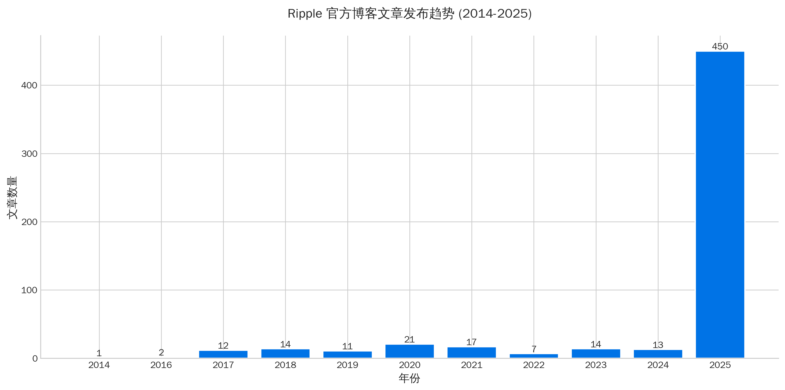

_数据来源:本研究对Ripple官网博客的文本挖掘统计(resources/ripple_blogs/process_data/articles_by_year.csv)_

2025年发文量的爆发式增长,并非单纯的传播策略调整,而是三重驱动因素的共振效应。监管层面,2023年7月美国联邦法院对Ripple与SEC诉讼案作出部分有利裁决,认定XRP在二级市场的程序化销售不构成证券发行,2025年初SEC进一步撤销上诉并将罚款从1.25亿美元降至5000万美元,法律不确定性的消除为Ripple在北美市场的大规模传播扫清障碍,企业需密集发声重建市场信心与客户信任。产品层面,RLUSD稳定币于2024年底完成试运行并于2025年正式规模化推出,作为锚定美元1:1的合规稳定币,RLUSD瞄准的是规模达1700亿美元的稳定币市场,新产品推广阶段需要高强度的市场教育与生态伙伴动员,内容营销成为触达开发者、金融机构、做市商等多元客群的关键手段。生态层面,Ripple提出"DeFi on XRPL"战略,将XRP Ledger从单纯的支付基础设施升级为支持借贷、交易、流动性挖矿等去中心化金融应用的生态平台,吸引开发者与资本需要持续的技术更新披露与案例展示,博客成为生态建设的"传声筒"。

当我们将发文量的时间序列与Ripple的业务里程碑交叉验证时,战略周期的演进脉络愈发清晰。2014-2016年为技术奠基期,年均发文不足2篇,Ripple仍处于技术协议开发与早期客户验证阶段,传播需求有限。2017-2019年为产品探索期,年均发文增至12篇,此阶段Ripple推出xCurrent、xVia、xRapid三款独立产品,针对不同客户痛点提供差异化解决方案,博客内容聚焦于产品功能介绍、技术优势阐释与早期客户案例,市场教育是传播主基调。2020-2021年为网络扩张期,年均发文攀升至19篇,这一阶段RippleNet全球网络初具规模,连接超过300家金融机构,ODL方案在欧洲与亚太走廊实现规模化应用(欧洲ODL交易量2021年同比增长250%),博客内容转向网络效应宣传——更多合作伙伴加入、更多支付走廊开通、更多交易量突破——以强化"网络价值"叙事吸引后续机构加入。2022-2024年为战略收缩期,年均发文回落至11篇,SEC诉讼的法律阴霾迫使Ripple在北美市场保持低调,传播策略转向合规叙事与国际化布局,博客重点转移至亚太、中东、欧洲等监管友好市场的拓展动态。2025年至今为规模化推广期,发文量激增450篇,标志Ripple从"支付基础设施提供商"向"数字资产生态平台运营商"的战略升维,传播对象从B端金融机构扩展至B端开发者与C端用户,内容类型从产品介绍扩展至生态激励、技术教程、社区治理,传播形态从单向宣传转向双向互动。

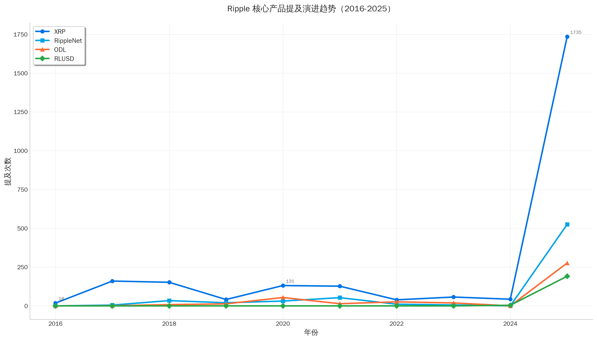

_数据来源:本研究对Ripple官网博客的文本挖掘统计(resources/ripple_blogs/process_data/product_mentions_by_year.json)_

产品组合的演进轨迹进一步印证了战略转型的内在逻辑。在博客文本分析的2014-2025年完整周期内,XRP累计被提及3102次,XRPL(XRP Ledger)被提及1093次,RippleNet被提及715次,ODL(On-Demand Liquidity)被提及336次,RLUSD被提及221次。若借用BCG矩阵(波士顿咨询集团增长-份额矩阵)的分析框架,可将Ripple的产品组合解构为不同战略角色。XRP与ODL构成"现金牛业务"——XRP作为桥接货币的核心地位自2012年确立以来持续稳固,3102次的累计提及频率证明其贯穿Ripple发展始终的战略地位;ODL方案自2018年推出后快速商业化,截至2024年Q4累计促成超过700亿美元的跨境支付交易量,成为Ripple主营收入的稳定来源。RLUSD则属于"明星业务"——虽然累计提及仅221次(集中在2024-2025年),但其瞄准的是预计2029年市值将达3万亿美元的稳定币市场,高增长潜力使其成为未来营收增长的核心引擎。早期产品xCurrent(提及38次)、xVia(提及17次)则属于"问题业务"——2017-2019年推出后市场反响平淡,2019年Ripple将其功能整合进RippleNet统一品牌,独立产品线终止,提及频次锐减至接近零,反映出企业"做减法"精简产品线的策略决断。

这种"双轮驱动"的产品组合策略——XRP/ODL巩固存量市场获取稳定现金流,RLUSD开拓增量市场追逐高增长潜力——体现出成熟企业在创新与稳定之间的动态平衡。跨境支付市场的B2B场景(银行间清算、企业跨境结算)虽然市场成熟但竞争激烈,SWIFT的网络锁定效应强大,Ripple通过XRP/ODL在中小额、新兴市场走廊建立差异化优势,但难以撼动SWIFT在大额批发支付中的主导地位。稳定币与DeFi市场则属于新兴蓝海,虽然USDT、USDC等先行者占据领先地位,但市场格局尚未固化,监管框架仍在塑造中,Ripple凭借RLUSD的合规优势(纽约信托牌照)与XRPL的性能优势(3-5秒确认、极低手续费),有机会在"合规稳定币+支付场景"赛道建立差异化定位。这种战略选择契合安索夫矩阵(Ansoff Matrix)中的"产品开发"与"市场开发"象限——在现有市场(跨境支付)深化产品创新(从XRP到RLUSD),同时向新兴市场(DeFi生态)拓展应用场景,规避单一赛道的天花板约束。

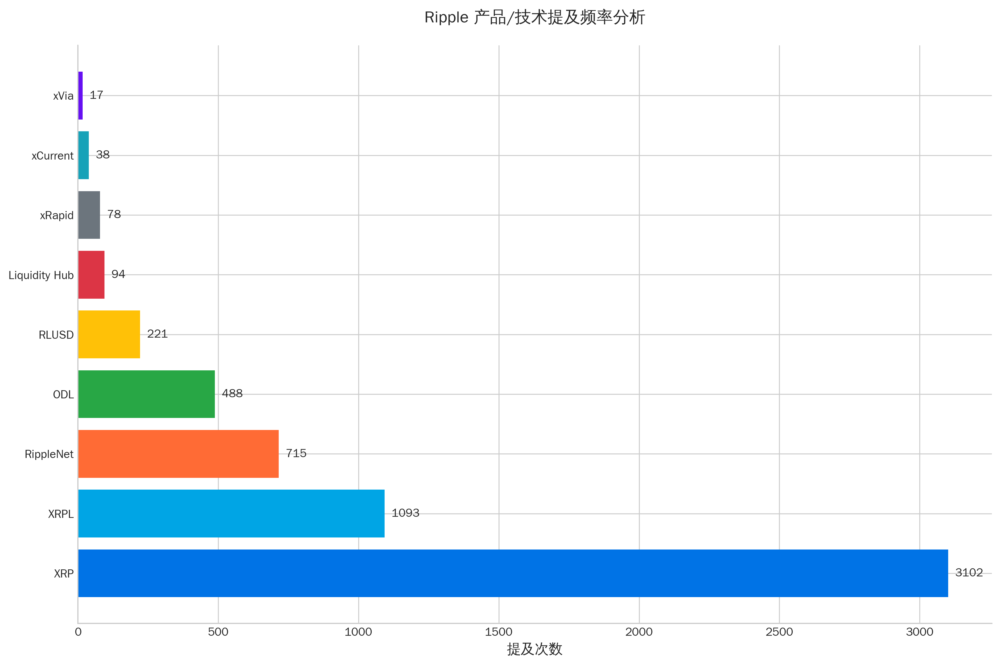

_数据来源:本研究对Ripple官网博客的文本挖掘统计(resources/ripple_blogs/process_data/products_frequency.csv)_

从产品分散到生态整合的演进路径,在年度数据的颗粒度观察中呈现更清晰的阶段特征。2017年XRP被提及160次,RippleNet仅5次,ODL(彼时称xRapid)仅1次,产品重心高度集中于XRP数字资产本身,Ripple的市场叙事是"利用XRP作为桥接货币解决Nostro账户资金沉淀问题"。2018年RippleNet提及增至34次,ODL提及8次,反映出企业开始强化"网络"概念——XRP不再是孤立的数字资产,而是嵌入RippleNet全球支付网络、通过ODL按需流动性方案服务金融机构的生态要素,产品叙事从"单点技术"升级为"网络平台"。2019年Ripple进行品牌整合,将xCurrent、xVia、xRapid统一纳入RippleNet总品牌,xRapid更名为On-Demand Liquidity(ODL),强调"按需"这一客户价值主张。博客数据验证了整合效果:2020年ODL提及达54次峰值,2021年RippleNet提及达53次峰值,品牌统一后市场认知度显著提升。2022-2024年的SEC诉讼期,XRP提及频次波动较大(2022年39次、2023年57次、2024年43次),但ODL与RippleNet作为业务品牌持续运作,反映出Ripple在法律不确定性中通过"去XRP化"叙事降低监管风险的策略调整——强调RippleNet的消息层价值与ODL的流动性管理功能,淡化XRP的资产属性。2025年XRP提及激增至1735次,RippleNet提及525次,ODL提及276次,RLUSD首次大规模提及191次,产品矩阵全面激活,标志Ripple在监管障碍消除后重新整合XRP与RLUSD双资产、RippleNet与XRPL双网络,构建"支付+DeFi"双轮驱动的生态平台。

这一演进轨迹映射出区块链企业商业化进程中的典型挑战与应对策略。技术驱动型企业往往在早期阶段陷入"技术锤子寻找钉子"的困境——拥有强大的技术方案(XRP Ledger的高速共识算法),但难以精准匹配客户痛点,因而推出多款产品试图覆盖不同细分需求(xCurrent/xVia/xRapid)。随着市场反馈积累与客户认知深化,企业逐步识别核心价值主张(流动性优化是最大差异化优势),进而整合产品线聚焦战略重心(统一为RippleNet品牌下的ODL方案)。然而,单一产品线的天花板与外部监管风险驱动企业再次"破局"——通过推出新资产(RLUSD稳定币)与拓展新场景(DeFi生态)实现战略升维。Ripple的博客传播轨迹,恰是这一"探索-聚焦-升维"战略循环的实时记录,为理解区块链商业化的非线性路径提供了鲜活案例。

### 4.4.3 全球市场布局:地理扩张与监管应对

跨境支付的网络效应决定了地理覆盖范围是企业竞争力的关键要素——支付网络连接的国家与地区越多、覆盖的支付走廊越密集,边际获客成本越低、用户转换成本越高,网络价值呈指数级增长。Ripple作为挑战SWIFT全球垄断地位的后进者,其地域拓展策略并非"撒胡椒面"式的均匀铺开,而是呈现出鲜明的"枢纽-走廊"结构与"监管套利"特征。博客文本分析中的国家地区提及频率,揭示了Ripple市场布局的优先级排序与战略逻辑。

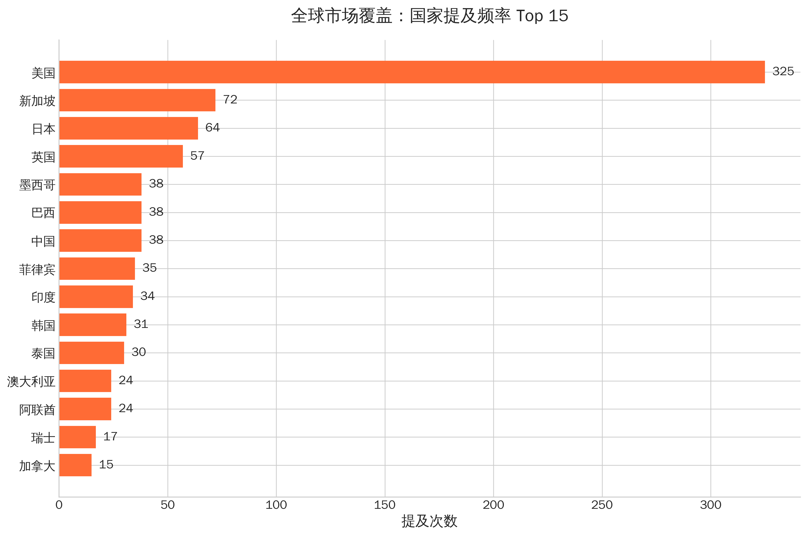

_数据来源:本研究对Ripple官网博客的文本挖掘统计(resources/ripple_blogs/process_data/countries_frequency.csv)_

美国以绝对优势领跑国家提及频率榜——"US"被提及264次,"United States"被提及61次,"USA"被提及4次,合计329次,占据所有国家提及的约30%。这一数据并不令人意外:Ripple总部位于旧金山,美国是其最大市场与监管环境的核心博弈场域,SEC诉讼更将美国推向舆论焦点。然而,若将视角从绝对提及频次转向"提及频次/市场规模"的相对强度指标,新加坡(72次)、日本(64次)、英国(57次)的战略地位凸显——这三个国家的跨境支付市场规模远小于美国,但提及频次仅次于或接近美国,反映出Ripple将其作为区域"枢纽市场"的战略定位。新加坡是Ripple亚太总部所在地,其作为国际金融中心的地位、对金融科技创新的开放态度(新加坡金融管理局MAS早在2016年即与Ripple展开监管沙盒合作)、辐射东南亚的地理位置,使其成为Ripple撬动亚太市场的战略支点。日本是Ripple最早实现规模化商业应用的市场,SBI Remit作为首家部署ODL的日本金融机构,年处理日本至菲律宾汇款走廊交易额18亿美元,日本金融厅(FSA)对加密资产的明确监管框架为Ripple提供了法律确定性。英国作为欧洲金融中心与全球第二大外汇交易市场,Ripple在此设立欧洲运营中心,辐射欧洲大陆与中东北非市场。

"枢纽市场"之下,Ripple的地域布局呈现出"走廊深耕"特征——聚焦特定高频汇款走廊实现点对点突破,而非面面俱到的全球覆盖。墨西哥与巴西各被提及38次,菲律宾35次,泰国30次,这些新兴市场国家的共同特征是:作为劳务输出大国,接收大量海外汇款;传统跨境汇款成本高昂(墨西哥接收美国汇款的平均成本曾高达7-10%);金融基础设施相对薄弱,对创新支付方案接受度高。美国-墨西哥走廊是全球最大的双边汇款走廊,年汇款规模超600亿美元,Ripple通过与墨西哥当地交易所Bitso合作,利用ODL方案将美元兑换为XRP再兑换为墨西哥比索,绕过传统代理行体系,将汇款成本降至1-2%,到账时间缩短至秒级。日本-菲律宾走廊同样是Ripple重点布局方向,SBI Remit与菲律宾合作伙伴Coins.ph联手,服务年逾400万菲律宾海外劳工的汇款需求。这种"走廊战略"契合波特五力模型中的"聚焦战略"(Focus Strategy)——在资源有限的情况下,放弃与SWIFT在全覆盖网络上的正面竞争,转而聚焦SWIFT覆盖不足或成本劣势明显的细分走廊,以差异化优势建立据点后再图扩张。

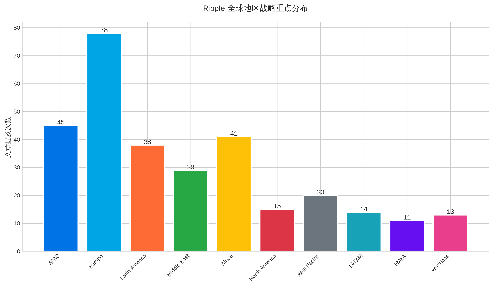

_数据来源:本研究对Ripple官网博客的区域主题分类统计_

区域差异化策略在Ripple的市场进入方式与价值主张上呈现显著分化。北美市场(美国与加拿大)虽然提及频次最高,但受SEC诉讼影响,Ripple在2020-2024年间采取战略收缩姿态,博客内容转向合规叙事——强调RippleNet的KYC/AML能力、与监管机构的合作案例、企业治理透明度——以区别于匿名性公链,争取监管机构的信任。2025年诉讼和解后,北美市场战略反弹,RLUSD稳定币选择以纽约州信托公司牌照发行(相较货币传输牌照MTL,信托牌照的监管门槛更高但信任背书更强),体现出Ripple"以最高合规标准换取长期市场准入"的长期主义策略。亚太市场(新加坡、日本、韩国、泰国、菲律宾、印度等)是Ripple布局最密集的区域,策略组合呈现"枢纽+走廊+终端"三级结构:新加坡与日本作为枢纽承担区域总部与监管对话功能,菲律宾与泰国作为走廊终端市场吸纳汇款流入,韩国与印度则兼具技术创新生态(区块链开发者社区活跃)与支付市场潜力(庞大人口基数与数字支付渗透率提升)。拉美市场(墨西哥、巴西、阿根廷)的战略重心是"成本优势放大"——传统跨境汇款成本高(10%+)为Ripple方案提供了巨大的优化空间,博客内容强调"80%成本节省""秒级到账"等量化效率提升,直击客户痛点。中东市场(阿联酋24次提及、沙特阿拉伯10次提及)与非洲市场(南非、尼日利亚、肯尼亚各10次提及)处于战略探索阶段,Ripple利用这些区域的"监管真空"或"监管开放"窗口期进行试点,为未来大规模进入积累经验。

监管应对策略是Ripple地域布局中无法回避的关键变量,博客内容分析揭示出监管话题热度的年度波动与战略调整的高度相关性。

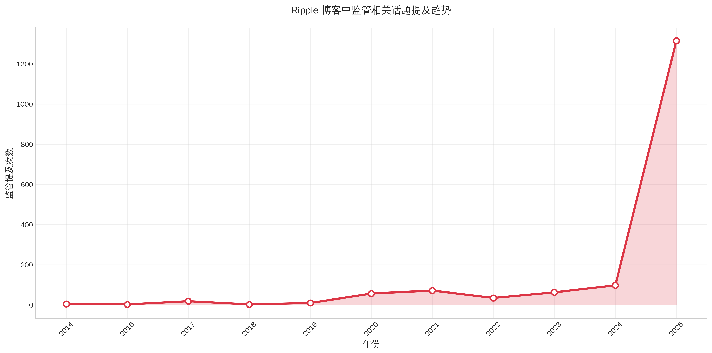

_数据来源:本研究对Ripple官网博客中"regulatory""compliance""SEC"等关键词的年度统计_

2020年前,监管话题在博客中的提及频率较低且平稳,反映出Ripple在相对宽松的监管环境中专注于产品开发与市场拓展。2020年12月SEC对Ripple提起诉讼,指控XRP构成未注册证券,成为监管话题的转折点。2021-2023年监管提及频次持续攀升但仍控制在100次以内,Ripple的传播策略转向"合规防御"——博客内容密集发布RippleNet的合规能力、与全球监管机构的合作案例、第三方法律意见书解读,试图通过"事实胜于雄辩"的方式对冲SEC诉讼的负面影响。2025年监管提及频次激增至1300+次,相比2024年的108次增长超过12倍,这一爆发式增长的背后是两层战略动机。一是"信心重建"——SEC撤销上诉并大幅降低罚款(从1.25亿降至5000万美元),联邦法院最终裁定XRP在二级市场销售不构成证券,法律确定性的到来需要Ripple通过高密度传播向市场宣告"监管风险解除",修复过去三年诉讼期间流失的客户信任与合作伙伴关系。二是"政策窗口抢滩"——2025年美国新政府对加密资产监管态度转向开放,任命对加密友好的Paul Atkins担任SEC主席,Ripple抓住政策窗口期密集发声,推动RLUSD稳定币在北美市场的快速渗透,博客内容转向"监管红利叙事"——强调"合规稳定币的春天到来""美国有望重夺全球加密金融中心地位"——将企业利益与国家战略绑定,争取政策支持。

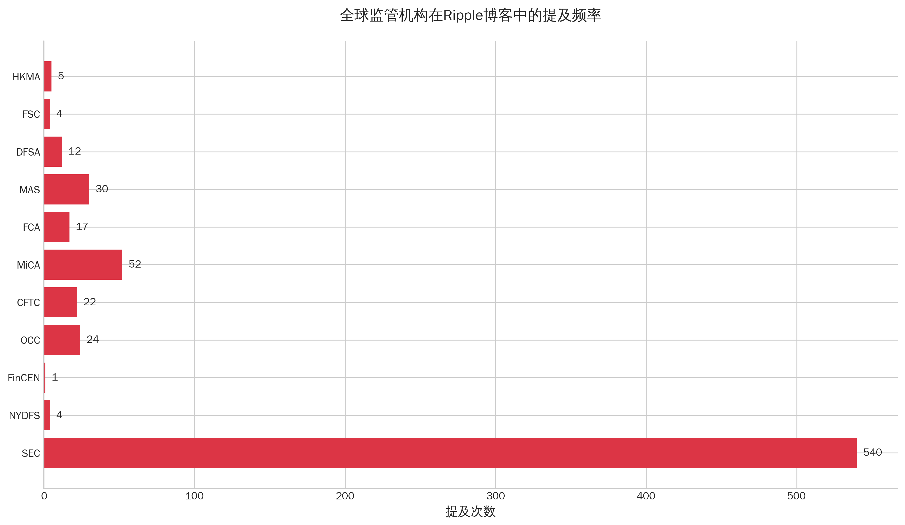

_数据来源:本研究对Ripple官网博客中监管机构名称的提及统计_

监管机构提及分布进一步揭示Ripple的"多地域监管对冲"策略。SEC(美国证券交易委员会)作为诉讼主体,提及频次显著领先,但新加坡金融管理局(MAS)、日本金融厅(FSA)、英国金融行为监管局(FCA)、阿联酋证券和商品管理局(SCA)等非美监管机构的提及频次同样可观。这种分布特征呼应了PESTEL分析框架中的"政治-法律"维度战略:当美国监管环境恶化时,Ripple通过深耕监管友好市场(新加坡、日本、阿联酋)维持业务连续性,避免单一市场监管风险导致全局崩盘。新加坡2023年为Ripple颁发主要支付机构牌照(Major Payment Institution License),日本FSA将XRP明确归类为加密资产而非证券,阿联酋迪拜虚拟资产监管局(VARA)授予Ripple虚拟资产服务提供商许可,这些监管里程碑均在博客中获得密集报道,强化"全球合规"的品牌形象。然而,这种"监管套利"策略亦面临挑战:各国监管标准的不一致性增加合规成本,企业需针对不同司法辖区定制产品形态与运营流程;部分监管友好市场的经济体量有限(如新加坡人口仅500余万),难以贡献规模化营收;一旦美国监管转向收紧(如2026年新政府更迭),Ripple在非美市场的投资可能面临"打水漂"风险。

Ripple的地域布局与监管应对策略,为区块链企业的国际化路径提供了重要启示。在技术全球化与监管属地化并存的背景下,企业难以复制互联网平台"全球统一产品+本地化运营"的模式,而必须在技术标准化与合规定制化之间寻求平衡。Ripple选择的是"核心技术全球统一(XRP Ledger开源协议、RPCA共识算法)+应用产品区域定制(RippleNet在不同市场强调不同功能、RLUSD在不同司法辖区申请不同牌照)"的混合策略,既保持技术迭代的规模效应,又满足属地监管的差异化要求。这一策略在区块链跨境金融领域可能具有普适性借鉴价值,但其长期有效性仍有待市场与监管环境的进一步检验。

### 4.4.4 产品生态演化:技术创新与应用场景拓展

若说前述战略演进与市场布局分析聚焦于Ripple的"外延式扩张"——地理覆盖范围、客户数量增长、市场份额提升——那么产品生态演化则呈现出企业"内涵式深化"的逻辑:如何通过技术创新与场景拓展,将单点产品升级为多边生态,将交易型关系升级为粘性型关系,将线性价值链重构为网络型价值网。RLUSD稳定币作为Ripple产品矩阵的最新组成部分,其应用场景分布与竞争定位,为理解这一生态演化逻辑提供了关键窗口。

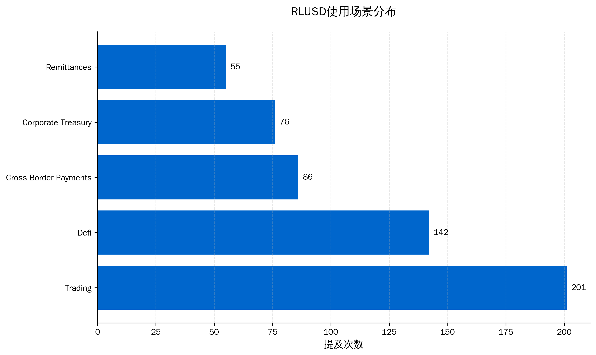

_数据来源:本研究对Ripple官网博客中RLUSD相关内容的场景分类统计_

RLUSD的使用场景提及分布呈现出"违背直觉"的特征:Trading(交易)以201次提及高居榜首,DeFi(去中心化金融)以142次位列第二,而Cross Border Payments(跨境支付)仅以86次提及位列第三,Corporate Treasury(企业财资管理)76次与Remittances(个人汇款)55次分列四五位。这一排序对于"定位为跨境支付而生"的Ripple而言,似乎存在战略错位——跨境支付作为企业立身之本,为何在新产品RLUSD的场景布局中反而让位于Trading与DeFi?

当我们将视角从静态的场景排序转向动态的生态构建逻辑时,这一"错位"的战略合理性逐渐浮现。稳定币的核心价值在于"稳定的价值尺度+区块链的流动效率",但这一价值的实现依赖于一个前提:充足的流动性深度。若某稳定币在加密货币交易所缺乏交易对、做市商报价稀薄、买卖价差巨大,用户即便持有该稳定币,也难以即时兑换为其他资产或法币,稳定币的"流动性承诺"沦为空谈。因此,Trading场景的201次高频提及,本质上是Ripple在"修路架桥"——通过与Coinbase、Kraken、Uphold等主流加密交易所合作,建立RLUSD/USD、RLUSD/XRP、RLUSD/BTC等交易对,培育做市商提供双向报价,积累交易量以降低滑点与价差,为RLUSD构建"随时可兑换"的流动性基础。这一逻辑契合价值链分析框架中的"进货物流"(Inbound Logistics)环节:在产品价值创造的起点,必须先确保原材料(流动性)的充足供应,才能支撑后续的生产运营(支付应用)与市场营销。

DeFi场景的142次提及同样服务于生态构建的战略目标。去中心化金融涵盖借贷(Lending)、去中心化交易所(DEX)、收益耕作(Yield Farming)、流动性挖矿(Liquidity Mining)等多元应用,这些应用的共同特征是:为资产持有者提供超越银行存款的收益回报,吸引资本留存在生态内部循环。Ripple通过在XRPL上部署RLUSD借贷协议(用户可将RLUSD存入协议获得利息收益,或以RLUSD作为抵押品借入其他资产)、在DEX上提供RLUSD/XRP流动性池并激励流动性提供者(LP)分享交易手续费,为RLUSD持有者创造"持币生息"的经济激励。这种激励机制服务于两个层面的战略目标:一是增强资产粘性,用户若将RLUSD质押在DeFi协议中获取收益,相较存放在交易所或钱包,其转换至其他稳定币(如USDT、USDC)的机会成本提高,降低客户流失率;二是吸引开发者生态,开发者在XRPL上构建DeFi应用并集成RLUSD,相当于为Ripple免费拓展应用场景,形成"开发者赚取开发收益、用户获得DeFi服务、Ripple扩大RLUSD使用规模"的三方共赢。

Cross Border Payments(86次)、Corporate Treasury(76次)、Remittances(55次)三大场景虽然提及频次低于Trading与DeFi,但这并不意味着战略地位下降,而是反映出场景成熟度的差异与优先级排序。跨境支付场景作为Ripple的传统优势领域,已有XRP与ODL方案成熟运作,RLUSD的加入是"锦上添花"而非"雪中送炭"——为对XRP价格波动敏感的金融机构提供稳定币替代方案,但短期内不会颠覆现有业务模式。企业财资管理场景针对跨国企业的痛点:传统体系下,企业需在各国开设银行账户并预置资金(Nostro账户),全球金融系统因此沉淀约5万亿美元低效资本。RLUSD+XRP的组合方案允许企业仅持有RLUSD(美元稳定币)与XRP(桥接货币),需要支付其他货币时通过实时兑换完成,消除Nostro账户资金占用,提升资本周转效率(ROI)。这一场景的商业价值巨大,但落地周期长——需要说服企业CFO改变几十年的财资管理习惯、需要与企业ERP系统深度集成、需要应对各国外汇管制与税务合规——因而博客传播相对克制,聚焦于头部客户案例的深度报道而非广撒网式推广。个人汇款场景虽然提及仅55次,但其普惠金融的社会价值与Ripple"让货币像信息一样流动"的愿景高度契合,博客内容强调的成本降低(从10%降至2%)与时效提升(从3天降至秒级)的量化效益,是Ripple履行企业社会责任、塑造正面品牌形象的传播素材。

RLUSD的竞争定位通过与主流稳定币的雷达图对比得以可视化呈现。

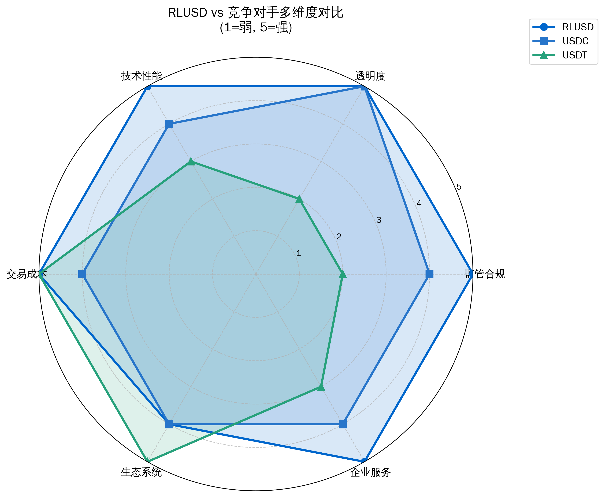

_数据来源:Ripple官方博客对RLUSD产品特性的多维度对比分析_

雷达图通常涵盖流动性深度(Liquidity Depth)、监管合规性(Regulatory Compliance)、交易速度(Transaction Speed)、手续费成本(Transaction Fee)、透明度(Transparency)、生态支持(Ecosystem Support)等维度。RLUSD的差异化优势集中在三个维度。监管合规性方面,RLUSD以纽约州信托公司牌照发行,受纽约州金融服务局(NYDFS)严格监管,资产储备需100%覆盖且定期审计,合规水平显著高于USDT(曾因储备不透明被质疑)与算法稳定币(UST因脱锚引发信任危机)。交易速度方面,RLUSD原生发行于XRPL与以太坊双链,XRPL的3-5秒确认时间远快于以太坊的12-15秒,且在网络拥堵时仍能保持稳定性能。手续费成本方面,XRPL的交易手续费仅约0.00001 XRP(约0.00002美元),相较以太坊ERC-20代币动辄数美元的Gas费,成本优势明显,对小额高频支付场景友好。

然而,RLUSD在流动性深度与生态支持维度面临显著劣势。USDT市值超1100亿美元,USDC市值超400亿美元,两者已建立起深厚的流动性护城河——全球数百家交易所支持交易、数万DeFi协议集成、数亿用户持有——先发优势构成的网络效应极难撼动。RLUSD作为2024年底推出的后进者,市值尚处于数亿美元量级,流动性深度与生态支持需要时间积累。Ripple的应对策略是"聚焦差异化场景突破":在合规要求极高的场景(如持牌金融机构的跨境清算、政府部门的数字支付)、对交易速度与成本敏感的场景(如小额高频汇款、跨境电商实时结算)、对XRPL生态有依赖的场景(如DeFi on XRPL的原生应用),RLUSD可凭借合规、性能、生态的组合优势建立差异化定位,而非在流动性与生态规模上与USDT/USDC正面竞争。

产品生态演化的底层逻辑在于网络效应的构建与强化。传统支付公司(如Visa、Mastercard)的网络效应源于"双边市场"结构:商户越多,持卡用户越愿意加入;用户越多,商户越愿意接入——双边增长相互促进,形成赢者通吃格局。区块链支付方案的网络效应更为复杂,呈现"多边市场"特征:金融机构接入网络提供支付服务,开发者构建应用扩展场景,做市商提供流动性保障交易,用户使用服务产生交易量——四方角色相互依存,任一方的缺失都会削弱网络价值。Ripple通过RLUSD的场景布局,试图编织这一多边网络:Trading场景吸引交易所与做市商,DeFi场景吸引开发者与资本,支付场景吸引金融机构与企业,汇款场景吸引终端用户——当四方角色各就各位并形成正反馈循环时,RLUSD的生态飞轮才能真正转动起来。这一生态构建策略相较传统"先拿牌照、后做业务"的线性路径,体现出区块链原生企业的"网络效应优先"思维:宁可前期让渡部分收益激励生态参与者(如DeFi流动性挖矿的高补贴),也要先做大网络规模,待网络效应显现后再收割价值。

然而,多边生态的协同难度亦不容低估。交易所关注流动性深度与交易量,开发者关注技术文档完善度与开发者激励,金融机构关注合规确定性与风险可控性,不同参与方的利益诉求存在冲突——如金融机构要求KYC严格审核以满足反洗钱监管,但这会增加用户接入摩擦,降低DeFi应用的无许可特性吸引力。Ripple需在不同角色之间寻求微妙平衡,既要满足持牌机构的合规刚需,又要保留开发者生态的开放活力,这种平衡术的难度远超单边市场。此外,RLUSD的双链策略(XRPL+以太坊)虽然扩大了兼容范围,但也带来碎片化风险:XRPL上的RLUSD与以太坊上的RLUSD在技术上是两种不同的代币,跨链桥接增加复杂度与安全风险,用户可能因混淆而误操作。这些生态协同的挑战,是Ripple从"产品提供商"向"生态运营商"转型过程中必须持续应对的管理议题。

### 4.4.5 博客内容分析的启示与局限

对Ripple官网博客562篇文章(2014-2025年)的系统性文本分析,为理解区块链跨境支付的商业化路径提供了独特视角。这一视角的价值不在于发现了颠覆性的新结论,而在于用可量化、可追溯的方式验证了前述章节的定性判断,并为战略演进提供了动态的、情境化的补充证据。

方法论层面,官方博客文本分析作为企业战略研究的"数字痕迹"方法,展现出与传统案例研究的互补价值。传统案例研究依赖二手文献、新闻报道或访谈回忆,信息获取存在时滞且可能失真;博客文本则提供企业在特定时点的"即时叙事",能够捕捉战略调整的实时信号与外部环境变化的互动关系。例如,2025年监管提及频次的激增(从2024年108次骤升至1300+次)与SEC诉讼和解的时间高度吻合,这种"事件-反应"的紧密耦合在横截面案例研究中难以呈现。时间序列数据的连续性使得趋势识别成为可能——产品提及结构的年度演变、地域布局重心的阶段性转移、监管应对策略的动态调整——这些纵向轨迹为理解企业战略的"路径依赖"与"关键转折"提供了经验基础。

实质性发现层面,博客分析验证并深化了前述章节的核心论点。4.1节强调Ripple作为研究案例的商业化成熟度,博客分析提供了定量证据:562篇内容、11年持续输出、覆盖40余个国家和地区,证明Ripple已超越"概念验证"阶段,进入规模化运营期。4.2节阐述Ripple的技术-组织-资产三维机制,博客分析揭示了这三维机制的动态演进:技术维度,从单一XRP Ledger到XRPL+以太坊双链部署,技术兼容性增强;组织维度,从300家金融机构网络到吸引开发者生态的平台化转型,参与方多元化;资产维度,从XRP单一资产到XRP+RLUSD双资产组合,满足不同客户的风险偏好。4.3节基于公开数据验证Ripple的效率优势,博客分析补充了战略维度的解读:效率优势并非自动转化为市场成功,Ripple需要通过战略传播(2025年450篇博客)、合规建设(纽约信托牌照)、生态激励(DeFi流动性挖矿)将技术优势转化为商业壁垒。

博客分析亦为后续章节提供了铺垫。第五章将探讨Ripple面临的限制因素,博客数据中监管提及的2020-2025年轨迹(从平稳到激增)揭示了监管不确定性对企业战略的深刻影响,SEC诉讼期间(2022-2024年)发文量下降与战略收缩的关联,印证了监管风险是制约区块链跨境支付发展的关键瓶颈。第六章将提炼普适性优化策略,博客分析中的地域布局差异(发达市场强调合规、新兴市场强调效率)、产品场景组合(Trading/DeFi先行,支付场景跟进)、生态构建逻辑(多边市场协同),为理解"情境因素"如何影响策略选择提供了丰富素材。

然而,研究局限性必须诚实承认。官方博客的选择性披露偏差是方法论层面的根本约束——Ripple展示成功案例(Azimo的22秒到账、SBI Remit的年交易18亿美元、ODL累计交易量突破700亿美元),对失败经历保持沉默。哪些市场拓展受挫?哪些合作伙伴中途退出?哪些产品功能未达预期?这些"负面证据"在博客中缺失,导致研究呈现的战略画像偏向乐观,难以全面评估Ripple的真实竞争力与潜在风险。关键词频次统计方法存在简化风险:某产品提及频次高(如XRP的3102次)未必意味着战略重要性高,可能仅反映该产品历史悠久且话题敏感(SEC诉讼围绕XRP展开);相反,某些战略支柱(如合规系统、风控架构)因技术敏感性或商业保密,博客提及稀少但实际重要性不容忽视。因果推断的谨慎是定量分析的基本准则:2025年发文量激增(450篇)与业务增长的因果关系难以确证——究竟是业务扩张驱动传播需求增加,还是营销策略主动加强以制造"繁荣假象"?博客数据无法提供因果机制的直接证据,需要结合财务数据、用户增长数据等外部验证。

2025年数据的异常性对研究结论的稳健性构成挑战。450篇文章占总量80%,这一极端分布使得大部分统计量(如产品提及总频次、国家提及总频次)严重依赖2025年数据,若2025年数据存在系统性偏误(如数据采集方法变化、历史文章补充抓取),则整体结论的可靠性下降。理想的应对方式是将2025年数据与历史数据(2014-2024年)分开分析,对比两个时段的趋势是否一致,但本研究囿于篇幅限制未能展开详尽的分组对比,这一不足有待未来研究弥补。

尽管存在上述局限,博客文本分析作为企业战略研究工具箱中的一种方法,仍具备不可替代的价值。对于区块链跨境支付这一新兴领域,传统的财务报表、市场份额数据往往滞后或缺失,官方博客、技术文档、开源代码库等"数字痕迹"成为研究者触及企业战略真实脉动的少数窗口。将文本分析与案例研究、实证检验、理论演绎相结合,能够形成"多源证据三角验证"(Triangulation)的研究范式,增强结论的可信度。Ripple博客分析的经验表明:官方叙事虽带有选择性,但其选择本身即是战略意图的信号——企业选择强调什么、淡化什么、回避什么,恰恰揭示了其战略重心、竞争焦虑与风险感知。研究者的任务不是盲信官方叙事,而是批判性地解读叙事背后的战略逻辑与情境约束,这正是学术研究的价值所在。

当我们将Ripple博客分析的发现置于第四章整体框架中审视时,一幅动态的、立体的Ripple画像逐渐清晰:技术层面,Ripple通过RPCA共识算法与分布式账本实现秒级清算,解决传统跨境支付的信息流与资金流分离问题(4.2节);组织层面,RippleNet构建的去中心化网络重构了参与方关系,降低多级代理的协调成本(4.2节);资产层面,XRP作为桥接货币与RLUSD作为稳定价值载体,共同优化流动性管理(4.2节);效率层面,成本降低80%、时效提升至秒级的实证效果已在Azimo、SBI Remit等案例中验证(4.3节);战略层面,Ripple经历了"产品探索-网络扩张-战略收缩-生态升维"的完整周期,应对了监管风险、市场竞争、技术迭代的多重挑战(4.4节);市场层面,Ripple采取"枢纽-走廊"地域布局与"监管套利"合规策略,在全球市场中寻求差异化生存空间(4.4节);生态层面,Ripple通过RLUSD的多场景布局与多边网络构建,试图从"支付工具提供商"升级为"数字资产生态平台运营商"(4.4节)。这一多维度、多层次的认知,为后续章节分析Ripple面临的限制因素(第五章)与提炼普适性优化策略(第六章)奠定了坚实的经验基础。

区块链跨境支付的商业化进程,既是技术创新的试验田,也是战略管理的竞技场,更是监管博弈的角力场。Ripple作为这一领域的先行者,其十余年的探索轨迹——无论成功经验还是挫折教训——都为后来者提供了宝贵的参考坐标。通过系统性的文本分析,我们得以窥见这一轨迹的细节与纹理,感知战略抉择的艰难与权衡,理解外部环境的约束与机遇。这正是案例研究的魅力所在:不仅提供"是什么"的描述,更揭示"为什么"的机制与"怎么办"的启示。

---

本章通过对 Ripple 案例的系统分析,揭示了区块链技术如何通过技术、组织、资产三个维度协同优化跨境支付效率。实证数据验证了 Ripple 在成本、时效、透明度方面的显著优势,特别在中小规模支付场景,效率提升更为突出。然而,监管不确定性、生态协作难题、传统路径依赖等挑战,限制了 Ripple 方案的普适性与规模化推广。下一章将深入剖析这些障碍的根源,从技术、监管、生态三个层面系统诊断 Ripple 及区块链跨境支付方案面临的实施障碍,为第六章的普适性优化策略提炼奠定基础。

---

## 数据来源脚注

[1] Ripple. "Unlocking Global Liquidity Bottlenecks with RippleNet". 试点数据基于美国-墨西哥汇款走廊,测试显示ODL方案相较传统模式可节省40-70%的成本,并将清算时间从2-3天缩短至2分钟以上。https://ripple.com/insights/unlocking-global-liquidity-bottlenecks-with-ripplenet/

[2] Ripple. "Ripple and R3 Team Up with 12 Banks to Trial XRP for Cross-Border Payments". 参与试点的12家银行包括Barclays、BMO Financial Group、CIBC、Intesa Sanpaolo、Macquarie Group、National Australia Bank (NAB)、Natixis、Nordea、Royal Bank of Canada (RBC)、Santander、Scotiabank、Westpac Banking Corporation。试点结果显示XRP方案可节省支付处理成本高达60%。https://ripple.com/insights/ripple-and-r3-team-up-with-12-banks-to-trial-xrp-for-cross-border-payments/

[3] Ripple. "SendFriend Uses On-Demand Liquidity to Save Customers Up to 80% In Remittance Fees". 2019年12月。SendFriend利用ODL将美国至菲律宾的汇款手续费从传统渠道(如Western Union)的10%降至2%,为客户节省80%的费用。SendFriend CEO David Lighton表示:"我们可以将交易成本降低75%,并将这些节省传递给客户。" https://ripple.com/insights/sendfriend-uses-on-demand-liquidity-to-save-customers-up-to-80-in-remittance-fees/

[4] Ripple. "Azimo and SCB Runs on Ripple for Instant Payments Into Thailand". Azimo与泰国暹罗商业银行(SCB)合作,通过RippleNet将欧洲至泰国的汇款时间从24小时缩短至平均22秒。Azimo联合创始人兼执行主席Michael Kent表示:"这一合作使我们能够将支付结算时间从约24小时缩短至平均22秒。向泰国汇款比向欧洲其他地区汇款还要快。" https://ripple.com/insights/azimo-and-scb-runs-on-ripple-for-instant-payments-into-thailand/

**数据说明**:

- 本章引用的成本节省与时效提升数据主要来源于Ripple官方博客披露的试点项目与商业化应用案例。试点数据(如40-70%成本降低、2-3天降至2分钟)属于特定走廊的测试结果,实际效果可能因货币对流动性、监管环境、金融机构系统集成程度等因素而有所差异。
- 商业化应用案例(如SendFriend的80%费用节省、Azimo+SCB的22秒到账)为实际运营数据,但代表性受限于特定走廊与特定时间段,不具备完全普适性。
- 本研究在引用这些数据时,已标注数据来源类型(试点/商业化应用)与适用场景(特定走廊),提醒读者对数据的适用范围保持审慎判断。独立第三方对Ripple方案效果的验证数据相对有限,未来研究可结合更多独立评估数据进行交叉验证。
