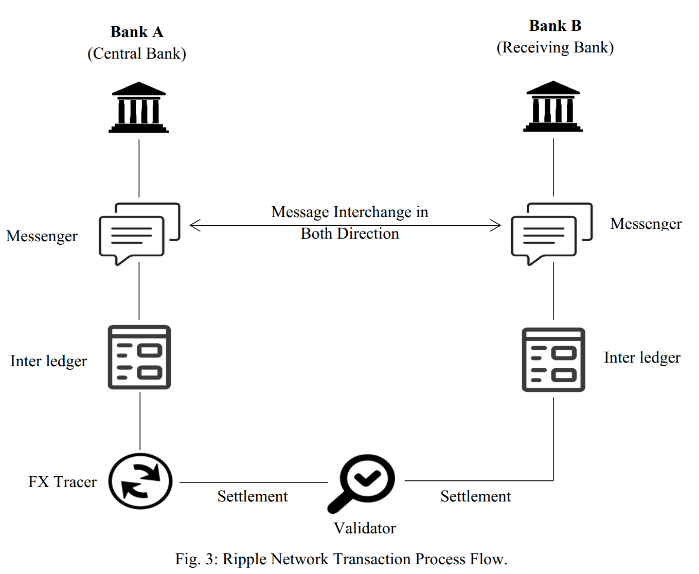
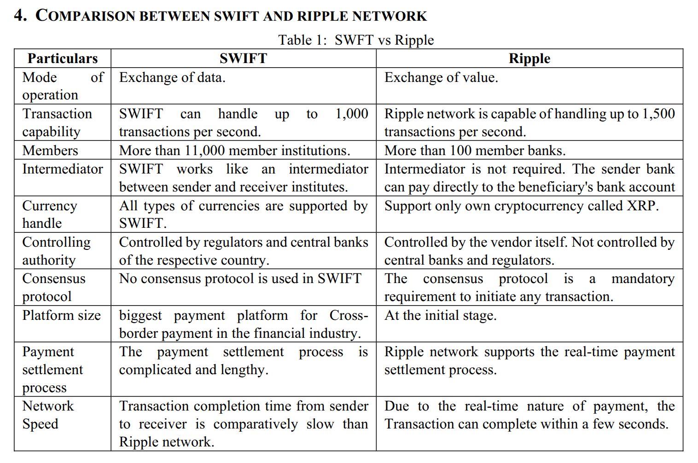
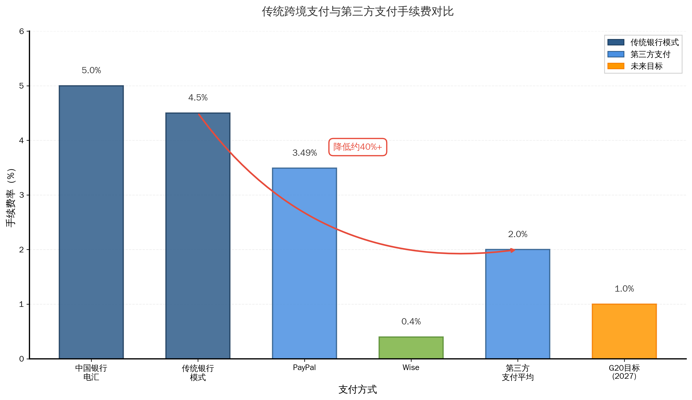
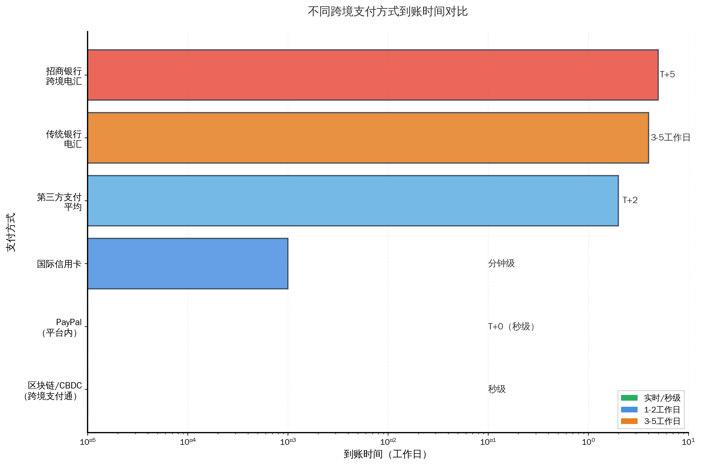

# 第四章 Ripple优化跨境支付的机制分析与实证检验

传统跨境支付体系在中小规模支付场景中的效率瓶颈,源于多级代理结构、信息流与资金流分离、流动性管理低效等结构性缺陷。第三章的分析表明,传统体系内部的优化尝试——无论是SWIFT gpi的报文加速、清算所的多边轧差,还是第三方支付的本地资金池——本质上仍是在既有架构框架下的"修修补补",未能从根本上突破代理行网络的路径依赖与协调成本困境。区块链技术凭借其去中心化、分布式账本、智能合约等特性,为跨境支付效率优化提供了全新的技术路径。Ripple作为最早商业化且在中小规模支付场景实现规模化应用的区块链跨境支付方案,其优化机制与实证效果值得深入剖析。

本章聚焦Ripple案例,从案例选择依据、核心机制解析、实证效果验证三个层面展开分析。在案例选择部分,论证Ripple作为研究对象的典型性与代表性;在机制分析部分,从技术、组织、资产三个维度解构Ripple的效率赋能逻辑;在实证检验部分,基于公开数据对比Ripple与传统模式在成本、时效、透明度等维度的差异,并客观指出其面临的挑战与约束。通过对Ripple案例的系统剖析,为理解区块链技术如何优化跨境支付效率提供经验支撑,同时为后续章节的障碍分析与策略提炼奠定基础。

## 4.1 Ripple案例选择依据及其生态定位

### 4.1.1 案例选择依据

区块链技术在跨境支付领域的应用方案众多,既包括比特币、以太坊等公链方案,也涵盖Ripple、Stellar、Corda等联盟链或私有链方案,各国央行数字货币(CBDC)的跨境支付探索亦在推进。选择Ripple作为本研究的核心案例,基于技术成熟度、场景适配性、技术路径代表性以及数据可得性四个维度的综合考量。

**技术成熟度与商业化程度**

Ripple于2012年由OpenCoin Inc.(后更名为Ripple Labs)创立,是最早将区块链技术应用于跨境支付领域并实现大规模商业化的解决方案。相较于比特币侧重于去中心化货币属性、以太坊聚焦智能合约与去中心化应用,Ripple从诞生之初即明确定位于金融机构间的跨境支付基础设施,技术架构与产品设计均针对支付场景的效率优化需求。截至2025年,Ripple已连接全球超过300家金融机构,覆盖40余个国家和地区,支持40余种货币的跨境支付能力。根据对562篇Ripple官方博客的文本分析,XRP(Ripple的数字资产)在2012至2025年间被提及3,102次,RippleNet(Ripple的全球支付网络)被提及715次,按需流动性方案ODL(On-Demand Liquidity)被提及488次,反映出Ripple在跨境支付领域的持续商业化实践与市场影响力。

相较于其他区块链方案,Ripple的商业化程度与技术稳定性已充分验证。比特币网络虽运行时间更长,但其每秒7笔交易(TPS)的处理能力、10分钟以上的确认时间以及高能耗的PoW共识机制,难以满足跨境支付的实时性与规模化要求。以太坊在转向PoS共识后,TPS提升至30左右,确认时间缩短至约15秒,但仍主要服务于智能合约与DeFi应用,在跨境支付领域的商业化案例相对有限。Stellar作为与Ripple技术路线相近的解决方案,虽同样定位于跨境支付,但其市场覆盖范围与金融机构参与度不及Ripple。CBDC跨境支付项目如mBridge尚处于试验阶段,2024年10月宣布达到"最小可行产品"(MVP)阶段,商业化应用仍需时日。因此,Ripple在技术成熟度与商业化程度上具备典型代表性。

**场景适配性:聚焦中小规模支付**

本研究的核心问题聚焦于中小规模、小额高频跨境支付场景的效率优化,而Ripple的产品定位与技术特性恰与此高度契合。传统跨境支付体系在大额B2B场景中的效率问题虽然存在,但企业客户通常拥有较强的成本承受能力与较长的资金规划周期,3-5个工作日的清算周期与2-3%的综合成本在可接受范围内。中小规模支付场景的核心痛点在于:固定成本占比过高导致小额支付经济性差、时效要求高但清算周期长、覆盖范围需触达新兴市场与偏远地区。Ripple通过3-5秒的交易确认时间、较低的边际成本、对新兴市场的覆盖能力,有效回应了这些痛点。

具体案例印证了Ripple的场景适配性。英国跨境汇款公司Azimo与泰国暹罗商业银行(SCB)合作,利用Ripple的ODL方案,将欧洲至泰国的跨境汇款到账时间从24小时缩短至平均22秒,时间成本降低99.9%。日本SBI Remit作为首家在日本实施ODL的金融机构,其服务的日本至菲律宾汇款走廊年交易规模达18亿美元,而传统跨境汇款成本高达交易金额的10.50%,远高于G8国家平均的5.92%,Ripple方案的成本优化空间显著。根据Ripple博客数据,欧洲ODL走廊的交易量在2021年同比增长250%,亚太地区同比增长130%,反映出中小规模支付场景对Ripple方案的强劲需求。这些案例均聚焦于个人汇款、中小企业跨境结算等中小规模场景,与本研究的问题导向高度一致。

**技术路径代表性:联盟链模式**

区块链技术在跨境支付领域的应用存在公链与联盟链两条路径。公链如比特币、以太坊采用完全去中心化的架构,任何节点均可参与网络,共识机制确保系统安全性,但代价是较低的交易吞吐量与较长的确认时间。联盟链采用准入控制机制,仅授权节点可参与共识,在牺牲部分去中心化特性的同时,换取更高的交易效率与更强的监管友好性。Ripple采用的是"适度去中心化"的联盟链模式,其授权节点列表(UNL, Unique Node List)机制允许金融机构选择信任的验证节点参与共识,在保障交易速度(3-5秒确认、1500 TPS)的同时,满足金融机构对风险控制与监管合规的要求。

这一技术路径选择代表了区块链金融应用的主流方向。金融机构在选择技术方案时,必须平衡创新性与安全性、效率与合规性。完全去中心化的公链虽在理念上契合"去信任"(Trustless)的区块链精神,但金融行业的强监管属性、客户身份识别(KYC)与反洗钱(AML)的合规要求,决定了金融机构难以接受匿名性与无准入门槛的公链架构。联盟链通过准入控制,既保留了分布式账本的技术优势——信息共享、不可篡改、实时同步——又满足了监管机构对参与方身份识别、交易可追溯、系统可控性的要求。国际清算银行(BIS)主导的mBridge项目、欧洲央行的TARGET Instant Payment Settlement(TIPS)系统,均采用联盟链或许可链架构。Ripple作为联盟链在跨境支付领域的先行者,其技术路径与经验教训对理解区块链金融应用的规律具有重要参考价值。

**数据可得性与研究可行性**

实证研究的有效性依赖于数据的可获取性与可靠性。Ripple作为商业化运营超过十年的方案,公开资料丰富,数据透明度高,为深度案例研究提供了坚实基础。技术层面,Ripple发布了详细的技术白皮书,Schwartz等(2014)的《Ripple协议共识算法》系统阐述了RPCA(Ripple Protocol Consensus Algorithm)的运行机制,为技术机制分析提供了权威文献支撑。市场层面,Ripple定期发布季度XRP市场报告,披露ODL交易量、网络活跃度、合作伙伴进展等关键指标;官方博客累计发布562篇文章,涵盖产品更新、案例分享、市场洞察,为追踪Ripple的业务演进与市场反馈提供了丰富素材。学术层面,国内外学者围绕Ripple的技术架构、效率评估、监管挑战等主题发表了多篇研究论文,本研究收集的9篇PDF格式学术文献为理论分析与实证验证提供了文献基础。

公链的透明性进一步增强了数据可得性。XRP Ledger作为开源的分布式账本,所有交易记录公开可查,研究者可通过区块浏览器追溯历史交易、验证数据真实性。这种数据透明度在传统跨境支付体系中难以实现——SWIFT系统的交易数据属于各参与银行的商业机密,研究者仅能依赖行业报告的汇总数据,无法获取交易级的细粒度数据。因此,Ripple案例在数据可得性上的优势,使得本研究能够基于可验证的公开数据展开实证分析,增强了研究结论的可靠性与可复制性。

综合上述四个维度,Ripple作为研究对象具备技术成熟、场景契合、路径代表、数据可得的综合优势,是剖析区块链技术优化中小规模跨境支付效率的理想案例。

### 4.1.2 Ripple生态定位与网络结构

**RippleNet网络拓扑结构**

Ripple构建的跨境支付生态系统以RippleNet为核心,采用分层架构实现技术、网络与应用的协同。底层是XRP Ledger(XRPL),这是一个开源的分布式账本,运行RPCA共识算法,负责交易的验证、记录与最终确认。XRPL的设计目标是实现高速(3-5秒确认)、低成本(交易手续费仅0.00001 XRP,约0.00002美元)、可扩展(理论TPS可达1500)的价值传输,为上层应用提供技术支撑。中间层是RippleNet,这是连接全球金融机构的支付网络,通过标准化的API接口与消息协议,实现跨机构的支付指令传递、信息同步与资金清算。参与RippleNet的金融机构之间形成点对点的支付通道,无需通过多级中间行转接,支付路径由算法自动优化选择。应用层是Ripple Payments(原名ODL,On-Demand Liquidity),这是利用XRP作为桥接货币、实现按需流动性管理的解决方案,核心价值在于消除传统Nostro账户的预置资金需求,释放金融机构的流动性资本。

网络的参与者类型多样化,构成分工协作的生态体系。金融机构(包括商业银行、支付服务商、汇款公司)是网络的主要用户,通过接入RippleNet为客户提供跨境支付服务。做市商在ODL模式中扮演关键角色,负责提供法币与XRP之间的即时兑换服务,确保货币转换的流动性深度。验证节点维护XRPL的运行,全球约150个验证节点分布式参与共识,其中包括金融机构运行的节点、Ripple官方节点以及独立第三方节点。每个金融机构可自主选择信任的验证节点列表(UNL),通常包含5-50个节点,当UNL中超过80%的节点对某笔交易达成一致时,该交易被确认并写入账本。这种灵活的信任机制在分布式与可控性之间实现平衡,既避免了中心化单点故障风险,又保留了金融机构对网络参与者的筛选权。

_数据来源:Ripple官方技术文档_

根据对Ripple官方博客的地理分布统计,RippleNet的市场覆盖呈现"发达市场与新兴市场并重、重点走廊深耕"的特征。美国作为Ripple总部所在地与最大市场,在博客中被提及325次(包括"US"264次、"United States"61次),反映出北美市场的战略地位。亚太地区是Ripple重点拓展区域,新加坡(72次)作为区域金融中心与RippleNet亚太枢纽、日本(64次)作为早期采纳市场、菲律宾(35次)与泰国(30次)作为汇款走廊目的地,共同构成亚太生态。拉美市场的墨西哥(38次)与巴西(38次)、中东的阿联酋(24次),均为Ripple布局的新兴市场。这种全球化布局契合跨境支付的网络效应逻辑——覆盖范围越广、支付走廊越密集,网络价值越高。

**产品线演进与整合**

Ripple的产品体系经历了从分散到整合的演进过程。早期阶段(2017-2019年),Ripple推出三款独立产品以满足不同客户需求:xCurrent负责实时消息传递与支付前对账,解决信息流问题;xVia提供标准化API接口,降低企业接入门槛;xRapid利用XRP作为桥接货币,解决流动性问题。根据博客文本分析,xCurrent在2017-2025年间被提及38次,xVia被提及17次,xRapid被提及78次,xRapid的提及频率显著高于其他两款产品,反映出利用XRP优化流动性的方案最受市场关注。

2019年后,Ripple进行品牌整合,将三款产品统一纳入RippleNet总品牌。xCurrent的消息层功能成为RippleNet的基础设施,xVia的API接口成为标准接入方式,xRapid演进为"按需流动性"(ODL)并进一步更名为Ripple Payments。这一整合策略简化了市场沟通,强化了RippleNet作为"一站式跨境支付网络"的品牌定位。从博客的年度数据可观察到产品提及的演变轨迹:2017年XRP被提及160次、RippleNet仅5次,2018年RippleNet提及增至34次,2020年ODL提及达到峰值54次,2021年RippleNet提及达53次,反映出品牌整合后RippleNet概念的市场认可度提升。2024年,Ripple推出RLUSD(Ripple USD)稳定币,锚定美元1:1,旨在补充XRP的波动性短板,为客户提供更稳定的跨境支付工具。RLUSD在2024-2025年间被提及221次,其中2025年提及191次,显示出稳定币在Ripple生态中的快速崛起。

产品演进反映出Ripple对市场需求的动态响应。早期分散的产品线满足了不同客户的差异化需求——部分金融机构仅需改进消息层效率(xCurrent),部分企业需要简化接入流程(xVia),部分机构愿意尝试XRP优化流动性(xRapid)。随着市场教育深入与客户接受度提升,Ripple转向整合策略,将流动性优化(ODL/Ripple Payments)作为核心差异化价值主张,同时保留消息层与API接口作为基础服务。RLUSD的推出则体现出Ripple在监管环境变化背景下的策略调整——面对XRP证券属性的法律争议与价格波动的市场顾虑,稳定币提供了兼顾合规性与稳定性的替代方案。

**与传统体系的定位关系**

Ripple并非旨在替代SWIFT等传统跨境支付体系,而是定位于增强与补充。SWIFT作为运行超过50年的全球金融信息网络,连接200多个国家和地区的11,000余家金融机构,日均处理超过4,400万条支付报文,在大额批发支付、贸易融资等领域具备深厚的网络效应与路径依赖。Ripple清晰认识到短期内无法撼动SWIFT在传统B2B支付中的主导地位,因而采取差异化定位:聚焦中小额、实时性要求高、新兴市场覆盖的支付场景,在SWIFT覆盖不足或效率较低的细分市场建立竞争优势。

实际业务中,Ripple与SWIFT呈现共存与互补格局。部分金融机构同时使用SWIFT与RippleNet,根据交易特征选择不同通道:大额、非紧急的B2B贸易结算通过SWIFT完成,中小额、高时效要求的个人汇款或跨境电商支付通过RippleNet处理。这种"双轨制"策略降低了金融机构的转换风险——无需彻底放弃已投资数十年的SWIFT基础设施,而是增量式引入Ripple方案,在实践中逐步验证效果。Ripple亦主动与传统体系对接,例如支持SWIFT报文格式,确保与现有系统的兼容性;与SWIFT gpi(全球支付创新)服务形成互补,在SWIFT负责信息传递的同时,Ripple提供资金清算的替代路径。

然而,竞争态势客观存在。Ripple的300余家机构覆盖相较SWIFT的11,000余家仍存在数量级差距,网络规模劣势限制了其普适性——若收款行未接入RippleNet,支付仍需回退至传统代理行模式,Ripple的效率优势无法发挥。SWIFT近年亦推出gpi服务,承诺实现当日到账与费用透明,对Ripple构成直接竞争。双方的竞合关系将持续演进,最终格局取决于网络效应的积累速度、监管政策的导向以及技术创新的迭代能力。

**监管合规定位**

监管合规是Ripple生态定位中无法回避的关键变量。2020年12月,美国证券交易委员会(SEC)对Ripple Labs及其高管提起诉讼,指控XRP构成未注册证券,违反美国证券法。诉讼期间,多家美国加密货币交易所下架XRP交易,Ripple的北美业务拓展受阻。2023年7月,联邦法院作出部分裁决,认定XRP在二级市场的程序化销售不构成证券发行,但机构销售部分仍存在争议。这一法律不确定性对Ripple的市场定位产生深远影响。

根据博客数据,监管相关话题的提及频率在诉讼期间显著上升,反映出合规问题对Ripple战略的重塑。Ripple采取两方面应对策略:一是加强合规建设,与各国监管机构积极沟通,强调RippleNet的监管友好性——准入控制、KYC/AML合规、交易可追溯——以区别于匿名性公链;二是推进国际化布局,在监管环境相对友好的亚太、中东、欧洲市场加大投入,降低对美国市场的依赖。新加坡、日本、英国等国家对Ripple的态度相对开放,为其提供了发展空间。RLUSD稳定币的推出亦被视为合规策略的组成部分——稳定币受到更明确的监管框架约束,相较XRP的法律模糊地带,RLUSD在合规性上更具确定性。

监管定位的模糊性构成Ripple发展的双刃剑。一方面,联盟链架构与合规导向使Ripple相较匿名公链更易获得金融机构与监管机构的信任,这是其商业化成功的重要因素;另一方面,SEC诉讼暴露出加密资产监管的全球不一致性与法律风险,这将在第五章深入分析。Ripple的生态定位必须在创新与合规之间寻求动态平衡,这一挑战亦是所有区块链金融应用面临的共性问题。

## 4.2 Ripple解决方案的核心机制与效率赋能分析

Ripple对跨境支付效率的优化并非单一技术突破的结果,而是技术机制、组织机制与资产机制三个维度协同作用的产物。技术维度,分布式账本与RPCA共识算法从根本上改变了信息流与资金流的传递方式,实现秒级清算;组织维度,去中心化网络结构重构了参与方关系,降低多级代理的协调成本;资产维度,XRP作为桥接货币与流动性工具,解决了传统Nostro账户的资金沉淀问题。三个维度相互依存、协同发力,共同构成Ripple的效率赋能逻辑。

### 4.2.1 技术机制:分布式账本与共识算法提升清算速度与可靠性

**XRP Ledger分布式账本架构**

传统跨境支付体系中,信息流与资金流分离是效率低下的根源之一。SWIFT系统负责传递支付报文,但资金的实际清算需依赖各国的实时全额结算系统(RTGS)或代理行的双边账户,信息传递的完成并不意味着资金到账。这种分离架构导致支付过程被割裂为多个环节:SWIFT报文传输、中间行接收与转发、外汇兑换、目标行入账,每个环节均需时间进行信息核对与资金调拨,层层累积形成3-5个工作日的清算周期。

XRP Ledger通过分布式账本实现信息流与资金流的统一。XRPL是一个全局共享的账本,记录所有账户的余额状态与历史交易,所有验证节点实时同步账本副本。当一笔跨境支付发起时,交易信息与资金划拨在同一账本上完成:付款方账户余额减少,收款方账户余额增加,状态变更经共识算法验证后写入账本,全网节点同步更新。这一过程无需中间行的信息转发与资金调拨,信息传递的完成即意味着资金清算的完成,从根本上消除了传统体系中信息流与资金流的时滞。

分布式账本的不可篡改特性进一步增强了系统可靠性。传统支付系统中,支付记录分散存储于各参与银行的数据库,一旦某一环节的数据被篡改或丢失,追溯与纠错成本高昂。XRPL采用密码学哈希链将交易记录永久串联,每个区块包含前一区块的哈希值,形成不可篡改的历史链条。交易一旦被确认并写入账本,除非控制全网超过80%的验证节点(在当前约150个节点的规模下,实际上不可行),否则无法篡改历史记录。这种技术保障为跨境支付提供了更高的信任基础——参与方无需信任某个中心化机构的诚信与技术能力,而是信任由密码学与分布式共识保障的系统规则。

**RPCA共识算法原理与性能优势**

共识算法是区块链系统的核心,决定了如何在分布式节点之间对交易顺序与账本状态达成一致。不同的共识机制在安全性、去中心化程度、交易速度之间存在权衡。比特币采用的工作量证明(PoW)机制通过算力竞争确保安全性,但代价是10分钟以上的出块时间与高能耗;以太坊转向的权益证明(PoS)机制将确认时间缩短至约15秒,但仍需多轮消息传递与等待。对于跨境支付场景,秒级确认与低能耗是刚需,Ripple Protocol Consensus Algorithm(RPCA)正是针对这一需求设计的共识方案。

RPCA的运行流程分为四个阶段。阶段一,各验证节点收集网络中广播的待确认交易,形成候选交易集。阶段二,每个节点将候选交易集发送至其信任的验证节点列表(UNL),并接收UNL节点返回的候选集。阶段三,节点对比不同UNL节点的候选集,对每笔交易进行投票,若某笔交易获得UNL中超过50%节点的认可,则进入下一轮投票;随后阈值提升至60%、70%,最终达到80%。阶段四,当某笔交易获得UNL中80%节点的一致同意时,该交易被视为达成共识,写入账本并全网广播。整个过程通常在3-5秒内完成,远快于PoW的10分钟与PoS的15秒。

RPCA的性能优势源于其对信任模型的创新。PoW与PoS假设网络中存在大量不诚实节点,因而需要通过经济激励(算力成本或质押成本)与概率博弈(最长链原则)确保安全性,代价是较长的确认时间。RPCA采用信任模型:每个节点选择自己信任的验证者(通常是知名金融机构、大学或Ripple官方节点),仅需在可信节点之间达成一致即可。这种"部分信任"假设契合金融行业的现实——金融机构之间虽存在竞争,但基于声誉机制与监管约束,彼此信任程度高于完全匿名的公链环境。因此,RPCA能够在保障安全性的前提下大幅提升交易速度,理论TPS可达1500,实际运行中可稳定维持数百TPS,完全满足跨境支付的吞吐量需求。

然而,RPCA的权衡在于去中心化程度。由于节点依赖UNL进行共识,若大部分节点选择相似的UNL(例如普遍包含Ripple官方推荐的节点),网络实际上形成了"准中心化"结构,Ripple官方或少数核心节点对系统的影响力较大。这一问题在学术界引发争议,批评者认为RPCA的去中心化程度不及PoW或PoS。Ripple的回应是,金融行业的信任结构本身具有层级性,金融机构更倾向于信任受监管的实体而非匿名节点,适度的中心化是获得金融机构接受的必要代价。此外,Ripple鼓励金融机构自行运行验证节点并设置独立UNL,以增强网络的去中心化程度,截至2025年,全球约150个验证节点中,第三方节点占比持续提升。

**清算流程对比:传统vs Ripple**

将传统代理行模式与Ripple的清算流程并置对比,可直观理解技术机制如何转化为效率提升。

传统代理行清算流程如下:1)客户在A国银行发起跨境汇款,填写收款人信息、汇款金额、目标货币;2)A国银行通过SWIFT网络发送MT103支付报文至B国银行或中间行;3)若A国银行与B国银行无直接代理关系,报文需经由一家或多家中间行转接,每个中间行接收报文后进行合规审查(AML/KYC)、外汇兑换、账户核对;4)中间行完成审查后,从其在上游行的Nostro账户扣款,并向下游行的Nostro账户付款,同时转发SWIFT报文;5)B国收款行收到报文与资金后,完成最终入账。整个过程涉及多次SWIFT报文传递、多次Nostro账户资金划拨、多次合规审查,耗时3-5个工作日,部分涉及非主流货币或偏远地区的支付可能需要7个工作日以上。

Ripple清算流程则大幅简化:1)客户通过金融机构的API接口发起跨境支付请求;2)金融机构通过RippleNet将法币转换为XRP(若采用ODL模式),或直接在XRPL上进行法币余额划转(若采用仅信息层的xCurrent模式);3)XRP在XRPL上瞬间传输,经RPCA共识验证后(3-5秒),交易确认并写入账本;4)目标地金融机构将XRP转换为目标货币,入账至收款人账户。端到端耗时从数秒至数分钟不等,具体时长取决于进出金环节的法币兑换速度与金融机构的处理效率,但XRPL账本层的传输与确认始终稳定在3-5秒。

_数据来源:Ripple官方对比分析_

效率提升的根源在于去中介化与自动化执行。传统模式中,每个中间行都是一个"人工干预节点",需要员工进行报文审核、风险判断、账户操作,自动化程度低且受工作时间限制(工作日、营业时间)。Ripple通过智能合约与预设规则实现自动化:交易条件在链上代码中定义,一旦触发条件(如付款方签名验证通过、账户余额充足),交易自动执行,无需人工干预;XRPL 7×24小时运行,不受节假日与时区限制。这种技术架构的转变,将支付从"人工操作密集型"转变为"代码执行密集型",从根本上提升了效率与可靠性。

然而需客观指出,Ripple的清算流程并非完全脱离传统体系。ODL模式中,法币与XRP的兑换环节仍需依赖做市商与交易所,而这些实体通常连接至传统银行账户,进出金环节的摩擦成本依然存在。若某一货币对的XRP流动性不足,兑换滑点可能侵蚀成本优势。此外,部分国家的外汇管制政策限制XRP的自由兑换,迫使Ripple采用仅信息层的方案,无法发挥资产层的优化效果。这些限制将在4.3.3节进一步讨论。

### 4.2.2 组织机制:去中心化网络重构参与方关系、降低协调成本

**从多级代理到点对点网络:交易成本理论视角**

传统跨境支付的多级代理结构本质上是一种"枢纽-辐射"组织模式。大型国际银行作为枢纽,与全球数百家银行建立代理关系,中小银行作为辐射节点,通过连接枢纽银行实现跨境清算能力。这种结构在信息技术落后的时代具有合理性——代理行网络集中了外汇兑换、合规审查、信用担保等专业能力,中小银行无需自行建立全球网络即可提供跨境服务。然而,层级结构带来高昂的协调成本与代理成本,在Williamson(1979)的交易成本理论框架下,可分解为搜寻成本、谈判成本与执行成本三个维度。

搜寻成本体现为寻找合适代理行的信息成本。中小银行若需开通至某新兴市场的支付通道,必须搜寻该市场的代理行、评估其信用与服务质量、谈判代理协议条款,这一过程耗时数月甚至数年。即便建立代理关系,每笔跨境支付仍需搜寻最优路径——通过哪个中间行转接、涉及哪些货币兑换——这些决策依赖经验与人工判断,信息不对称导致路径选择未必最优。谈判成本体现为代理协议的签订与维护。代理行之间需约定Nostro账户的资金额度、手续费分成、合规责任划分等条款,合同谈判复杂且需定期更新。执行成本体现为逐级清算的操作成本。每个中间行需完成报文解析、账户核对、资金划拨、风险审查等操作,涉及多部门协作与跨系统数据同步,人工成本与系统维护成本高昂。

RippleNet的去中心化网络结构从根本上降低了上述三类交易成本。搜寻成本降低源于网络的公开透明性。所有接入RippleNet的金融机构在网络中可见,支付路径由算法自动优化选择,无需人工搜寻与谈判。例如,若A银行需向B银行发起支付,RippleNet自动检索网络中的可用路径(直连或通过其他节点中转),选择成本最低、速度最快的路径,整个过程在毫秒级完成。谈判成本降低源于智能合约的标准化执行。代理行模式中,每对银行之间需签订双边协议,n家银行需维护n(n-1)/2对关系。RippleNet通过统一的协议与API接口,将双边谈判转化为"一次接入、全网互通",金融机构仅需与RippleNet建立标准接口,即可与所有成员进行交易,协议维护成本大幅下降。执行成本降低源于自动化清算。支付条件在智能合约中预设,交易自动触发、验证、执行,无需人工干预,运营成本降至边际接近零。

传统代理行网络的另一痛点是Nostro账户的资金沉淀。为确保跨境支付的即时履约能力,银行需在全球各主要货币区的代理行预存大量资金,形成Nostro账户(我行在他行的账户)。据估算,全球Nostro账户沉淀资金规模高达5万亿美元,这些资金无法用于盈利性投资,仅能赚取低息存款回报,资金利用率极低。对中小银行而言,Nostro账户的资金占用构成沉重负担,限制了其跨境业务扩张能力。

**流动性管理机制创新:ODL(按需流动性)解析**

Ripple的ODL方案通过XRP作为桥接货币,实现"按需流动性"管理,从根本上解决Nostro账户困境。ODL的核心逻辑是:金融机构无需预存目标货币的Nostro资金,而是在支付发起时,临时将源货币兑换为XRP,通过XRPL瞬间传输至目标地,再将XRP兑换为目标货币完成交付。XRP仅在支付流程中短暂持有(数秒至数分钟),无需长期沉淀,资金周转效率大幅提升。

以墨西哥比索至菲律宾比索的汇款为例,传统模式下,汇款公司需在菲律宾银行的Nostro账户预存大量比索资金,以应对客户汇款需求。若某日汇款量激增,Nostro账户余额不足,需紧急调拨资金,增加流动性管理难度;若某日汇款量低迷,预存资金闲置,资金回报率低。ODL模式下,流程简化为:1)客户在墨西哥以比索发起汇款;2)汇款公司通过做市商将比索兑换为XRP;3)XRP在XRPL上传输(3-5秒);4)菲律宾端的做市商将XRP兑换为比索,入账至收款人。整个过程无需预存比索Nostro资金,流动性需求降为零,汇款公司可将原本沉淀的资金用于其他业务,资本效率显著提升。

案例数据验证了ODL的效果。日本SBI Remit作为首家在日本实施ODL的金融机构,其服务的日本至菲律宾汇款走廊年交易规模达18亿美元。传统模式下,SBI Remit需在菲律宾预存大量比索资金,占用资本规模庞大。采用ODL后,无需预存,资金释放用于扩展其他市场,业务规模快速增长。Ripple披露的数据显示,欧洲ODL走廊的交易量在2021年同比增长250%,占全球ODL交易的40%以上;亚太地区ODL交易同比增长130%。这些增长数据反映出金融机构对流动性优化的强烈需求。

ODL的局限在于对XRP流动性的依赖。若某一货币对的XRP交易深度不足,兑换过程可能出现滑点(实际成交价格偏离预期),侵蚀成本优势。此外,XRP价格在数秒至数分钟的持有期内虽波动有限,但在极端市场条件下(如加密资产市场剧烈震荡),价格风险依然存在。Ripple通过两方面应对:一是培育做市商生态,激励专业做市商为各货币对提供流动性,确保兑换的即时性与价格稳定性;二是推出RLUSD稳定币,为风险厌恶型客户提供价格波动更小的桥接工具。

**网络效应与生态建设:突破临界规模的挑战**

网络效应理论指出,网络的价值与用户数量呈非线性增长关系。梅特卡夫定律(Metcalfe's Law)表述为:网络价值正比于用户数的平方(V ∝ n²)。对跨境支付网络而言,参与的金融机构越多,可连通的支付走廊越密集,每个成员从网络中获得的价值越高,从而吸引更多成员加入,形成正向循环。

Ripple面临的核心挑战是突破临界规模。截至2025年,RippleNet连接300余家金融机构,相较SWIFT的11,000余家,差距达数十倍。网络规模的劣势限制了RippleNet的普适性——若客户的收款行未接入RippleNet,支付仍需回退至传统代理行模式,Ripple的效率优势无法发挥。这形成"先有鸡还是先有蛋"的悖论:金融机构因网络覆盖不足而犹豫接入,网络因机构接入不足而覆盖受限。

Ripple采取多层次策略应对网络效应挑战。种子用户策略方面,Ripple聚焦创新型金融机构与新兴市场机构作为早期采纳者。例如,西班牙桑坦德银行(Santander)于2018年推出基于RippleNet的跨境支付服务One Pay FX,成为首家大型银行采纳Ripple的案例,起到示范效应。新兴市场方面,Ripple在东南亚(泰国、菲律宾)、拉美(墨西哥、巴西)、中东(阿联酋、沙特)等地区深耕,这些市场的传统代理行网络覆盖不足,金融机构对新方案的接受度更高。走廊深耕策略方面,Ripple选择高频汇款走廊(如美国-墨西哥、日本-菲律宾、欧洲-泰国)集中资源,先在特定走廊实现临界规模,形成局部网络效应,再逐步扩展至其他走廊。

然而,网络锁定效应构成Ripple扩张的强大阻力。Rogers(1962)的创新扩散理论指出,新技术的采纳遵循S型曲线:早期采纳者(Innovators与Early Adopters)占比约16%,早期大众(Early Majority)与后期大众(Late Majority)占比约68%,落后者(Laggards)占比约16%。从早期采纳者跨越至早期大众存在"鸿沟"(Chasm),许多创新技术在此阶段失败。SWIFT运行超过50年,金融机构已投入巨额资金建设基于SWIFT的支付系统、培训员工、建立操作流程,转换成本高昂。即便Ripple在技术上更优,金融机构亦需权衡转换成本与收益,决策周期漫长。Ripple的网络规模能否突破临界点、跨越"鸿沟",取决于其能否在足够多的支付走廊证明显著的成本-效率优势,从而推动早期大众的规模化采纳。

### 4.2.3 资产机制:XRP在流动性提供与桥接货币中的作用

**XRP技术功能:解决货币对组合爆炸**

跨境支付涉及全球数百种法定货币,若要实现任意两种货币的直接兑换,需要建立n(n-1)/2个货币对市场,其中n为货币种类数量。以100种货币为例,需建立4,950个货币对市场,而实际中大量小币种之间缺乏流动性,直接兑换成本高昂甚至无法实现。传统解决方案是使用少数主流货币(美元、欧元)作为中介货币:先将源货币兑换为美元,再将美元兑换为目标货币。这种方案虽减少了货币对数量,但增加了兑换环节(两次兑换)与汇率风险(两次汇率波动)。

XRP作为"桥接货币"(Bridge Currency)提供了更优解。在RippleNet中,各国法币无需建立两两直接市场,而是统一建立与XRP的兑换市场,n种货币仅需建立n个XRP交易对。墨西哥比索至菲律宾比索的汇款,路径为比索→XRP→比索,相较传统的比索→美元→比索,减少了对美元市场的依赖,降低了美元汇率波动的传染风险。同时,XRP在XRPL上的传输速度(3-5秒)远快于传统银行间的美元清算(数小时至数天),缩短了汇率风险暴露窗口。

XRP的另一技术功能是防止网络垃圾交易。XRPL要求每个账户保留最低10 XRP储备(约20美元),且每笔交易需支付0.00001 XRP手续费(约0.00002美元)。这些设计防止恶意用户通过大量无意义交易占用网络资源,确保系统稳定性。相较于以太坊因网络拥堵导致Gas费飙升至数十美元,XRPL的手续费始终维持在可忽略水平,适合小额高频支付场景。

**XRP在ODL流程中的应用:从理论到实践**

ODL流程的完整实现依赖XRP在流动性提供中的四个关键环节。

环节一:源货币兑换为XRP。支付发起时,金融机构通过做市商或交易所,将客户的源货币(如墨西哥比索)实时兑换为XRP。做市商在交易所提供买卖报价,确保即时成交。这一环节的效率取决于XRP的流动性深度——若比索-XRP交易对的订单簿充足,兑换滑点小、成本低;若流动性不足,可能出现较大滑点,侵蚀成本优势。

环节二:XRP在XRPL上传输。兑换得到的XRP通过XRPL从源地账户转移至目标地账户,传输由RPCA共识验证,耗时3-5秒,手续费0.00001 XRP。这一环节是ODL方案效率优势的核心——传统跨境资金划拨需经过多级代理行账户,耗时数天;XRPL的点对点传输将时间压缩至秒级,无需中间行,手续费接近零。

环节三:XRP兑换为目标货币。XRP到达目标地账户后,目标地做市商将XRP兑换为目标货币(如菲律宾比索),入账至收款人。这一环节同样依赖比索-XRP交易对的流动性,做市商需确保足够的比索储备以完成即时兑换。

环节四:汇率风险管理。虽然XRP持有时间仅数秒至数分钟,但在极端市场条件下,XRP价格仍可能波动。金融机构可通过两种方式对冲风险:一是利用衍生品市场(如XRP期货),锁定兑换价格;二是采用RLUSD稳定币替代XRP,消除价格波动。

实际案例验证了ODL流程的可行性。英国Azimo与泰国SCB合作,利用ODL将欧洲至泰国的汇款时间从24小时缩短至平均22秒。具体流程为:1)客户在英国发起英镑汇款;2)Azimo通过欧洲交易所将英镑兑换为XRP;3)XRP在XRPL上传输至泰国SCB的账户(3-5秒);4)SCB通过泰国交易所将XRP兑换为泰铢,入账至收款人。整个流程端到端耗时22秒,相较传统24小时,时间成本降低99.9%。客户体验的显著改善推动了ODL在该走廊的快速普及。

SBI Remit案例则体现ODL的成本优势。日本至菲律宾汇款的传统成本高达交易金额的10.50%,显著高于G8国家平均的5.92%。高成本源于日元-比索直接市场流动性不足,传统模式需通过美元中转,涉及两次兑换与多级代理行手续费。SBI Remit采用ODL后,路径简化为日元→XRP→比索,减少兑换环节,取消代理行手续费,综合成本降至约1%,成本优势显著。年交易规模18亿美元的市场中,每1%的成本降低意味着1800万美元的直接节省,为客户与金融机构共同创造价值。

**XRP经济模型与争议**

XRP的经济模型在设计上与比特币、以太坊存在显著差异。XRP总量固定为1000亿枚,创世时全部生成,无需挖矿,避免了PoW的能耗问题。Ripple Labs持有约500亿XRP,为防止集中抛售冲击市场,Ripple将大部分持有量锁定在托管账户(Escrow),每月释放10亿XRP,未使用部分返回托管。根据Ripple的Q2 2021 XRP市场报告,该季度从托管释放30亿XRP,实际仅使用约3亿XRP用于ODL等业务,其余27亿返回托管,体现出Ripple对市场供给的谨慎管理。

然而,Ripple持有大量XRP引发中心化争议。批评者认为,Ripple Labs对XRP供给的控制权过大,违背了区块链去中心化的初衷。且Ripple的商业利益与XRP价格高度绑定——XRP价格上涨,Ripple持有的资产增值,ODL方案的流动性改善;XRP价格下跌,Ripple估值缩水,ODL吸引力降低。这种利益关联引发监管机构的警觉,成为SEC诉讼的重要依据。SEC主张,XRP的发行与销售构成证券发行,Ripple通过销售XRP为公司融资,投资者购买XRP的预期回报依赖Ripple的努力,符合证券的Howey测试标准。

2023年7月,美国联邦法院对SEC诉讼作出部分裁决,认定XRP在二级市场的程序化销售(Programmatic Sales)不构成证券,但Ripple向机构投资者的直接销售仍存在证券属性争议。这一裁决为XRP的法律地位提供了部分澄清,但争议尚未完全解决。法律不确定性对Ripple的业务拓展构成阻碍——部分美国交易所在诉讼期间下架XRP,影响流动性;部分金融机构因合规顾虑暂缓采纳ODL方案,观望司法进展。

价格波动风险是XRP作为桥接货币的另一挑战。虽然ODL流程中XRP持有时间仅数秒至数分钟,但加密资产市场波动剧烈,2021年Q2 XRP的波动率达11.5%,高于比特币的5.0%与以太坊的7.3%。在极端行情下,数秒内的价格波动可能达到数个百分点,侵蚀成本优势。为应对这一问题,Ripple于2024年推出RLUSD稳定币,锚定美元1:1,价格波动接近零,为风险厌恶型客户提供替代方案。根据博客数据,RLUSD在2024-2025年间被提及221次,其中2025年提及191次,反映出市场对稳定币方案的强烈需求。RLUSD与XRP形成互补:XRP适合追求极致速度与成本优化的场景,RLUSD适合追求价格稳定与合规确定性的场景。

**资产机制效率贡献总结**

XRP作为数字资产,在Ripple生态中发挥桥接货币与流动性工具的双重作用。桥接货币功能简化了货币对组合,降低了汇率风险暴露窗口;流动性工具功能消除了Nostro账户沉淀,释放了金融机构的资本效率。两者协同作用,构成Ripple相较传统模式的核心差异化价值。

然而,资产机制的效率贡献依赖于外部条件。流动性深度是前提——若XRP在某货币对的交易量不足,兑换成本上升,ODL优势减弱。监管环境是约束——若某国禁止XRP交易或对加密资产兑换施加严格管制,ODL方案无法实施。价格稳定性是保障——虽持有时间短,但极端波动仍构成风险。Ripple通过培育做市商生态、推出稳定币、加强合规建设等措施,逐步改善这些外部条件,但完全消除制约尚需时日。

## 4.3 Ripple优化效率的实证检验

Ripple在技术、组织、资产三个维度的机制创新,最终需通过实证数据验证其效率优化效果。本节基于公开数据,从成本、时效、信息透明度、覆盖范围四个维度,对比Ripple与传统跨境支付模式的差异,量化效率提升的幅度;随后总结Ripple优化效率的关键管理要素,提炼其对跨境支付行业的普适性启示;最后客观指出Ripple方案面临的挑战与约束,为第五章的障碍分析做铺垫。

### 4.3.1 实证效果:基于公开数据的成本、速度对比分析

**成本效率对比**

跨境支付成本包含显性成本与隐性成本两部分。显性成本涵盖手续费、汇率溢价、中间行费用;隐性成本包括资金占用成本、时间成本、纠纷处理成本。传统模式下,成本结构复杂且随交易规模呈非线性变化——固定费用导致小额支付成本占比高,大额支付成本占比相对低。

传统银行跨境电汇的成本结构如下。以中国银行为例,手续费按交易金额的1‰收取,最低50元人民币,电讯费150元/笔。对于10,000元人民币的小额汇款,手续费10元+电讯费150元,显性成本160元,占交易金额1.6%。若涉及中间行转接,每个中间行加收10-30美元手续费,假设经过2个中间行,额外增加约300元人民币成本,总成本升至460元,占比4.6%。汇率溢价方面,银行的外汇牌价相较市场中间价通常存在0.5-2%的价差,以1%计,10,000元汇款的汇率损失100元,综合成本达560元,占比5.6%。对于1,000,000元人民币的大额汇款,手续费1,000元+电讯费150元+中间行费用300元+汇率溢价10,000元,总成本11,450元,占比1.145%。可见,固定费用导致小额支付的成本占比显著高于大额支付,这正是中小规模支付场景效率低下的根源之一。

第三方跨境支付平台的成本相对透明且与交易规模成比例。根据《支付行业专题报告》,主流第三方平台的综合费率在0.4%-3.49%之间。以万里汇(WorldFirst)为例,跨境电商收款的综合费率约0.8%-1.2%,显著低于传统银行的小额电汇成本,但对于大额支付,费率优势不明显。部分平台提供锁汇服务,允许客户锁定汇率,消除汇率溢价,但需支付额外费用。

Ripple的ODL方案成本结构简洁。根据Ripple官方披露,ODL可降低跨境支付成本40-70%。具体成本构成包括:XRP兑换费用(由做市商收取,通常为0.2%-0.5%)、XRPL交易手续费(0.00001 XRP,约0.00002美元,可忽略)、金融机构服务费(各机构自主定价,通常为0.3%-0.5%)。综合费率约0.5%-1%,无论交易规模大小,费率保持稳定。以10,000元人民币小额汇款为例,按1%费率计,成本100元,相较传统模式的560元,降低82%;对于1,000,000元大额汇款,成本10,000元,相较传统模式的11,450元,降低13%。可见,Ripple的成本优势在小额支付场景更为显著,契合中小规模支付的需求特征。

_数据来源:支付行业专题报告、Ripple官方披露,作者整理_

需要强调,Ripple的成本数据主要来源于官方披露与合作案例,独立第三方的验证数据有限。官方数据可能存在选择性披露的偏差——仅展示成本优势显著的案例,对效果不佳的案例保持沉默。此外,成本优势受外部条件约束:若某货币对的XRP流动性不足,兑换滑点可能抵消手续费优势;若某国对加密资产交易征收高额税费,综合成本可能上升。因此,本研究在引用Ripple成本数据时,标注"基于Ripple官方披露",提示读者对数据来源保持审慎判断。

**时效效率对比**

跨境支付时效包括交易确认时间(从发起到确认)与资金到账时间(从确认到收款人可用)。传统模式下,两者通常合一,统称清算周期;Ripple模式下,交易确认在XRPL层面秒级完成,但资金到账受进出金环节影响,端到端时间存在差异。

传统银行跨境电汇的清算周期普遍为3-5个工作日。第三章分析指出,招商银行跨境电汇到账时间可达T+5,涉及非主流货币或偏远地区的支付甚至需要7个工作日以上。清算周期长的根源在于多级中转与批量处理:SWIFT报文需逐级转发,每个中间行在接收报文后,需等待足够数量的交易累积后进行批量清算,而非逐笔实时处理;外汇兑换环节需等待市场开盘与流动性充足的交易时段;各环节受工作日、营业时间限制,周末与节假日无法处理。这种"批量+人工干预"的模式决定了清算周期的天级特征。

第三方支付平台通过本地资金池模式缩短清算周期。以PayPal为例,境内转账可实现T+0到账,跨境支付通常为T+1至T+2。然而,这一速度的实现依赖于平台在两国均设有本地实体与资金池,资金实际上未跨境流动,而是在平台内部账户之间划转。对于平台未覆盖的国家或货币,仍需回退至传统代理行模式,清算周期回归3-5天。

Ripple的时效优势体现在两个层面。XRPL账本层面,交易确认时间稳定在3-5秒。这一速度由RPCA共识算法保障,不受交易量波动影响,7×24小时稳定运行。端到端层面,资金到账时间取决于进出金环节的效率。若金融机构的系统集成良好,法币与XRP的兑换自动化处理,端到端时间可控制在数秒至数分钟;若金融机构采用人工审核或批量处理,端到端时间可能延长至数小时。

具体案例量化了时效提升幅度。英国Azimo与泰国SCB合作,将欧洲至泰国的汇款时间从24小时缩短至平均22秒,时间成本降低99.9%。虽然22秒相较传统的24小时提升显著,但需注意,传统模式的24小时已是较快水平(部分银行可达T+1),相较行业平均的3-5天,该案例选择的对比基准偏乐观。尽管如此,秒级到账的体验提升仍是质的飞跃,特别对于紧急汇款、跨境电商即时结算等场景,时效优势直接转化为商业价值。

_数据来源:支付行业专题报告、Ripple官方案例,作者整理_

**信息透明度与可追溯性对比**

传统跨境支付的信息透明度问题源于参与方系统割裂。SWIFT系统提供报文追踪服务,客户可通过SWIFT报文号查询支付状态,但仅能获知报文传递的节点与时间,无法掌握资金实际清算进度——报文已到达收款行,并不意味着资金已入账,中间可能存在账户核对、合规审查等环节的延迟。各中间行的处理进度不透明,客户处于"信息黑箱"状态,无法预测准确到账时间。一旦出现纠纷(如资金未到账、金额错误),溯源与责任认定困难,需逐级联系中间行核查,处理周期长达数周。

Ripple的XRPL提供完全透明的信息追踪。所有交易记录公开存储于分布式账本,客户可通过XRPL区块浏览器实时查询交易状态:交易是否已提交、是否已验证、是否已写入账本、当前确认数等信息一目了然。交易一旦确认,即为最终确认,不存在"已确认但未到账"的模糊状态。这种透明性降低了信息不对称,增强了客户信任,亦便利了合规审计——监管机构可直接查询链上交易记录,无需依赖金融机构提交报告,审计效率与可信度提升。

透明度优势在合规场景中尤为突出。反洗钱(AML)与反恐融资(CFT)要求金融机构对可疑交易进行追溯,传统模式下,需逐级向中间行索取交易细节,信息收集耗时数天至数周。XRPL的交易记录永久保存、不可篡改,监管机构可实时追溯资金流向,识别可疑模式,显著提升合规效率。然而需注意,透明性在隐私保护方面构成挑战——XRPL的交易记录公开可查,虽账户地址匿名,但通过交易模式分析,仍可能推断账户所有者身份,部分客户对隐私暴露存在顾虑。Ripple通过提供企业级隐私方案(如加密交易元数据)缓解这一问题,但完全隐私与完全透明的平衡仍是技术挑战。

**覆盖范围与可及性对比**

SWIFT系统覆盖200多个国家和地区,连接11,000余家金融机构,在全球范围内建立了无可匹敌的网络覆盖。即便是偏远地区的小型银行,只要加入SWIFT网络,即可与全球任何成员进行跨境支付。这种普适性是SWIFT长期积累的核心竞争力。

Ripple的覆盖范围相对有限。截至2025年,RippleNet连接300余家金融机构,覆盖40余个国家和地区,支持40余种货币。覆盖范围集中于北美(美国)、欧洲(英国、瑞士)、亚太(新加坡、日本、泰国、菲律宾)、拉美(墨西哥、巴西)、中东(阿联酋)等地区。根据对Ripple博客的地理分布统计,美国被提及325次,新加坡72次,日本64次,英国57次,墨西哥与巴西各38次,反映出Ripple在这些市场的深耕。

覆盖范围的差异决定了两者的应用场景分化。SWIFT适合需要全球普适性的场景——例如,向非洲某小国的偏远银行汇款,只有SWIFT可达,Ripple无法覆盖。Ripple适合在其覆盖的支付走廊内,追求高效率与低成本的场景——例如,日本至菲律宾的汇款走廊,两国均有RippleNet成员,采用ODL可显著优化成本与时效。

Ripple采取"走廊深耕"策略应对覆盖范围劣势。相较于追求全球普遍覆盖,Ripple聚焦高频汇款走廊,集中资源确保这些走廊的流动性深度与服务质量。例如,美国-墨西哥走廊年汇款规模超过600亿美元,日本-菲律宾走廊年规模约18亿美元,欧洲-泰国走廊亦达数十亿美元,这些走廊的交易频次高、规模大,Ripple在此建立竞争优势后,网络效应逐步向周边市场扩散。

准入门槛方面,Ripple通过API接口与云服务降低金融机构接入成本。传统代理行模式下,中小银行需与多家代理行逐一签订协议,建立Nostro账户,部署系统接口,周期长达数月至数年。RippleNet提供标准化API,金融机构仅需集成一次,即可连接全网成员,MoneyNetInt仅用8周即完成接入,快速开通6个合作伙伴的支付通道。这种"即插即用"的接入体验降低了准入门槛,加速了网络扩张。

 vs. Ripple-Based Payments.png)

_数据来源:行业对比分析,作者整理_

综合四个维度的对比分析,Ripple在成本、时效、信息透明度方面相较传统模式具备显著优势,特别在中小规模、小额高频支付场景,优势更为突出;在覆盖范围方面,Ripple存在明显劣势,限制了其普适性。这种差异化的优劣分布决定了Ripple与传统模式的共存格局——Ripple在特定走廊、特定场景建立竞争优势,传统模式在全球普适性、大额支付中保持主导。

### 4.3.2 优势总结:效率提升的关键管理要素

Ripple对跨境支付效率的优化并非单一维度的改进,而是技术、组织、资产三个维度协同作用的结果。从管理学视角提炼关键要素,可为理解区块链技术如何优化传统金融基础设施提供普适性启示。

**技术维度:共识算法与自动化执行**

技术创新是效率提升的基础。RPCA共识算法将交易确认时间压缩至3-5秒,相较PoW的10分钟、PoS的15秒,实现数量级提升。秒级确认的实现依赖于算法设计的创新——通过信任模型替代经济激励模型,在保障安全性的前提下大幅降低共识开销。分布式账本实现信息流与资金流的统一,消除了传统体系中信息传递与资金清算的割裂,从根本上缩短了清算周期。智能合约的自动化执行减少了人工干预环节,降低了操作成本与错误率,7×24小时运行消除了工作日与时区限制,提升了系统可用性。

关键管理要素:技术创新必须针对场景痛点,而非为创新而创新。Ripple的技术设计紧密围绕跨境支付的核心需求——速度、成本、可靠性——展开,每项技术选择(联盟链而非公链、RPCA而非PoW、准入控制而非完全开放)均基于场景约束(金融行业的监管要求、机构客户的风险偏好)做出权衡。这种"场景驱动的技术选型"是技术创新转化为商业价值的关键。

**组织维度:网络结构与协作机制**

组织创新重构了参与方关系。传统多级代理的层级结构被去中心化的点对点网络替代,协调成本大幅降低。交易成本理论的三个维度——搜寻成本、谈判成本、执行成本——均因网络结构的扁平化与自动化而下降。Nostro账户的流动性管理从"预置资金"转向"按需流动性",释放了金融机构的资本效率,这一转变不仅是技术实现,更是组织模式的创新——从资本密集型转向技术密集型,从库存管理转向流程优化。

网络效应是组织机制发挥作用的前提。Ripple的覆盖范围虽不及SWIFT,但在特定走廊的深耕建立了局部网络效应,确保参与该走廊的成员能够获得显著价值。这种"走廊深耕"策略体现了网络扩张的阶段性——相较于追求全面覆盖,优先在高频走廊建立临界规模,形成示范效应,再逐步扩散至其他市场,降低了网络冷启动的难度。

关键管理要素:组织创新需平衡去中心化与可控性。完全去中心化的公链虽在理念上契合区块链精神,但金融行业的强监管属性、客户身份识别(KYC)与反洗钱(AML)的合规要求,决定了金融机构难以接受匿名性与无准入门槛的架构。Ripple的"适度去中心化"——通过UNL机制赋予金融机构选择信任节点的自主权——在创新与合规之间实现平衡,这种务实主义是区块链金融应用的重要经验。

**资产维度:桥接货币与流动性工具**

资产创新解决了流动性难题。XRP作为桥接货币,简化了货币对组合,降低了汇率风险暴露窗口;作为流动性工具,消除了Nostro账户沉淀,实现"按需流动性"管理。这一创新的价值不仅在于技术可行性,更在于商业模式的重塑——金融机构从"资本持有者"转变为"流动性管理者",资本利用率提升,商业模式从重资产转向轻资产。

资产机制的效率贡献依赖于生态支撑。XRP的桥接功能需要做市商提供充足的流动性,ODL的成本优势需要交易所提供低滑点的兑换服务,RLUSD稳定币的推出需要储备资产的托管与审计。Ripple通过培育生态伙伴——激励做市商、合作交易所、发行稳定币——构建支撑资产机制的基础设施,这种"生态建设"能力是资产创新落地的保障。

关键管理要素:资产创新需应对外部不确定性。XRP价格波动、监管法律地位不确定、流动性深度受市场情绪影响,这些外部变量对ODL方案的稳定性构成挑战。Ripple通过推出稳定币(RLUSD)、加强合规建设、与监管机构沟通等措施,逐步降低外部不确定性,体现了创新者面对复杂环境的适应性策略。

**技术-组织-资产协同:系统性创新的启示**

Ripple的效率优化并非单一要素的突破,而是三个维度的系统性创新。技术层面的秒级确认,若无组织层面的网络扁平化,仍需经过多级中转,优势无法发挥;组织层面的去中介化,若无资产层面的流动性工具,Nostro账户问题依然存在;资产层面的桥接货币,若无技术层面的快速传输,汇率风险暴露窗口无法缩短。三者相互依存、协同发力,共同构成Ripple的竞争优势。

这一启示对跨境支付行业的普适性优化策略具有重要意义。单一维度的改进——如SWIFT gpi仅优化信息层、清算所仅改进结算层——难以突破传统体系的结构性制约。系统性创新要求技术、组织、资产三个维度同步变革,这将是第六章提炼普适性优化策略的核心逻辑。

### 4.3.3 面临的挑战与约束:监管不确定性、生态协作难题、传统路径依赖

Ripple在效率优化方面的显著优势,并未转化为对传统跨境支付体系的全面替代,其市场渗透率仍相对有限。这一现象背后,是监管、生态、技术等多层面障碍的制约。客观剖析这些挑战与约束,既是对Ripple案例的全面评估,也为第五章的深度障碍分析与第六章的策略提炼提供铺垫。

**监管不确定性:法律地位模糊与合规成本上升**

加密资产的监管在全球范围内尚未形成统一共识,各国对数字资产的法律定性、交易监管、税收政策存在显著差异。XRP的法律地位争议是Ripple面临的最大监管挑战。2020年12月,美国SEC对Ripple Labs提起诉讼,指控XRP构成未注册证券,违反美国证券法。SEC主张,XRP的发行与销售符合证券的Howey测试标准:Ripple通过销售XRP为公司融资,投资者购买XRP的预期回报依赖Ripple的努力(如技术开发、市场推广),因此XRP应被视为证券,需遵守证券法的注册与披露要求。

诉讼对Ripple业务造成直接冲击。多家美国加密货币交易所在诉讼期间下架XRP交易,导致美国市场的XRP流动性骤降,ODL方案在美国的推广受阻。部分金融机构因合规顾虑,暂缓接入RippleNet,观望司法进展。2023年7月,联邦法院作出部分裁决,认定XRP在二级市场的程序化销售不构成证券,但Ripple向机构投资者的直接销售仍存在争议。这一裁决为XRP的法律地位提供了部分澄清,但争议尚未完全解决,上诉程序可能持续数年。

根据Ripple博客数据,监管相关话题的提及频率在诉讼期间显著上升,2020-2023年间,监管机构(regulatory bodies)在博客中被频繁提及,反映出监管问题对Ripple战略的重塑。Ripple采取两方面应对:一是加强与监管机构的沟通,强调RippleNet的监管友好性——准入控制、KYC/AML合规、交易可追溯——以区别于匿名性公链;二是推进国际化布局,在监管环境相对友好的亚太(新加坡、日本)、欧洲(英国、瑞士)、中东(阿联酋)市场加大投入,降低对美国市场的依赖。RLUSD稳定币的推出亦被视为合规策略的组成部分——稳定币受到更明确的监管框架约束,相较XRP的法律模糊地带,RLUSD在合规性上更具确定性。

监管不确定性的影响不限于法律诉讼,更体现为合规成本的上升与市场信心的波动。金融机构在采纳Ripple方案前,需评估法律风险、咨询合规顾问、调整内部政策,决策周期延长。加密资产市场对监管消息高度敏感,SEC诉讼消息公布后,XRP价格在数日内暴跌超过50%,价格波动加剧了ODL方案的汇率风险,削弱了成本优势。全球监管差异导致Ripple需在不同国家采取差异化合规策略,增加了运营复杂度与成本。

这一挑战为第五章的监管与合规层面障碍分析提供切入点。区块链跨境支付的推广,不仅需要技术创新,更需要监管框架的同步演进。监管滞后与法律不确定性,是所有区块链金融应用面临的共性挑战。

**生态协作难题:网络规模劣势与利益协调成本**

网络效应的双刃剑特征在Ripple案例中充分显现。网络规模是价值的源泉,但突破临界规模需要克服协作难题。Ripple连接300余家金融机构,相较SWIFT的11,000余家,差距达数十倍。网络规模劣势限制了RippleNet的普适性——若收款行未接入RippleNet,支付仍需回退至传统代理行模式,Ripple的效率优势无法发挥。这形成恶性循环:因覆盖不足,金融机构接入意愿低;因接入不足,覆盖持续受限。

生态协作的难点在于参与方的利益协调。传统代理行网络中,中间行通过手续费分成获利,对去中介化的Ripple方案存在天然抵触。部分大型国际银行既是SWIFT的股东,又是代理行网络的核心节点,采纳Ripple意味着侵蚀自身既得利益,动力不足。中小银行虽对降低成本有强烈需求,但受限于技术能力与资源投入,接入RippleNet需要系统改造、员工培训、双轨运行(同时维护SWIFT与RippleNet),转换成本高昂。金融机构与做市商之间的利益分配亦存在博弈——做市商提供流动性需承担XRP价格波动风险,若无足够激励,流动性深度不足,ODL方案效果打折。

Ripple通过多层次策略应对协作难题。早期采纳者激励方面,Ripple为接入RippleNet的金融机构提供技术支持、市场推广、培训服务,降低接入成本;部分案例中,Ripple通过XRP赠与或投资入股,与合作伙伴建立深度绑定。走廊深耕策略方面,Ripple选择高频汇款走廊集中资源,确保这些走廊的流动性深度,形成局部网络效应后,再向周边扩散。做市商生态建设方面,Ripple通过激励计划吸引专业做市商,确保各主要货币对的XRP流动性充足,降低兑换滑点。

然而,生态建设是长期工程,短期内难以突破SWIFT的网络锁定。网络效应的马太效应——强者恒强——使得SWIFT凭借先发优势与规模优势,持续巩固主导地位。Ripple需在足够多的支付走廊证明显著的成本-效率优势,推动早期大众的规模化采纳,才能跨越创新扩散曲线的"鸿沟",这一过程可能需要十年甚至更长时间。

生态协作难题为第五章的生态与市场层面障碍分析提供素材。区块链跨境支付的推广,不仅是技术替代,更是利益格局的重构,需要协调多方参与者的动机,这是管理挑战而非技术挑战。

**传统路径依赖:SWIFT锁定效应与技术兼容性摩擦**

路径依赖理论指出,历史选择塑造当前路径,转换成本锁定参与者,即便存在更优方案,亦难以跳出既有轨道。SWIFT运行超过50年,全球金融机构已在其基础上建立了庞大的技术基础设施、操作流程、人员培训体系。这种长期投资形成"沉没成本",转换至Ripple意味着既有投资的部分贬值,决策者面对转换成本与收益的权衡,倾向于保守策略。

技术兼容性摩擦增加了转换难度。金融机构的内部系统(核心银行系统、支付网关、风控系统)多为十年以上的遗留系统(Legacy System),架构陈旧、文档缺失、维护困难。集成RippleNet需要开发API接口、改造数据格式、调整业务流程,系统改造周期长、风险高。部分金融机构采取"双轨制"策略——同时维护SWIFT与RippleNet通道,根据交易特征选择路径——但双轨运行增加了系统复杂度与运营成本,仅在效率提升足够显著的场景下,双轨制才具经济性。

进出金环节的摩擦成本制约了端到端效率。虽然XRPL账本层的传输实现秒级,但法币与XRP的兑换环节仍依赖传统银行账户。做市商需在银行开立账户,客户的法币需先转入做市商账户,再兑换为XRP;目标地XRP兑换回法币后,需从做市商账户转出至客户账户。这些进出金环节受银行营业时间、批量处理、合规审查的限制,耗时可能达到数小时甚至1-2天,侵蚀了XRPL秒级传输的时效优势。部分国家的外汇管制政策限制加密资产的自由兑换,导致ODL方案无法实施,Ripple仅能提供仅信息层的xCurrent方案,流动性优化效果无法发挥。

传统路径依赖体现了创新扩散的阻力。Rogers的创新扩散理论指出,新技术从早期采纳者跨越至早期大众存在"鸿沟",许多创新在此失败。Ripple能否跨越这一鸿沟,取决于其能否在足够多的场景证明压倒性优势,推动金融机构克服转换成本,采取行动。当前,Ripple在特定走廊(如日本-菲律宾、欧洲-泰国)的成功案例,尚未形成全行业的规模化采纳,仍处于早期采纳阶段。

传统路径依赖为第五章的技术层面障碍分析提供线索。区块链跨境支付的推广,不仅需要技术领先,更需要克服既有系统的惯性与锁定,这要求创新者提供足够的激励(成本降低、效率提升)与支持(技术集成、过渡方案),降低转换壁垒。

## 4.4 Ripple方案的优势与局限性分析

通过对Ripple案例选择依据、核心机制、实证效果的系统剖析,本章揭示了区块链技术优化跨境支付效率的机制与路径。在此基础上,运用SWOT分析框架,系统总结Ripple方案的优势(Strengths)、劣势(Weaknesses)、机会(Opportunities)与威胁(Threats),为全面评估其市场定位与发展前景提供结构化视角,亦为第五章的障碍分析与第六章的策略提炼提供承接。

**优势(Strengths)**

技术层面,Ripple实现了秒级清算与低成本传输。RPCA共识算法将交易确认时间稳定在3-5秒,相较传统跨境支付的3-5个工作日,时间成本降低数百倍;XRPL的交易手续费仅0.00001 XRP(约0.00002美元),边际成本接近零。分布式账本实现信息流与资金流的统一,消除了传统体系中SWIFT报文传递与资金清算的割裂,从根本上缩短了清算周期。理论TPS可达1500,实际运行稳定维持数百TPS,完全满足跨境支付的吞吐量需求。这些技术指标在同类区块链方案中具备比较优势——相较比特币的7 TPS与10分钟确认、以太坊的30 TPS与15秒确认,Ripple在支付场景的适配性更优。

商业化层面,Ripple拥有超过十年的商业化运营经验,连接300余家金融机构,覆盖40余个国家和地区,支持40余种货币。相较于大部分区块链项目停留在概念验证(PoC)或小规模试点阶段,Ripple已实现规模化商业应用,积累了丰富的客户案例与运营经验。Azimo+SCB、SBI Remit等成功案例验证了技术方案的可行性与商业价值,为市场拓展提供了示范效应。Ripple的品牌知名度与市场影响力在区块链跨境支付领域居于领先地位,吸引了金融机构、监管机构、学术界的广泛关注。

场景适配层面,Ripple聚焦中小规模支付场景,契合市场增长点。第一章研究背景指出,个人相关跨境支付的复合增速超过30%,远高于B2B场景的5.9%,小额高频支付是行业增长的核心驱动力。Ripple的低成本、高时效、低门槛特性,恰与中小规模支付的需求契合。传统跨境支付在小额场景的固定费用占比过高(手续费+电讯费可达5-6%),Ripple将成本降至0.5-1%,优势显著。跨境电商、个人汇款、自由职业者收入结算等场景的爆发式增长,为Ripple提供了广阔的市场空间。

**劣势(Weaknesses)**

网络规模层面,Ripple连接300余家金融机构,相较SWIFT的11,000余家,差距达数十倍。网络规模劣势限制了RippleNet的普适性——若收款行未接入RippleNet,支付仍需回退至传统代理行模式,效率优势无法发挥。覆盖范围集中于北美、欧洲、亚太部分市场,对非洲、拉美大部分地区、中东部分国家的覆盖有限,难以满足全球任意两点间的跨境支付需求。网络效应的马太效应使得SWIFT凭借先发优势持续巩固主导地位,Ripple短期内难以撼动。

监管风险层面,XRP的法律地位在美国等市场存在争议,SEC诉讼虽在2023年获得部分有利裁决,但争议尚未完全解决,上诉程序可能持续数年。全球监管差异导致Ripple需在不同国家采取差异化合规策略,增加运营复杂度与成本。部分国家对加密资产交易施加严格管制或禁止,限制了ODL方案的实施。监管不确定性对金融机构的采纳决策构成阻碍,部分机构因合规顾虑选择观望,延缓了网络扩张速度。

技术局限层面,RPCA的去中心化程度受到质疑。由于节点依赖UNL进行共识,若大部分节点选择相似的UNL(如普遍包含Ripple官方推荐的节点),网络实际上形成"准中心化"结构,Ripple官方对系统的影响力较大。虽然Ripple鼓励金融机构自行运行验证节点以增强去中心化,但当前约150个验证节点中,第三方节点占比仍需提升。TPS方面,Ripple的1500 TPS虽满足当前需求,但相较传统支付网络(Visa可达24,000 TPS),仍存在差距,未来若交易量爆发式增长,可能面临扩展性挑战。

依赖性层面,ODL方案依赖做市商提供流动性,若某货币对的做市商退出或流动性不足,ODL方案效果打折。进出金环节依赖传统银行账户,受银行营业时间、合规审查、批量处理的限制,端到端时效优势受侵蚀。XRP价格波动虽在短暂持有期内影响有限,但极端市场条件下,价格风险依然存在。这些外部依赖性限制了Ripple方案的稳定性与可控性。

**机会(Opportunities)**

市场增长方面,个人相关跨境支付的快速增长为Ripple提供广阔空间。第一章数据显示,B2C跨境支付预计未来增速11.1%,几乎是B2B的两倍;中国跨境电商2024年规模达2.07万亿元,2019-2024年CAGR 16.5%。全球出入境人员2024年达6.1亿人次(+43.9%),留学、旅游、跨境消费等场景的支付需求旺盛。这些市场的共同特征是小额高频、时效要求高、成本敏感,恰与Ripple的优势匹配。

政策支持方面,G20于2020年提出跨境支付改进目标,承诺到2027年将跨境零售支付成本降至1%,推动实时支付网络的互联互通。这一政策导向为Ripple等创新方案提供了政策窗口。各国央行数字货币(CBDC)的探索亦在推进,虽CBDC可能对Ripple构成竞争,但亦可能形成互补——Ripple可作为不同CBDC之间的桥接层,实现跨国CBDC的互操作。部分国家对区块链技术持开放态度,新加坡、瑞士、阿联酋等国家为区块链金融应用提供"监管沙盒"与政策支持,为Ripple拓展市场提供友好环境。

技术演进方面,RLUSD稳定币的推出补充了XRP的价格波动短板,为风险厌恶型客户提供稳定的桥接工具,扩大了Ripple方案的适用范围。跨链互操作技术的发展,使得不同区块链网络之间的资产转移与数据交互成为可能,Ripple可通过跨链桥接扩展至其他区块链生态,增强网络效应。人工智能与大数据在风控、合规、客户服务中的应用,可提升Ripple方案的安全性与用户体验,降低运营成本。

**威胁(Threats)**

竞争加剧方面,CBDC跨境支付项目的推进对Ripple构成直接威胁。中国人民银行主导的mBridge项目(多边央行数字货币桥),连接中国、泰国、阿联酋、沙特等国央行,利用区块链技术实现CBDC的跨境支付,2024年10月达到MVP阶段,若大规模商业化,可能在部分走廊替代Ripple。Stellar作为与Ripple技术路线相近的竞争对手,亦在拓展跨境支付市场,虽当前规模不及Ripple,但在部分细分市场(如小额个人汇款、非营利组织捐赠)形成竞争。SWIFT推出的gpi服务承诺实现当日到账与费用透明,虽未根本解决传统体系的结构性问题,但对部分客户构成"足够好"的选择,延缓其向Ripple迁移。

监管趋严方面,全球对加密资产的监管呈收紧趋势。美国、欧盟、中国等主要经济体均在加强对加密资产交易、发行、托管的监管,反洗钱(AML)、反恐融资(CFT)、税收合规的要求提升,Ripple需投入更多资源应对合规,运营成本上升。数据本地化与隐私保护的监管要求(如欧盟GDPR、中国数据安全法),对跨境数据流动施加限制,XRPL的全球账本共享模式可能与部分国家的数据主权要求冲突,需要技术与政策调整。

技术威胁方面,量子计算的发展对现有密码学构成长期威胁。XRPL采用的ECDSA(椭圆曲线数字签名算法)在量子计算机面前可能被破解,需要向抗量子密码算法升级,技术迁移成本高昂。新共识算法(如Avalanche、Algorand)的出现,可能在性能上超越RPCA,若竞争对手采用更优算法,Ripple的技术优势可能被侵蚀。网络安全风险持续存在,虽XRPL运行十年未遭重大攻击,但51%攻击、智能合约漏洞、做市商账户被盗等风险无法完全排除,一旦发生安全事故,将对Ripple声誉与客户信心造成沉重打击。

综合SWOT分析,Ripple在技术、商业化、场景适配方面具备显著优势,但在网络规模、监管风险、去中心化程度方面存在明显劣势。市场增长与政策支持提供了发展机遇,但竞争加剧、监管趋严、技术威胁构成潜在风险。Ripple能否在机遇与威胁并存的环境中,发挥优势、弥补劣势,取决于其战略选择与执行能力。这些优势与局限,亦是所有区块链跨境支付方案面临的共性问题,第五章将深入剖析这些障碍的根源,第六章将提炼应对策略。

---

本章通过对Ripple案例的系统分析,揭示了区块链技术如何通过技术、组织、资产三个维度协同优化跨境支付效率。实证数据验证了Ripple在成本、时效、透明度方面的显著优势,特别在中小规模支付场景,效率提升更为突出。然而,监管不确定性、生态协作难题、传统路径依赖等挑战,限制了Ripple方案的普适性与规模化推广。下一章将深入剖析这些障碍的根源,从技术、监管、生态三个层面系统诊断Ripple及区块链跨境支付方案面临的实施障碍,为第六章的普适性优化策略提炼奠定基础。
